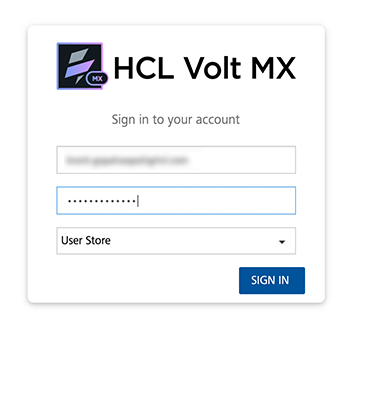

                           

Demo App QuickStart Guide (Building a Sample App – iOS): Configuring the Engagement Services Demo Application using Engagement Services Console

Configuring the Engagement Services Demo Application using Engagement Services Console
======================================================================================

The section explains how to provision the Engagement demo application using the Engagement services console.

**To configure the Engagement demo application follow these steps**:

1.  Open an Internet browser.
2.  Enter the URI: _manage.hclvoltmx.com_ in the address field and press the **Enter** key.
    
    The **Sign in to your Volt MX Account** page appears.
    
    
    
3.  Enter your email ID and password as user-credentials.
4.  Click the **Sign in** button to continue.
    
    The system displays the **VoltMX Foundry** homepage.
    
    
    
5.  **VoltMX Foundry** home page: Click **Environments** in the left panel.
    
    The Clouds page appears.
    
6.  Click the **Engagement Services** tab next to the **Sync Services** tab.  
    
    The **Engagement Services** home page (Dashboard) appears.
    
7.  **Engagement** services: In the left panel, click **Apps** under the **Overview** section. You can view all the configured applications and configure new applications.
    
    
    
8.  Click the **Add New App** button to configure a new app.
    
    The **Add New App** page appears with the **App Info** tab set to active.
    
9.  **App Info**: Enter the following details.
    
    *   **Application Name**: Enter the application name.
    *   **Application ID**: Click the **Generate** button to populate the system- generated application ID. You can enter the application ID manually in the text field.
    *   **App Category**: Select the app category from the drop-down list.
    *   **App Icon (Size: 78x78)**: Click the **Browse** button to navigate to the image file location and select it.
    
    
    
10.  Click the **Settings** tab and choose **Apple** to display the Apple settings screen.
11.  To configure the **Apple** platform, enter details for the following fields:
    1.  **Application Mode**: (Production or Development): By default, the application mode is set to production. Based on your requirement, select the mode as production or development.
        
        The application mode indicates the current status of the project. Push certificates are changed depending on the choice of application mode, and each mode requires a separate certificate.
        
     2.  **Production Mode**: When selected, real time certificates and associated password details are used to send push notifications. Binary (.ipa) files are directly installed on the devices that need production certificate.
     3.  **Development Mode**: When selected, you can send push message notifications using Apple’s demo server.
     4.  **Upload iPhone Push Certificate**: Click the **Browse** button to upload the certificate for iPhone.
     5.  **Certificate Password**: Enter the password for iPhone.
     6.  **Upload iPad Push Certificate**: By default, the No option is set to active. Select the Yes option, if you want to upload the certificate for iPad.
12.  Click **Save.**
    
       
      
     Select the same application mode that you have selected while creating the **APNS** certificate type.  
    
13.  On **Apps** screen, click the drop-down list and select the **Publish** option to publish the application. The application now can send notifications.
    
     The following screen displays the **TestApp** as an example.  
     
