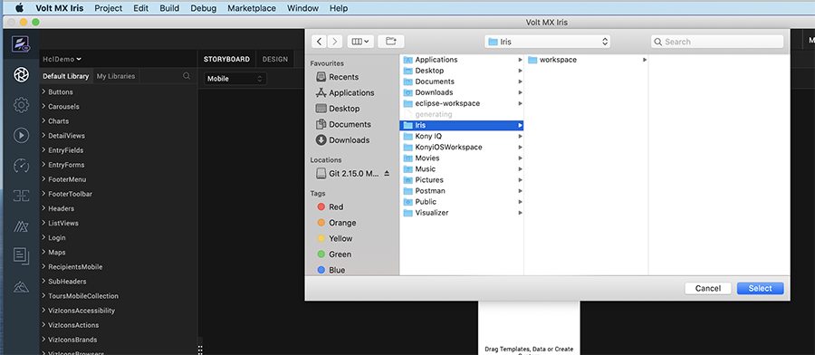
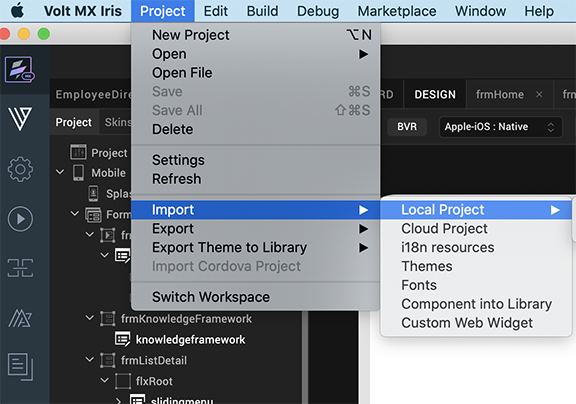

<!--  -->

<!-- Demo App QuickStart Guide (Building a Sample App – iOS): Downloading and Configuring the Engagement Services Demo Client Application -->

# Downloading and Configuring the Engagement Services Demo Client Application

The section explains how to download the Engagement services demo application from GitHub and configure the app using Iris for iOS devices.

> **_Note:_** We assume that Apple’s Xcode and Iris are installed before the following steps are performed.

To download and configure the Engagement demo client application, follow these steps:

1.  Connect to the URL [https://marketplace.demo-hclvoltmx.com/items/volt-mx-engagement-demo](https://marketplace.demo-hclvoltmx.com/items/volt-mx-engagement-demo) where the application is located.

    The **VoltMX-Engagement-Service-Demo** page appears.

2.  On the upper-right corner of the page, click **Download** and save the zip file on your system.

    The list-view displays the following files:

    - **Binaries**: Contains the binaries (iOS) of the VoltMXMessagingDemo app.
    - **VoltMXMsgDemo app**: Client side VoltMXMessagingDemo application code.
    - **License.txt**: GitHub provides an option to include a software license in your project when you create a new repository.
    - **README.md**: The `README.md` is used to generate the.html summary you see at the bottom of projects.

3.  Close the **VoltMX-Engagement-Service-Demo-Iris** page.
4.  Open **Iris**. Under the **File** menu, click **Import** > **Local Project**.

    

    The **Import Volt MX Project** window appears.

    

5.  Click the **Browse** button and navigate to the project folder that has the files you want to import.

    

6.  Select the **VoltMX Engagement Services Demo App** and click **Finish** to complete the importing of project in to Iris.

    The **Engagement Services Demo App** project opens into **Iris**.

    
