                           

Demo App QuickStart Guide (Building a Sample App – iOS): Generating an Apple Push Notification Service (APNS) Certificate

Generating an Apple Push Notification Service (APNS) Certificate
================================================================

The Apple Push Notification Service (APNS) certificate is needed for the iOS devices to register with Apple to receive notifications.

**To generate an Apple Push Notification Service (APNS) certificate, follow these steps**:

The first step to generate an Apple Push Notification Service (APNS) certificate is to generate a certificate request (CSR) file. The certificate request (CSR) file is used to request a development SSL certificate.

1.  To generate a `CSR file`, launch the **Keychain Access** application from the **LaunchPad**.
    

    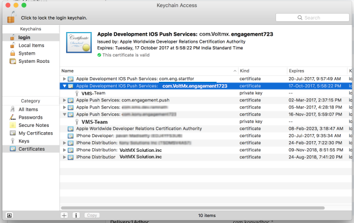

    
2.  Select the **Keychain Access** > **Certificate Assistant** > **Request a Certificate From a Certificate Authority ...** to create a SSL certificate.
    

    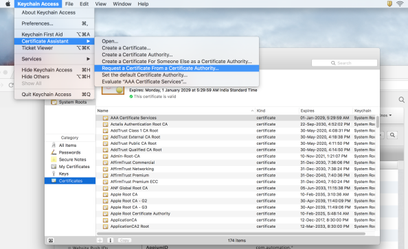

    
    The **Certificate Assistant** window appears.
    
3.  Under the **Certificate Information** section enter the following details:
    *   **User Email Address**: Enter your email address.
    *   **Common Name**: Enter the common name.
    *   **Request is**: Select the option as **Saved to disk**.

    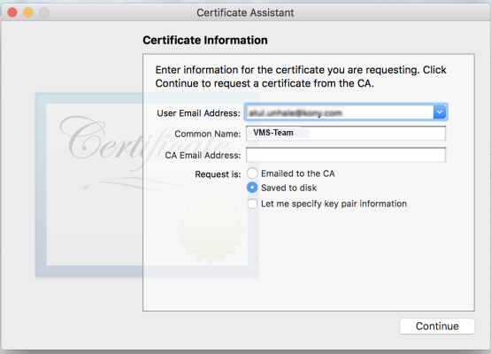

    
4.  Click **Continue** to proceed. The **Save As** dialog box appears.
5.  **Save As** dialog box: Change the file name extension in the **Save As** field to .`CSR` and click **Save**.
    

    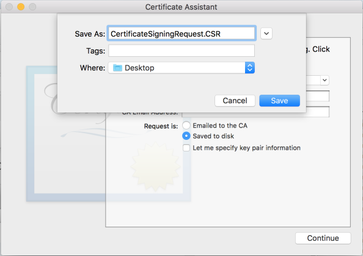

    
6.  Click **Continue** to proceed. The **Conclusion** notification appears.
7.  Click **Done** to create the CSR request and save it on your computer.

    
    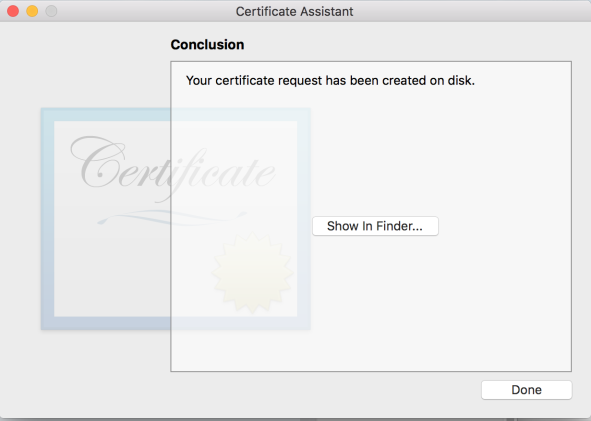

    
8.  Log on to the [developer.apple.com](http://developer.apple.com/) site with your Apple credentials. If you do not have an Apple developer’s account, register with Apple.
    

    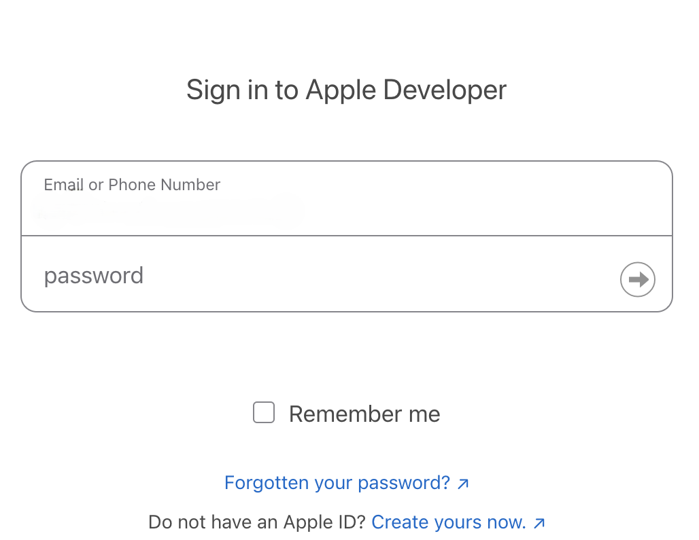

    
9.  Click **Sign In** to continue.

10. The next step is to create an App ID for push notifications. On the **Developer Account** page, click **Identifiers** under **Certificates, IDs and Profiles** in **Program resources**.

    

11. The **Certificates, Identifiers and Profiles** page appears. Click the **+** sign next to the **Identifiers** to create new App ID.
    
    

12. The **Register new Identifier** page appears. Select **App IDs** and click **Continue**

    

13. Select **App** and click **Continue**

    

14. **Register an App ID**: Enter the details for the following fields:
    *   **Description**: Enter the application name.
    *   **Bundle ID**:
        *   **Explicit**: Enter the bundle Id. Remember the bundle Id as it is used to configure the application in Iris.
        

    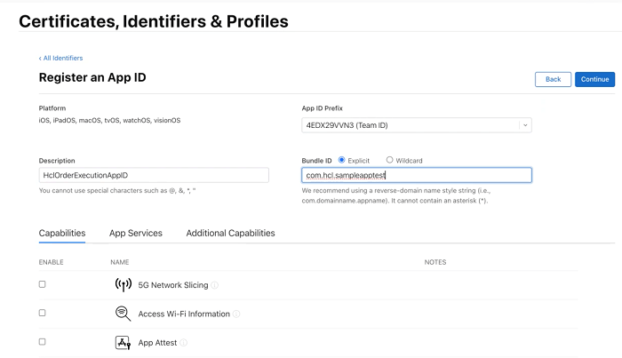
        

15. Ensure that **Push Notifications** is checked under the **Capabilities** section. Click **Continue** to proceed.
    

    
    

    The new Identifer will get created.
    
16. The next few steps discuss the configuration of the **app ID** for push notifications. Search the newly created App ID in the search bar and Click on (HclOrderExecutionAppID) App ID to **Edit**.

    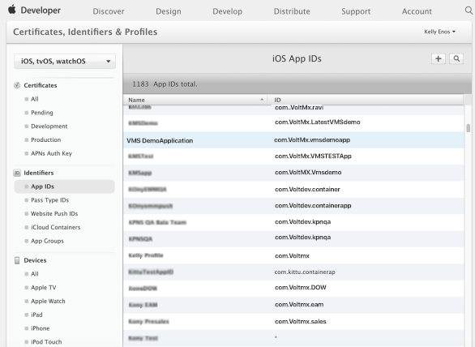
    
    The **Edit your App ID Configuration** page appears.
    

    
    

17. In **Capabilities** section, Click on **Configuration** button next to the **Push Notifications**.
    
    

18. To create a development certificate, click **Create Certificate** in the **Development SSL Certificate** section. Click **Done**.
    
    
    
19. The **Create a New certificate** page appears. The next step involves choosing the **CSR** file that was generated earlier. Click **Choose File** to upload the .`CSR` file.
    
    
    
20. Click **Continue** after the `CSR` file is selected to complete the certificate creation.
    
21. The **Download Your Certificate** page appears. click **Download** to download the certificate.
    

    

    
22. Double click aps\_production.cer in the **Downloads** folder to add it to the **Keychain Access** application.
    
    
    
23. To view the certificate in the **Keychain**, launch the **Keychain Assistant** and search by the certificates category. The push certificate is displayed.
    
    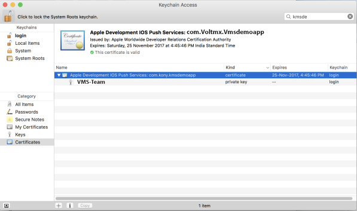
    
24. Right-click the certificate and click **Export Apple Production iOS Push Services:com.voltmx.vmsdemoapplication** from the drop-down list to export the certificate.
    

    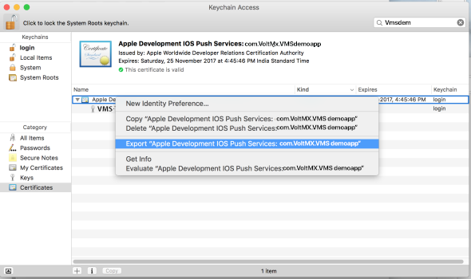
    

25. Enter the file name and the location where the file is to be saved and click **Save**.
    

    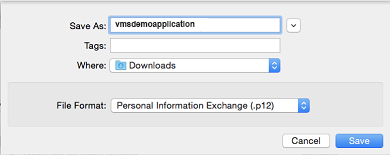

    
26. Enter the password and click **OK** to continue.
    
    
    
27. Enter your admin password for your computer and click **Allow**. This ensures that the certificate can be exported to the folder mentioned.
