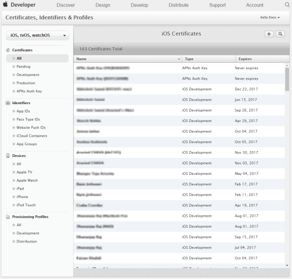
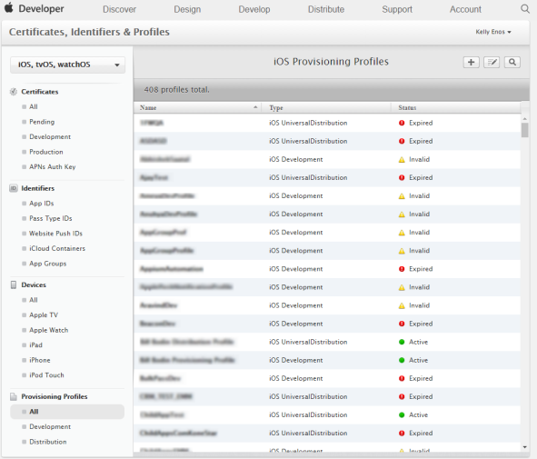
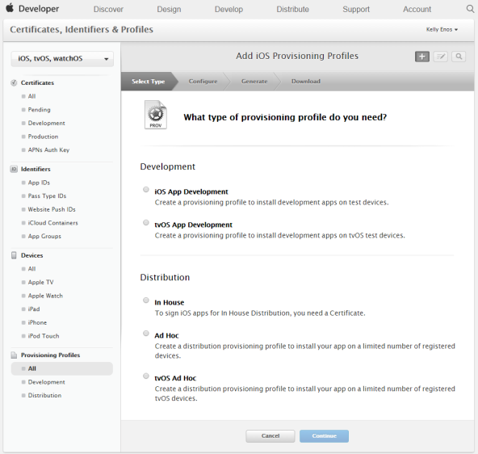
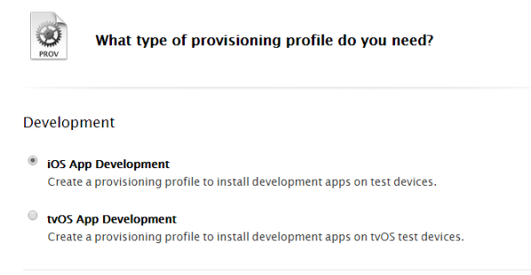
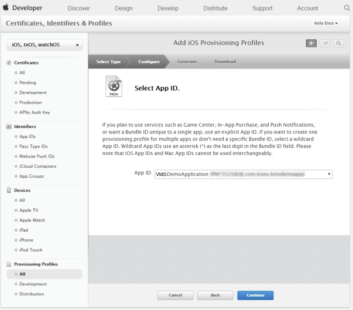
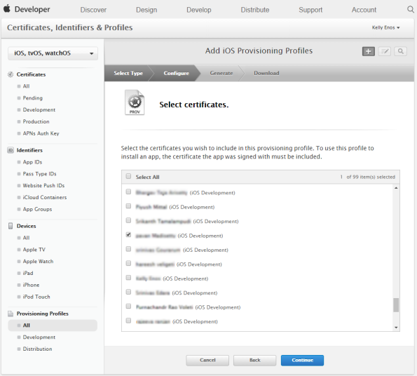
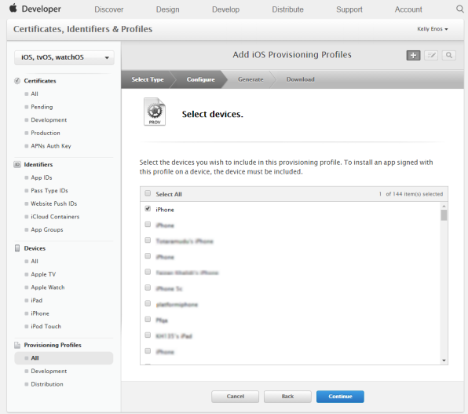
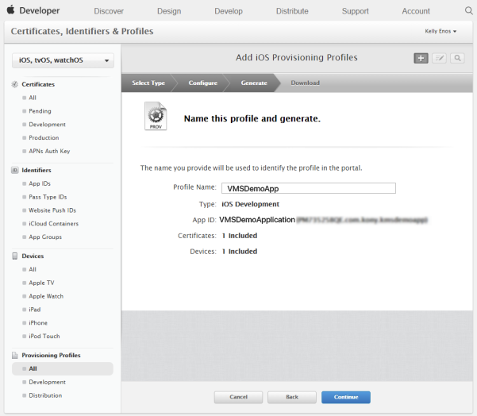
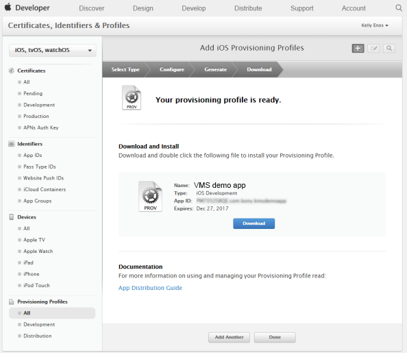
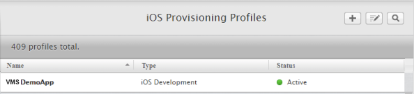

                           

Demo App QuickStart Guide (Building a Sample App – iOS): Generating the Provisioning Profile

Generating the Provisioning Profile
===================================

A provisioning profile is needed to identify the devices on which the developed application can be deployed. The following steps describe the creation of the provisioning profile for VMS demo application.

1.  Log in to your [developer.apple.com](http://developer.apple.com/) account with your credentials (user ID and password).
2.  Click **Sign In** to continue.
3.  On the **Developer Account** page, click **Certificates, IDs and Profiles** in the left pane to continue.
    
    The **Certificates, Identifiers and Profiles** page appears.
    
    
    
4.  Click **All** under the **Provisioning Profiles** header in the left pane to view all the existing profiles or create new profiles.
    
    
    
5.  On the upper-right corner of the screen, click the plus sign next to the **iOS Provisioning Profiles** header to create a new profile.
    
    The **What type of provisioning profile do you need**? page appears.
    
    
    
6.  Select the **iOS App Development** option under the **Development** section. Click **Continue**.
    
    
    
7.  Select the **App ID** for which the profile is created from the drop-down list and click **Continue**.
    
    
    
8.  The **Select certificates** page appears. Select the required certificate from the list-view to include in the profile.
    
    > **_Note:_** To install the application on a device, the signed certificate should be included in the profile.
    
    
    
9.  Click **Continue**.
10.  The **Select devices** page appears. Select the device on which you need to install the application.
    
     
    
11.  Click **Continue.**
    
     The **Name this profile and generate** page appears.
    
12.  **Profile Name**: Enter the profile name and click **Continue** to create the provisioning profile for the selected certificate and the device.
    
      
    
     The **Your provisioning profile is ready** page appears.
    
13.  Click **Download** to download the profile.
    
     
    
14.  Click **Done**. The system displays the newly added provisioning profile in the list-view.
    
     
