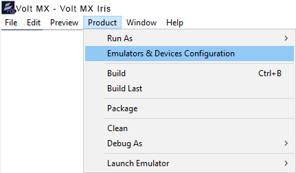
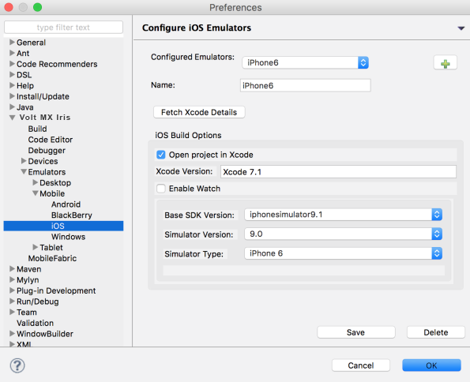
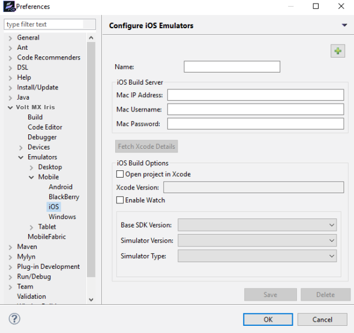
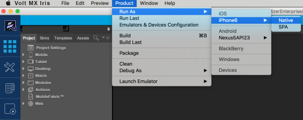

                           

Demo App QuickStart Guide (Building a Sample App – iOS): Installing the Configured Engagement Services Demo Client Application on an iOS Device

Installing the Configured Engagement Services Demo Client Application on an iOS Device
======================================================================================

The section explains how to install a configured Engagement services application on an iOS device. Follow these steps:

1.  Connect the iOS device using a USB cable to the computer where the application to be installed is located.
2.  **Iris**: From the menu bar, select the option as **Product** > **Emulators and Device Configuration**.
    
    
    
    The **Preference** window appears.
    
3.  In the **Preference** window, select the option as **Product** > **Emulators and Device Configuration** > **VoltMX Iris** > **Emulators** > **Mobile** > **iOS**.
    
    The **Configure iOS Emulators** section appears.
    
    
    
4.  If you wish to open the Iris in a Windows system and connect to the Mac system, you need to enter the following details to connect with the iOS build server.
    
    *   **Name**: Enter a name for the iOS emulator.
    *   **Mac IP Address**: Enter the IP address of your Mac system.
    *   **Mac User Name**: Enter the user name.
    *   **Mac Password**: Enter the system password.
    *   **Base SDK Version**: Select the current SDK version from the drop-down list.
    *   **Simulator Version**: Select the current iOS simulator version from the drop-down list.
    *   **Simulator Type**: Select the current iOS simulator type from the drop-down list.
    
    
    
5.  Click **Save** to save the configuration details. Click **OK** to continue.
    
    The iOS device is connected and the device ID is displayed.
    
6.  From the menu bar, select the option as **Product** > **Run As** > **iPhone6** > **Native** or **SPA**.
    
    
