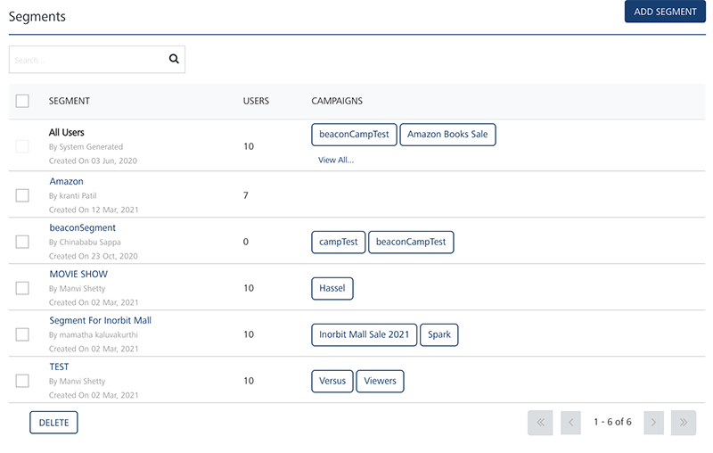
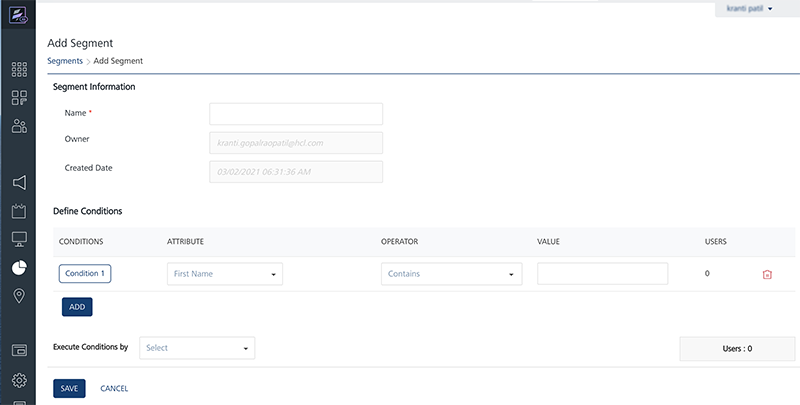
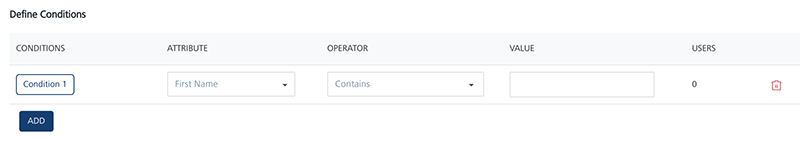
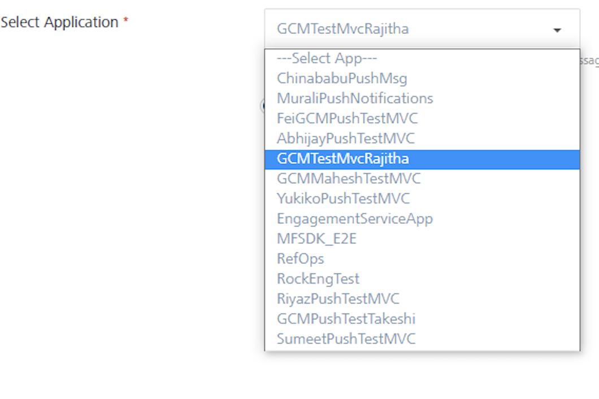
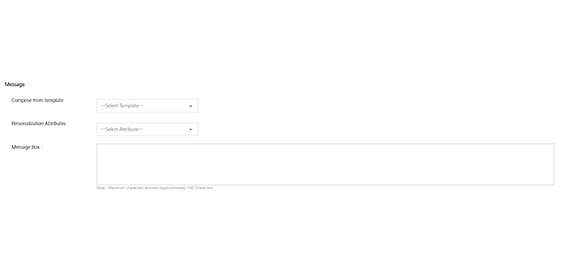

                            

Sending Adhoc, Email, SMS and Push Notifications
================================================

The section explains how to set up the demo application on an iOS device to receive ad hoc - push, email and SMS messages after the subscription is complete. Details of configuring a segment are also provided.

1.  Log in to Volt MX Foundry cloud and click **Overview** > **Subscribers** > **Users**.
2.  The Users screen displays the details of the user who subscribed using the application installed on device.
    
    
    
3.  Next, click **Overview** > **Subscribers**\> **Devices** to view the list of all devices, their device IDs and the applications the devices are subscribed.
    
    
    

This section explains how to set up the demo application on an iOS device to receive ad hoc push, email and SMS messages after the subscription is complete.

Configuration of a Segment:
---------------------------

This section describes the execution steps needed to create a segment. The created segment is used to send ad hoc email, SMS and push notifications.

1.  Click **Segment** under **Engagement** in the left panel. Click **Add Segment** to add a new segment.
    
    
    
2.  Enter the name of the segment. The **Owner** and **Created Date** fields are automatically populated.
    
    
    
3.  Under the **Define Conditions** section, for the condition No.1, choose **First Name** for the User attribute. Select the **Operator** as **Contains** and type the first name of the user as Muralidhar. You see the **Users** column is updated with the number of the users that match the condition.
    
    > **_Note:_** Condition No. is a reference to the user attributes added in the grid that helps to define conditional logic in the Segment Definition area.
    
    
    
4.  Select the required condition from the drop-down list to use for segment definition.
    
    
    
5.  If you select the execute condition as **Match all** conditions or **Match any** condition, then based on the fulfilled condition(s), the system inserts the number of users under the **Users** column.
6.  If you select the executive condition as **Advanced**, then five logic buttons appears. Based on your requirement, select the logical operators.
7.  Click the **Validate** button. The system validates, if the logic is correct. It states that the validation is successful. Click **Ok** to continue. The system displays the **View Segment** screen.
    
    The number of added users appears under the **Users** column.
    
    
    
8.  Click **Save** to save the segment. The system adds the new segment into the segments grid on **Segments** screen. The system displays the confirmation message that segment saved successfully.
    
    
    

Sending Adhoc Push Notifications
--------------------------------

The ability to send push notifications is one of the most important features of engagement services. The push message feature lets you configure and send push messages based on the preferences and personalization attributes for targeted subscribers or segments. Push messages are sent only to subscribed apps that are active and installed on mobile devices.

### Sending Adhoc Push Notifications to Subscribers

This section describes how to configure push notifications to send them to individual subscribers.

1.  From the **Engagement** section, click **Adhoc** from the left panel. The **Adhoc** screen appears with three tabs including **Adhoc Information**, **Select Users** and **Define Message**. By default, the **Adhoc Information** tab is set to active.
    
    
    
2.  **Select Channe**l: Select the **Push Message** channel from the drop down list.
    
    The **Select Application** drop down list appears.
    
3.  Select the required application from the drop-down list.
    
    
    
    Push Messages are sent only to configured platforms with an app.
    
4.  Click the **Next -Select Users** button to continue. The **Select Users** tab becomes active.
    
    
    
    Based on your requirement, select the option as **Subscribers** or **Segment**. Based on selected app, the list view populates with the details of associated subscribers.
    
    
    
5.  Select the number of subscribers from the list view and click **Next - Define Message** to continue.
    
    The **Define Message** tab becomes active.
    
    
    
    The **Define Message** page includes **Message Information** section to add a new push message. The **Message Type** field includes two options to add a new push message:
    
    *   Silent Push
    *   Standard Push
    
    By default, the message type option is set to standard push.
    
6.  In the **Push Message** section, enter the **Message Title** and the push message in the **Message Box**. If required, select the personalization attributes.
7.  **Enable Rich Push**: Select the checkbox, if you want to associate the rich push. To customize your text, you can use the Rich Text Editor tool bar available at the top of Rich Content box.
8.  **Silent Push**: Select the option, if you wish to enable the silent push. When a silent push notification reaches a device, you do not know about the notification but your app may process the notification and perform an action like downloading new content. When you check the **Silent Push** option, system displays platform specific properties fields only. This is because the **Message Title** and the **Message Text** fields are not applicable for silent push.
9.   Choose the option **Now** to send notification immediately. Click **Send** to deliver the push message.
10. If you would like to schedule the message delivery at a later day and time, choose the **Later** option on **Adhoc Information** screen.Select the **Start Date and Time** and **Expiry Date and Time**. Click **Schedule Notification** for the message delivery to be scheduled for later.
    
    
    

### Sending Adhoc Push Notifications to Segments

This section describes how to configure push notifications to be sent to the segments (which is a group of subscribers).

1.  **Select User From**: Select the option as **Segmen**t in **Define Message** screen. The **Select Users** list view appears.
    
    
    
2.  Click the **Select a Segment** from the drop down list to select the required segments.
    
    
    
3.  The selected segment with associated users appears in the list view.
    
    
    
4.  Click **Next Define Message** to continue. The **Define Message** screen appears.
    
    
    
5.  In the **Message** section, enter the **Title** and **Message** for the push notification to be sent. Choose **Now** on the **Adhoc Information** page to send push message immediately. Click **Send.**
6.  If you want to schedule the message delivery at a later day and time, choose the **Later** option. Select the **Start Date and Time** and **Expiry Date and Time**. Click **Schedule Notification** to schedule message delivery at a later date.
    
    
    

Sending Adhoc Email Notifications
---------------------------------

The **Email Message** feature allows you to configure and send email messages based on the preferences and personalization attributes for the targeted users or segments.

### Sending Adhoc Email Notifications to Users

1.  From the **Engagement** section, click **Adhoc** from the left panel. The **Adhoc** screen appears with three tabs including **Adhoc Information**, **Select User**s and **Define Message**. By default, the **Adhoc Information** tab is set to active.
2.  **Select Channel**: Select the **Email Message** channel from the drop down list.
    
    
    
3.  Click **Next- Select Users** to continue. The **Select User** screen tab becomes active. The **Select Users** screen displays all the users in the list view. By default the **To** option is set to **Users**.
    
    
    
4.  In the **User Information** section, there is an option to choose **Users** or predefined **Segments** in the **TO**, **CC** and **BCC** sections of the email. Choose the user(s) to send email notifications.
    
    
    
5.  Click **Next -Define Message** to continue. The **Define Message** tab becomes active.
    
    
    
6.  Type the **Sender Name**, **Sender Email** information in the corresponding fields at the end of Defining Message Target section.
    
    > **_Note:_** Choose the Send to Me option, if the sender needs to be copied on the email. Choose Send Copy to Others option, if a copy of the email needs to be sent to multiple email addresses.
    
    
    
7.  Next, in the Message section, compose a new email message along with the email subject as shown below. You can use the Rich Text Editor available at the top of Message text are to customize the email message text.
    
    
    
8.  Click the **View API Payload** button to view the API payload.
9.  Click **Send** to continue.
10. If you want to schedule the message delivery at a later day and time, choose the **Later** option on **Adhoc Information** screen . Select the **Start Date and Time** and **Expiry Date and Time**. Click **Schedule Notification** to schedule message delivery at a later date.
    
    
    

### Sending Adhoc Email Notifications to Segments

The steps involved to send the adhoc email notifications are similar to sending adhoc push notifications to segments.

Sending Adhoc SMS Notifications
-------------------------------

The SMS message feature allows you to configure and send SMS messages based on the preferences and personalization attributes for the targeted users or segments.

1.  From the **Engagement** section, click **Adhoc** from the left panel. The **Adhoc** screen appears with three tabs including **Adhoc Information**, **Select Users** and **Define Message**. By default, the **Adhoc Information** tab is set to active.
2.  **Select Channel**: Select the **SMS Message** channel from the drop down list.
    
    
    
3.  Click **Next- Select Users** to continue. The **Select Users** tab becomes active. The **Select Users** screen displays all the users in the list view. By default the **To** option is set to **Users**.
    
    
    
4.  Select the user to send the text message from the list view.
5.  Click **Next - Define Message** to continue. The **Define Message** tab becomes active.
6.  In the **Message** section, select the personalization attributes from the drop down list and enter SMS message in the Message Box text area.
    
    
    
7.  You can also use the SMS template to create a new SMS message. Select the SMS template from the drop down list to create a new SMS message.
    
    
    
8.  Click the **View API Payload** button to view the API payload.
9.  Click **Send** to continue.
10. If you want to schedule the message delivery at a later day and time, choose the **Later** option on **Adhoc Information** screen. Select the **Start Date and Time** and **Expiry Date and Time**. Click **Schedule Notification** to schedule message delivery at a later date.
    
    
    
    | Rev. | Author | Edits |
    | --- | --- | --- |
    | 7.2.5 | AU | AU |
