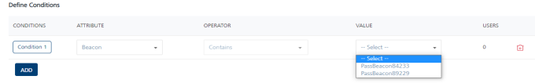
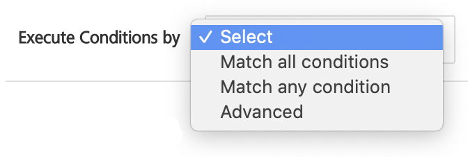

                             

Quick Start Guide – Campaign Management: Adding a Segment to Use with a Campaign

Adding Segments
===============

Segments are based on a criteria that you define and ensure that you target appropriate users for your campaign. Based on a user's attributes, you can create new segments.

To add a segment, follow these steps:

1.  On the **Segments** page, click the **Add Segment** button.
    
    The **Add Segment** page appears. The Add Segment page includes two sections: **Segment Information** and **Define Conditions**.
    
    
    
    Segment Information
    -------------------
    
2.  In the **Segment Information** section, do the following:
    
    *   **Name** (mandatory): Enter a name for the segment that you want to define. Your segment name should include alphanumeric characters only.
    *   **Owner**: The system automatically populates the field with the segment owner's name.
    *   **Created Date**: The system automatically populates the field with the current date and current time.
    
    **Define Conditions**
    ---------------------
    
    In the **Define Conditions** section, do the following:
    
3.  The **Define Conditions** list view contains the following fields:
    *   **Conditions**: Click **Add** to add a new condition row. A new condition is added with a number under the **Conditions** column in the grid, such as **Condition 2**.  

          
        

    The condition numbers are references to the user attributes associated with that condition. For example, **Condition 1** refers to the **First Name** user attribute. The numbered conditions can be used to define different combinations for a segment.

    *   **Attributes**: Under the **Attributes** column, select the attribute from the drop-down list. You can select any user attributes as required. For example, First Name, Last Name, Email, Country, State, Location, Beacon, and any dynamic user attribute.

       
    

       
    For more information on **User Attribute** types, refer to [Adding User Attributes](../../../Foundry/vms_console_user_guide/Content/Administration/Adding_Attributes_to_Audience.md).
          
        
    ### Beacons
        
     For the user attribute as **Beacon**, select the beacon from the drop-down list under the **Value** column.
        
    
        
    ### Geofence
        
    *   For the user attribute as **Location**, select the location from the drop-down list under the **Value** column. For more information on how to add geolocations and beacons, refer to [Engagement > Geofence.](../../../Foundry/vms_console_user_guide/Content/Geolocation/Geo_Location.md)
        
      
        
    *   **Operator**: Under the **Operators** column, select the required operator from the drop-down list. You can compare a user attribute with a value by using a specified operator such as **Contains**, **Equal**, or **NotEqual**. The following table describes operators that you can use to define a segment.
        
        | Operator | Description |
        | --- | --- |
        | Contains | The operator checks if the attribute value for all users have a common substring given in the value field |
        | Equal | The operator checks if both operands have the same value |
        | NotEqual | The operator checks if both operands do not have the same value |
        | GreaterThan | The operator checks if the value of the left-hand operand is greater than the value of the right-hand operand |
        | LessThan | The operator checks if the value of the left-hand operand is less than the value of the right-hand operand |
        | GreaterThan CurrentDate + {days} | The operator checks if the date value of the attribute is greater than the current date plus number of days specified in the value field |
        | GreaterThan CurrentDate - {days} | The operator checks if the date value of the attribute is greater than the current date minus number of days specified in the value field |
        | LessThan CurrentDate + {days} | The operator checks if the date value of the attribute is lesser than the current date plus number of days specified in the value field |
        | LessThan CurrentDate - {days} | The operator checks if the date value of the attribute is lesser than the current date minus number of days specified in the value field. |
        
    *   **Value**: Helps you configure values for conditions. Enter a value in the **Value** field. For example, you can create a condition where a user has a Volt MX account.
4.  **Execute Conditions by**: Select the required condition from the drop-down list to define the segment definition.
    
    
    
5.  **Execute Conditions By**: Select the execute condition as **Match all conditions** or **Match any condition** from the drop-down list. Based on the fulfilled condition, the system inserts the number of users that qualify for the segment under the **Users** column.
    
    
    
6.  If you select the executive condition as **Advanced**, logic buttons appear. You can validate different conditions by using logic buttons while applying the segment definition. They are **()**, **AND**, **OR**, and **NOT** to create expressions.
7.  Click the **Logic** button to apply the conditional logic. The system inserts the logic button next to the condition number in the **Segment Definition** area. You can refer the following table to know more about logic buttons.
    
    | Logic Button | Description |
    | --- | --- |
    | AND | If an AND operator is used between two conditions or among conditions, all the common users satisfying both sets of conditions are included in the segment criteria |
    | OR | If an OR operator is used between two conditions or among conditions, the users satisfying either of the conditions are included in the segment criteria |
    | NOT | The logical operator NOT reverses the logical value of a condition on which it operates. The condition can be a simple condition or a condition containing AND and OR. |
    
8.  Follow the specified order of operation to calculate the conditional logic for the segment definition:
    
    1.  Work on brackets first.
    2.  Otherwise just go from left to right.
    
    You can delete any elements inserted in the segment definition window by clicking the **Delete** button. The system deletes the elements from right to left order.
    
9.  Click the **Validate** button.  
    If conditional logic is not used correctly, the system displays the error message that the segment criterion is invalid. The system displays a confirmation message if the logic is correct. The message states that the validation is successful. 
10.  Click **OK** to continue.
    
     The system displays the **Add Segment** screen. The number of added users appears under the **Users** column.
    
     
     
11.  Click the **Cancel** button to exit from the window without saving any information.   
    The system displays the **Segments** home page.
12.  Click the **Save** button.  
    The system adds the new segment into the segments list view with a confirmation message that the segment is saved successfully.
