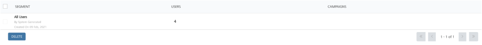
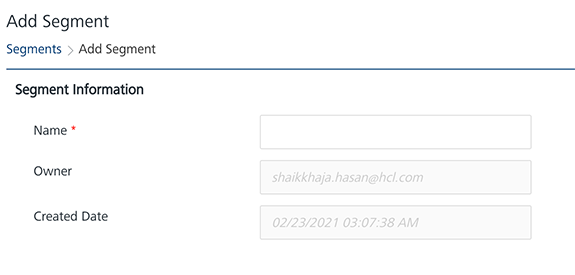
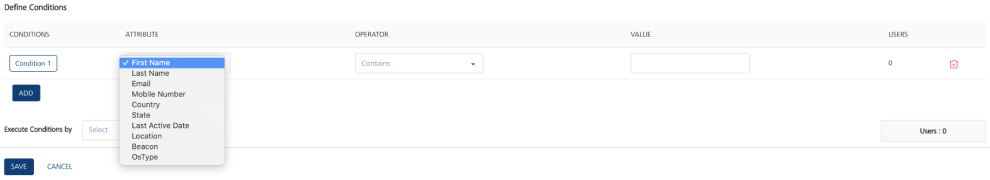
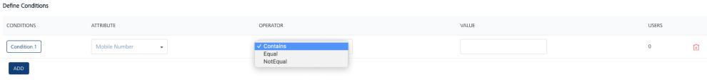
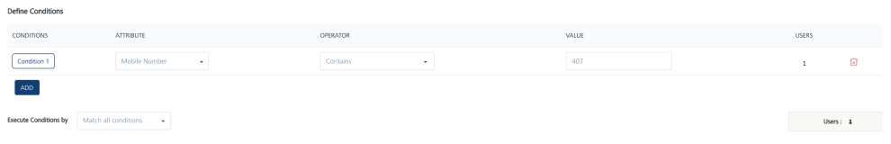
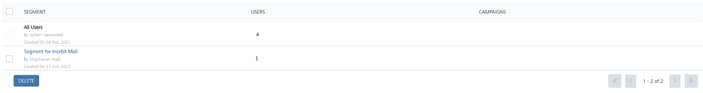

                          

Creating a Segment to Use with a Campaign
=========================================

A segment is derived from the different conditions that are set on user attributes, and is used to send push messages or campaign messages to users who have common needs or services. The section provides the details about how to create a segment and associate with a campaign. The example describes about how to create a segment based on the area code of a phone number.

The different steps that are involved in the creation of the segment follow.

1.  After logging in to the Foundry Engagement Server console, In the left panel, click **Segments** under the **Engagement** section. Click Add Segment to display the screen to add the new segment details.
    
    
    
2.  In the **Segment Information** section, enter the name of the segment. The owner name and the created date are pre-populated.
    
    
    
3.  The **Define Conditions** section allows for defining the conditions for the segments. The **User Attribute** is a drop-down that comprises First Name, Last Name, Email, Mobile Number, Location and Beacon. Choose the **Mobile Number** in this example.
    
    
    
4.  Similarly, the Operator drop-down comprises **contains**, **equal** and **not equal** values to define the conditions for a user. Choose **Contains** as the operator for this example. Enter the value in the **Value** text box. In this example, enter a value for area code pertaining to mobile number of the user as 407.
    
    
    
5.  From **Execute Conditions By** drop-down, choose **Match All Conditions**. This matches all the conditions defined in the **Define Conditions** section and shows the number of users that qualify for the defined segment. In this example, the count is 1.  
    
    
6.  Click **Save** to save the segment created. A screen showing that the segment was successfully saved is then displayed.  
    
