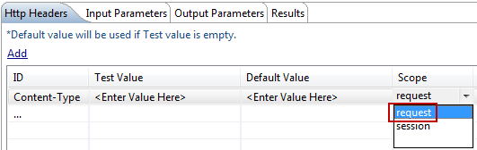

# Troubleshooting JMS Issues

This chapter explains how to troubleshoot specific properties that you may encounter while developing applications using VoltMX MobileFoundry Integration Service (`middleware.properties`). You can access `middleware.properties` file from `<middleware.home>/middleware/middleware-bootconfig` and edit.

## Other Features

*  **What is the Standard way in which I can handle HTTP status codes (401, and 404) from VoltMX MobileFoundry Integration Service?**

    **Solution**

    In PostProcessor, Result object is available. In that, you can use the following code snippet to find the httpStatus code:

    <pre><code>Param statusCodeparam = result.findParam("httpStatusCode");
    int httpStatusCode = Integer.parseInt(statusCodeparam.getValue());</code></pre>

    By default, VoltMX MobileFoundry Integration Service passes the HTTP status code in the resultset json format to device. The following is the sample output string:

    <pre><code>
    resultset =  {"httpStatusCode":200,"marketIndex":[{"indName":"Dow Jones Ind.","indVal":"15618.22","symbol":"0DJIA","indValChg":" -20.90"},{"indName":"Nasdaq Comp.","indVal":"3939.86","symbol":"0NDQC","indValChg":"3.27"},{"indName":"NYSE Composite","indVal":" 10011.65","symbol":"0NYC","indValChg":"-52.46"},{"indName":"S & P 500","indVal":"1762.97","symbol":"0S&P5","indValChg":" -4.96"}],"opstatus":0}
    </code></pre>

    You can use the following snippet in `.js` file to get the httpStatusCode from JSON resultset object.

    `int statusCode = resultset["httpStatusCode "];`

*  **How can I use Basic Authenticate in RESTful service with dynamic userids in request? When working with service definitions in VoltMX Studio, I need to be able to dynamically assign those values in code, that is, do I have to authenticate with Active Directory and then with REST endpoints?**

    **Solution**

    Dynamically, in basic authentication, in every request, you can pass the username and password in request params with the following specified param names:

    1.  userid
    2.  pwd

    If you have any domain and hostname, then use the following specified param names:

    1.  domain
    2.  hname

    VoltMX MobileFoundry Integration Service first checks in:

    1.  request parameters
    2.  if not available, it checks in session, that is, _session.getAttribute(userid)_
    3.  if not available in request and session, then it takes from the service definition file.

    In JS code level:

    <pre><code>
    var inputParamTable={};                  
    inputParamTable["appID"] = "ServicesApp";                 
    inputParamTable["serviceID"] = "BasicAuthService";
    inputParamTable["userid"] = "steve";                  
    inputParamTable["pwd"] = "apple";  
    inputParamTable["domain"] = "kits";                  
    inputParamTable["hname"] = "apple";  
    </code></pre>

    If you want to store userid and password in HTTP session, write the below code in pre / post processor:

    <pre><code>
    Session session = request.getSession(false);
    session.setAttribute("userid", "steve");
    session.setAttribute("pwd", "******");
    </code></pre>

*  **If end server has proxy enabled authentication, then what should I do?**

    **Solution**

    You need to configure the below -D parameters:

    <pre><code>
    voltmx.http.proxyHost
    voltmx.http.proxyPort
    voltmx.http.proxyUser  
    voltmx.http.proxyPassword
    </code></pre>

    If end server is with NTLM enabled authentication, then you need to configure the additional below -D parameter:  

    `voltmx.proxy.ntlm.domainName`

*  **How can I** **add Headers?**

    **Solution**

    1.  For example, to add "Content-Type" as a header:

        In the **Service Definition** editor -> **Http Headers** tab, under **Id**, declare _Content-Type_ as header type and under **Session**, select _session_ from the drop-down list as shown:

        

        Write preprocessor for the service and use the following snippet in preprocessor:

        <pre><code>
        Session session = request.getSession();
        session.setAttribute("Content-Type"," application/json");
        </code></pre>

    2.  If you want to pass header values in "request" parameters,

        In the **Service Definition** editor -> **Http Headers** tab, under **Scope**, select _request_ from the drop-down list, then pass the header value with same key that you defined in Header section with _request_ as scope.

        

        For example,

        <pre><code>
        1.Content-Type - request scope in VoltMX Studio Header section  
        2.Use the below code in JavaScript  
        var inputParamTable={};             
        inputParamTable["Content-Type"] = "application/json";  
        </code></pre>

*   **How can I add Custom Cookies in header?**

    **Solution**

    1.  Create cookie object using HTTP client 4.1 API, org.apache.http.cookie.Cookie

    2.  In pre or post processor, use the following snippet:

        <pre><code>
        Session session = request.getSession(false);
    	session.setAttribute("KCookie",cookie);
        </code></pre>  

*   **How can I change the url or user authentication details dynamically?**

     **Solution**
     Implement URLProvider2 class and write your own logic to override the service definition values.  

*   **If request data is more than 1024 MB, then Linux default values do not allow to forward the request. What do I need to do so that Linux values allow to forward the request?**  

    **Solution**

    Login to Linux shell with root privileges.

    Set the following in Linux Operating System:

    Below changes apply on QNBDEV server to resolve the BRE service issue.

    <pre><code>&#x23;vi /etc/sysctl.conf   (Add the below values)
    &#x23;increase TCP max buffer size settable using setsockopt()net.core.rmem_max = 16777216
    net.core.wmem_max = 16777216
    &#x23;recommended for hosts with jumbo frames enabled
    net.ipv4.tcp_mtu_probing=1
    </code></pre>  

*   **If a SOAP response has an embedded xml, then what do I need to do?**

    **Solution**

    Select the **Escape embedded xml in response** check box in the SOAP service definition editor in VoltMX Studio to enable it.

    Sample HTTP Response from end server:

    <pre><code>
        &lt;soapenv:Envelope xmlns:Soapenv="http://schemas.xmlsoap.org/soap/envelope/" xmlns:xsd="http://www.w3.org/2001/XMLSchema" xmlns:xsi="http://www.w3.org/2001/XMLSchema-instance"&gt;
        &lt;soapenv:Body&gt;
        &lt;lmsSOAPResponse xmlns="HYPERLINK "http://lms.sbi.com/"http://lms.sbi.com"&gt;
                 &lt;lmsPReturn&gt;&lt;?xml version="1.0" encoding="UTF-8" standalone="no"?&gt;&lt;LMS&gt;&lt;record id="0"&gt;&lt;CO_APP2_GMI&gt;![CDATA[Google check]]&lt;/CO_APP2_GMI&gt;&lt;NMI_ELG_CAL&gt;&lt;/record&gt;&lt;/LMS&gt;&lt;/lmsReturn&gt;
              &lt;/lmsSOAPResponse&gt;
           &lt;/soapenv:Body&gt;
        &lt;/soapenv:Envelope&gt;
    </code></pre>

    The sample embedded xml in SOAP response is converted into valid SOAP response for parsing as shown:

    <pre><code>
    &lt;soapenv:Envelope xmlns:Soapenv="http://schemas.xmlsoap.org/soap/envelope/" xmlns:xsd="http://www.w3.org/2001/XMLSchema" xmlns:xsi="http://www.w3.org/2001/XMLSchema-instance"&gt;
    &lt;soapenv:Body&gt;
    &lt;lmsSOAPResponse xmlns="HYPERLINK 'http://lms.sbi.com/' http://lms.sbi.com"&gt;
    &lt;lmsPReturn>&gt;&lt;?xml version="1.0" encoding="UTF-8" standalone="no"?&gt;&lt;LMS&gt;&lt;record id="0"&gt;&lt;CO_APP2_GMI&gt;![CDATA[Google check]]&lt;/CO_APP2_GMI&gt;&lt;NMI_ELG_CAL&gt;&lt;/record&gt;&lt;/LMS&gt;&lt;/lmsReturn&gt;
    &lt;/lmsSOAPResponse&gt;
    &lt;/soapenv:Body&gt;
    &lt;/soapenv:Envelope&gt;
    </code></pre>
