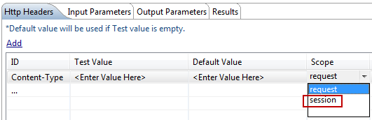

                           


Troubleshooting Volt MX Foundry Integration Service
===============================================

This chapter explains how to troubleshoot specific properties that you may encounter while developing applications using Volt MX Foundry Integration Service (`middleware.properties`). You can access `middleware.properties` file from `<middleware.home>/middleware/middleware-bootconfig` and edit.

Properties in Volt MX Foundry Integration Service
---------------------------------------------

   > **_Note:_** In license validation on WebSphere, Volt MX supports only Oracle JDK. Middleware license does not get validated on WebSphere if the server has IBM JDK. This is an expected behavior for license validation on WebSphere. This behavior is present in Middleware 5.0 and higher versions.

<style>
table{
    border-collapse: collapse;
    border-spacing: 0;
    border:2px solid #ccc;
}

th{
    border:2px solid #000000;
}

td{
    border:1px solid #000000;
}

</style>


| Property in Volt MX Foundry Integration Service      | Troubleshooting Tip |
| ----------- | ----------- |
| cacheid.transport=PARAM\_ONLY      | The property is only for memcached. Instead of HTTP session, Volt MX Foundry Integration Service maintains session values in memcached. Memcached provides a cacheid. You can set the following values for cacheid: PARAM\_ONLY: PARAM\_ONLY is defined in `middleware.properties` file, by default. This represents that the cacheid is passed as param in every result sent to the device. COOKIE\_ONLY: To pass the cacheid as cookie to the device or browser. You can use this property if you are running memcached in your Application Server. Set the PARAM\_ONLY to COOKIE\_ONLY to enable the application to set a cookie on the users’ device. EITHER: To pass the cacheid sometimes as PARAM\_ONLY and sometimes as COOKIE\_ONLY.       |
| log.description.error=true   | The SOAP fault details are logged, by default. If you do not want to log SOAP fault details, then change it false.        |
| p.exclude=password      | If you do not want to log any sensitive information in request / response parameters, specify the key name. For example, if you specify password=jack123, it masks and shows as password=\*\*\*\*.       |
| do.not.log   | If you do not want to log specific values into report database, then specify do.not.log=<key>. For example, if you specify do.not.log=SESSIONID, then, sessionid is not inserted into database.        |
| ssl.SocketFactory.hostname.verifierBROWSER\_COMPATIBLE\_HOSTNAME\_VERIFIER      | If the application has self signed certificates, then use ssl.SocketFactory.hostname.verifier=ALLOW\_ALL\_HOSTNAME\_VERIFIER       |
| dontEscapeXMLSpecialChars=   | If you want to send the special characters; **<**,**\>**,**\\****'**, **\\****"**, **&** in the xml request as is, set dontEscapeXMLSpecialChars= any of the above specified special character.For example, In, "jhonson & jhonson", if you want to send the special character, **&**, then specify:fault : jhonson &amp; jhonsondontEscapeXMLSpecialChars=& thenhexpected : jhonson & jhonson        |
| deployment-config.properties      | If you are unable to publish an application to the server hosted on Tomcat 7.0.X: In `deployment-config.properties`, provide the URL as shown in the below example.http://<ipaddress  or  host>:<port>/manager/text In `conf/tomcat-users.xml`, the manager should have the following roles: admin-gui,manager-gui,manager-script,manager-jmx,manager-status.       |
| antisamy.xml   | If you are unable to upload images of large size, then in `antisamy.xml` located at `<middleware.home>/middleware/middleware_bootconfig` folder, modify the below tag value to your size; <directive  name="maxInputSize"  value="<size value>"/>.For example, if you want to upload images of maximum size, 21,000 bytes, then modify the below tag as: <directive  name="maxInputSize"  value="21,000"/>        |
| SUN JSSE Security Provider      | While connecting Secured Socket Layer (SSL) to HTTPS based end point URLs, in `middleware.log`, if the following exception occurs:java.net.SocketException: java.lang.ClassNotFoundException: com.sun.net.ssl.internal.ssl.SSLSocketFactoryImpl then, in `middleware.properties` file, change the following Secured Socket Layer (SSL) Factory provider setting :ssl.SocketFactory.provider=sun.security.ssl.SSLSocketFactoryImplssl.ServerSocketFactory.provider=sun.security.ssl.SSLSocketFactoryImpl to:ssl.SocketFactory.provider=com.sun.net.ssl.internal.ssl.SSLSocketFactoryImpl ssl.ServerSocketFactory.provider=com.sun.net.ssl.internal.ssl. SSLServerSocketFactoryImpl       |


Other Features
--------------

-  **What is the Standard way in which I can handle HTTP status codes (401, and 404) from Volt MX Foundry Integration Service?**

**Solution**

In PostProcessor, Result object is available. In that, you can use the following code snippet to find the httpStatus code:

<figure class="highlight"><pre><code class="language-voltmx" data-lang="voltmx">
    Param statusCodeparam = result.findParam("httpStatusCode");
    int httpStatusCode = Integer.parseInt(statusCodeparam.getValue());
</code></pre></figure>

By default, Volt MX Foundry Integration Service passes the HTTP status code in the resultset json format to device. The following is the sample output string:

<figure class="highlight"><pre><code class="language-voltmx" data-lang="voltmx">
    resultset =  {"httpStatusCode":200,"marketIndex":[{"indName":"Dow Jones Ind.","indVal":"15618.22","symbol":"0DJIA","indValChg":"            -20.90"},{"indName":"Nasdaq Comp.","indVal":"3939.86","symbol":"0NDQC","indValChg":"3.27"},{"indName":"NYSE Composite","indVal":"          10011.65","symbol":"0NYC","indValChg":"-52.46"},{"indName":"S & P 500","indVal":"1762.97","symbol":"0S&P5","indValChg":"             -4.96"}],"opstatus":0}
</code></pre></figure>

You can use the following snippet in `.js` file to get the httpStatusCode from JSON resultset object.

int statusCode = resultset\["httpStatusCode "\];
    

* * *

-  **How can I use Basic Authenticate in RESTful service with dynamic userids in request? When working with service definitions in Volt MX Iris, I need to be able to dynamically assign those values in code, that is, do I have to authenticate with Active Directory and then with REST endpoints?**
    
**Solution**

Dynamically, in basic authentication, in every request, you can pass the username and password in request params with the following specified param names:

*  userid
*  pwd

If you have any domain and hostname, then use the following specified param names:

*  domain
*  hname

Volt MX Foundry Integration Service first checks in:

*  request parameters
*  if not available, it checks in session, that is, _session.getAttribute(userid)_
*  if not available in request and session, then it takes from the service definition file.

In JS code level:

```

    var inputParamTable={};                  
    inputParamTable["appID"] = "ServicesApp";                 
    inputParamTable["serviceID"] = "BasicAuthService";
                    inputParamTable["userid"] = "steve";                  
    inputParamTable["pwd"] = "apple";  
    inputParamTable["domain"] = "kits";                  
    inputParamTable["hname"] = "apple";  
```

If you want to store userid and password in HTTP session, write the below code in pre / post processor:

```

    Session session = request.getSession(false);
    session.setAttribute("userid", "steve");
    session.setAttribute("pwd", "******");
```

* * *

-  **If end server has proxy enabled authentication, then what should I do?**

**Solution**

You need to configure the below -D parameters:

```
kony.http.proxyHost
kony.http.proxyPort
kony.http.proxyUser
kony.http.proxyPassword
kony.proxy.ntlm.domainName
kony.proxy.authentication.mode
KONY_SERVER_FORCE_ENABLE_PROXY
```

If end server is with NTLM enabled authentication, then you need to configure the additional below -D parameter:

```

    voltmx.proxy.ntlm.domainName
```

* * *

-  **How can I** **add Headers?**

**Solution**


For example, to add "Content-Type" as a header:

In the **Service Definition** editor -> **Http Headers** tab, under **Id**, declare _Content-Type_ as header type and under **Session**, select _session_ from the drop-down list as shown: <br/>



Write preprocessor for the service and use the following snippet in preprocessor:

```

    Session session = request.getSession();
    session.setAttribute("Content-Type"," application/json");
```

If you want to pass header values in "request" parameters,

In the **Service Definition** editor -> **Http Headers** tab, under **Scope**, select _request_ from the drop-down list, then pass the header value with same key that you defined in Header section with _request_ as scope. <br/>


For example,

```
1)
    Content-Type - request scope in Volt MX Iris Header section  
    2)Use the below code in JavaScript  
    var inputParamTable={};             
    inputParamTable["Content-Type"] = "application/json";  
```

* * *

-  **How can I add Custom Cookies in header?**
    
**Solution**


*  Create cookie object using HTTP client 4.1 API, org.apache.http.cookie.Cookie
*  In pre or post processor, use the following snippet:

```

    Session session = request.getSession(false);
    session.setAttribute("KCookie",cookie);
```

* * *

-  **How can I change the url or user authentication details dynamically?**
    
**Solution**

Implement URLProvider2 class and write your own logic to override the service definition values.
    

* * *

-  **If request data is more than 1024 MB, then Linux default values do not allow to forward the request. What do I need to do so that Linux values allow to forward the request?**

**Solution**

Login to Linux shell with root privileges.

Set the following in Linux Operating System:

> **_Note:_** Below changes apply on QNBDEV server to resolve the BRE service issue.

\# vi /etc/sysctl.conf ( Add the below values)  
#increase TCP max buffer size settable using setsockopt()net.core.rmem\_max = 16777216 net.core.wmem\_max = 16777216  
#recommended for hosts with jumbo frames enabled net.ipv4.tcp\_mtu\_probing=1


* * *

-  **If a SOAP response has an embedded xml, then what do I need to do?**

**Solution**

Select the **Escape embedded xml in response** check box in the SOAP service definition editor in Volt MX Iris to enable it.

Sample HTTP Response from end server:

```

<soapenv:Envelope xmlns:Soapenv="http://schemas.xmlsoap.org/soap/envelope/" xmlns:xsd="http://www.w3.org/2001/XMLSchema" xmlns:xsi="http://www.w3.org/2001/XMLSchema-instance">     
<soapenv:Body>     
    <lmsSOAPResponse xmlns="HYPERLINK "http://lms.sbi.com/"http://lms.sbi.com">
         <lmsPReturn>&lt;?xml version="1.0" encoding="UTF-8" standalone="no"?&gt;&lt;LMS&gt;&lt;record id="0"&gt;&lt;CO_APP2_GMI&gt;![CDATA[Google check]&lt;/CO_APP2_GMI&gt;&lt;NMI_ELG_CAL&gt;&lt;/record&gt;&lt;/LMS&gt;</lmsReturn>
      </lmsSOAPResponse>
   </soapenv:Body>
</soapenv:Envelope>
```

The sample embedded xml in SOAP response is converted into valid SOAP response for parsing as shown:

```

<soapenv:Envelope xmlns:Soapenv="http://schemas.xmlsoap.org/soap/envelope/" xmlns:xsd="http://www.w3.org/2001/XMLSchema" xmlns:xsi="http://www.w3.org/2001/XMLSchema-instance">
   <soapenv:Body>
      <lmsSOAPResponse xmlns="HYPERLINK "http://lms.sbi.com/"http://l   
ms.sbi.com">
         <lmsPReturn>&lt;?xml version="1.0" encoding="UTF-8" standalone="no"?&gt;&lt;LMS&gt;&lt;record id="0"&gt;&lt;CO_APP2_GMI&gt;![CDATA[Google check]&lt;/CO_APP2_GMI&gt;&lt;NMI_ELG_CAL&gt;&lt;/record&gt;&lt;/LMS&gt;</lmsReturn>
      </lmsSOAPResponse>
   </soapenv:Body>
</soapenv:Envelope>
```

* * *

-  **What should I do when I get a message as "Maximum offline sessions exceeded?"**
    
**Solution**

This message displays when you have upgraded the Volt MX Iris to a version 2 service pack releases higher than the server. To overcome this message, you need to contact Volt MX Support team. If you are a cloud user, you have to contact the Volt MX Customer Representative and plan for the server upgrade.


* * *

-  **What is the solution when middleware logs are not rolling consistently in windows environment?**
    
**Solution**

Check whether you have User and Administrator permissions for the folders where middleware logs are logged. If you do not have permissions, get the permissions for the folders.


* * *

-  **What should I do when I get "null" as the value for $<placeholder> and if the entry is deleted from the request template when I send the request to the endpoint service?**
    
**Solution**

If the run-time value for $<placeholder> appears as "null", replace $ with $! to get an empty string in place of "null" to avoid the entry getting deleted.

While you replace with $! in the request body template, follow these guidelines:

*  Use $! in only the request template body. Do not use $! while you define the URL parameters in the endpoint URL.
*  If you use "foreach" in the request template body, you should not mention $! for "foreach" parameters.
    
    For example: #foreach ($rec in $ZashpayAccount.records)
    

* * *

-  **What is the process of Secured Socket Layer (SSL) setup in Volt MX Foundry Integration Service?**
    
**Solution**

The process of SSL setup is as follows:

**Pre-requisities**: Volt MX Foundry Integration Service Installation

**Steps for setting up SSL:**

*  Configure https port in catalina.properties for the property https\_port in the path <VoltMX server installation location>\\tomcat\\instance1\\conf (Ex: D:\\Workspaces\\VoltMXServer\\tomcat\\instance1\\conf,https\_port = 8443 ).
*  Add the <security-constraint> tag to middleware web.xml
    
```

    <security-constraint>
        <web-resource-collection>
            <web-resource-name>middleware</web-resource-name>
            <url-pattern>/*</url-pattern>
        </web-resource-collection>
        <user-data-constraint>
            <transport-guarantee>CONFIDENTIAL</transport-guarantee>
        </user-data-constraint>
    </security-constraint>
```
*  Copy the below connector configuration for SSL enabling in server.xml:
```

    <Connector address="${TOMCAT.BIND.IP}" port="${https_port}" 
        maxHttpHeaderSize="8192" maxThreads="150" enableLookups="false" 
        acceptCount="25" disableUploadTimeout="true" server="VoltMX" 
        tcpNoDelay="true" compression="on" 
        compressableMimeType="text/css,text/javascript,text.html"  
        SSLEnabled="true" scheme="https" secure="true" 
        protocol="org.apache.coyote.http11.Http11NioProtocol"
        clientAuth="false" sslProtocol="TLS" 
        keystoreFile="D:/ssl/tomcat.jks" keystorePass="password" 
        truststoreFile="D:/ssl/tomcat.jks" truststorePass="password"/>
```

> **_Note:_** D:/ssl/tomcat.jks is the **keystore** and **truststore** location. You can point this to java cacerts also.  
TOMCAT.BIND.IP is the IP configured in catalina.properties file.  

> **_Important:_** The above mentioned steps are for one-way SSL. If you want to enable two-way SSL on Volt MX Foundry Integration Service, please make clientAuth = true.
    

* * *

Java Messaging Service (JMS) Issue
----------------------------------

-  **If you are unable to start JBoss 5.1.0 with JDK 1.7.X and in `Server.log` and if you come across the below error:**
```

    3:53:10,693 ERROR [AbstractKernelController] Error installing to Instantiated: name=AttachmentStore state=Described
    java.lang.IllegalArgumentException: Wrong arguments. new for target java.lang.reflect.Constructor expected=[java.net.URI] actual=[java.io.File]
    at org.jboss.reflect.plugins.introspection.ReflectionUtils.handleErrors(ReflectionUtils.java:395)
    at org.jboss.reflect.plugins.introspection.ReflectionUtils.newInstance(ReflectionUtils.java:153)
    at org.jboss.reflect.plugins.introspection.ReflectConstructorInfoImpl.newInstance (ReflectConstructorInfoImpl.java:106)
    at org.jboss.joinpoint.plugins.BasicConstructorJoinPoint.dispatch  
    (BasicConstructorJoinPoint.java:80)
    at org.jboss.aop.microcontainer.integration.AOPConstructorJoinpoint.createTarget(AOPConstructorJoinpoint.java:282) at org.jboss.aop.microcontainer.integration.AOPConstructorJoinpoint.dispatch(AOPConstructorJoinpoint.java:103)
    at org.jboss.kernel.plugins.dependency.KernelControllerContextAction$JoinpointDispatchWrapper.execute(KernelControllerContextAction.java:241)
    at org.jboss.kernel.plugins.dependency.ExecutionWrapper.execute(ExecutionWrapper.java:47)
    at org.jboss.kernel.plugins.dependency.KernelControllerContextAction.dispatchExecutionWrapper(KernelControllerContextAction.java:109)
```
    
**Solution**

In `/jboss_jms/server/default/conf/bootstrap/profile.xml` file, change the following:

```
<constructor><parameter><inject bean="BootstrapProfileFactory" property="attachmentStoreRoot" /></parameter></constructor>
```

to:

```
<constructor><parameter class="java.io.File"><inject bean="BootstrapProfileFactory" property="attachmentStoreRoot" /></parameter></constructor>
```

[Open topic with navigation](../Content/Troubleshooting.md)


