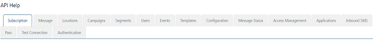

                           

API Help
========

Representational state transfer (REST) is an architectural style consisting of a coordinated set of architectural constraints applied to components, connectors, and data elements, within a distributed hypermedia system. REST API uses HTTP methods such as GET, POST, PUT, and PATCH to execute different operations pertaining to modules of Volt MX Engagement services console.

From the **Settings** section, click **API Help** from the left panel. The **API Help** page appears with 16 tabs. By default, the **Subscription** tab is set to active.

The APIs are braodly categorized in to the two categories:

[App Integration APIs](#app-integration-apis)

[Device Side APIs](#device-side-apis)

App Integration APIs
--------------------

The section contains the **App Integration** APIs:

Message, Locations, Campaigns, Segments, Users, Events, Templates, Configuration, Message Status, Access Management, Applications, Inbound SMS, Pass, Test Connection, and Authentication

Device Side APIs
----------------

The section contains the **Device side** APIs:

Subscription, Locations, and Message Status

> **_Important:_** For more detail about Engagement Services APIs, refer to [Engagement Services API Programming Guide](../../../../Foundry/engagement_api_guide/Content/Introduction_1.md).
