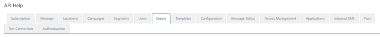

                           

Events
======

From the **Event** section, under **Engagement**, you can add events and configure them. Similarly, you can use REST APIs to add events and configure them.

From the **Settings** section, click **API Help** from the left panel. The API Access page appears with sixteen tabs: **Subscription**,**Message**, **Locations**, **Campaigns**,**Segments**, **Users**, **Events**, **Templates**, **Configuration**, **Message Status**, **Access Management**, **Applications**, **Inbound SMS**, **Pass**, **Test Connection** and **Authentication**. By default, the **Subscription** tab is set to active.

To view **Event** details, click the **Events** tab in the **API Help** screen. The **Events** tab displays following sections:

*   [Get All Events](#get-all-events)
*   [Get Event by ID](#get-event-by-id)
*   [Create Event](#create-event)
*   [Modify Event](#modify-event)
*   [Publish Event](#publish-event)
*   [Unpublish Event](#Unpublis)

For more details, see [Events](../../../../Foundry/vms_messaging_apis/Content/REST_API_Event/Event.md)

Get All Events
--------------

*   **URL**: Displays the sample HTTP URL to post input parameters for **Get All Events** services.
*   **Http Method**: Displays the http method as GET.
*   **Response Payload**: Displays the sample payload.

Get Event by ID
---------------

*   **URL**: Displays the sample HTTP URL to post input parameters for **Get Event by ID** services.
*   **Http Method**: Displays the http method as GET.
*   **Response Payload**: Displays the sample payload.

Create Event
------------

*   **URL****POST** : Displays the sample HTTP URL for Post method pertaining to Create Event services.
*   **Http Method**: Displays the http method as POST.
*   **Content-Type**:Displays the sample payload's request header content type as application/json.
*   **Request/Response Payload**:Displays the sample payload. for the POST method.

Modify Event
------------

*   **URL** **POST** : Displays the sample HTTP URL for Post method pertaining to Modify Event services.
*   **Http Method**: Displays the http method as POST.
*   **Content-Type**:Displays the sample payload's request header content type as application/json.
*   **Request/Response Payload**:Displays the sample payload. for the POST method.

Publish Event
-------------

*   **URL**: Displays the sample HTTP URL for the **POST** method and the **POST** method pertaining to **Publish Event** service.
*   **Http Method**: Displays the http method as POST.
*   **Response Payload**:Displays the sample payload. for the POST method.

Unpublish Event
---------------

*   **URL**: Displays the sample HTTP URL for the POST method pertaining to **Unpublish Event** service.
*   **Http Method**: Displays the http method as POST.
*   **Response Payload**:Displays the sample payload. for the POST method.
