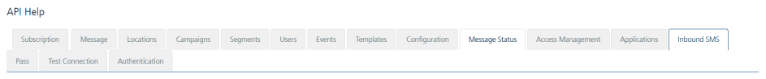

                           

Inbound SMS
===========

From the **Configuration** section, under **Settings**, you can configure inbound numbers and commands. Similarly, you can use REST APIs to configure inbound numbers and commands and configure them.

From the **Settings** section, click **API Help** from the left panel. The API Access page appears with sixteen tabs: **Subscription**,**Message**, **Locations**, **Campaigns**,**Segments**, **Users**, **Events**, **Templates**, **Configuration**, **Message Status**, **Access Management**, **Applications**, **Inbound SMS**, **Pass**, **Test Connection** and **Authentication**. By default, the **Subscription** tab is set to active.

To view **Inbound SMS** details, click the **Inbound SMS** tab in the **API Help** screen. The **Inbound SMS** tab displays following sections:

*   [Get Inbound Numbers](#get-inbound-numbers)
*   [Create Inbound Number](#create-inbound-number)
*   [Modify Inbound Number](#modify-inbound-number)
*   [Delete Inbound Number by ID](#delete-inbound-number-by-id)
*   [Get Inbound Command](#get-inbound-command)
*   [Create Inbound Command](#create-inbound-command)
*   [Modify Inbound Command](#modify-inbound-command)
*   [Delete Inbound Command](#delete-inbound-command)
*   [Inbound Request](#inbound-request)
*   [Get Inbound Status](#get-inbound-status)

For more details, see [Inbound SMS](../../../../Foundry/vms_messaging_apis/Content/REST_API__SMS/SMS_API.md)

Get Inbound Numbers
-------------------

*   **URL**: Displays the sample HTTP URL to get inbound numbers.
*   **Http Method**: Displays the http method as GET.
*   **Response Payload**: Displays the sample payload.

Create Inbound Number
---------------------

*   **URL**: Displays the sample HTTP URL to create inbound numbers.
*   **Http Method**: Displays the http method as POST.
*   **Content Type**: Displays the content type as application/json.
*   **Request/Response Payload**: Displays the sample payload.

Modify Inbound Number
---------------------

*   **URL**: Displays the sample HTTP URL to modify inbound numbers.
*   **Http Method**: Displays the http method as POST.
*   **Content Type**: Displays the content type as application/json.
*   **Request/Response Payload**: Displays the sample payload.

Delete Inbound Number by ID
---------------------------

*   **URL**: Displays the sample HTTP URL to delete an inbound number by its ID.
*   **Http Method**: Displays the http method as POST.
*   **Response Payload**: Displays the sample payload.

Get Inbound Command
-------------------

*   **URL**: Displays the sample HTTP URL to get inbound command details.
*   **Http Method**: Displays the http method as GET.
*   **Response Payload**: Displays the sample payload.

Create Inbound Command
----------------------

*   **URL**: Displays the sample HTTP URL to create inbound commands.
*   **Http Method**: Displays the http method as POST.
*   **Content Type**: Displays the content type as application/json.
*   **Request/Response Payload**: Displays the sample payload.

Modify Inbound Command
----------------------

*   **URL**: Displays the sample HTTP URL to modify inbound commands.
*   **Http Method**: Displays the http method as POST.
*   **Content Type**: Displays the content type as application/json.
*   **Request/Response Payload**: Displays the sample payload.

Delete Inbound Command
----------------------

*   **URL**: Displays the sample HTTP URL to delete inbound commands.
*   **Http Method**: Displays the http method as POST.
*   **Response Payload**: Displays the sample payload.

Inbound Request
---------------

*   **URL**: Displays the sample HTTP URL to raise an inbound request.
*   **Http Method**: Displays the http method as POST.
*   **Content Type**: Displays the content type as application/json.
*   **Request/Response Payload**: Displays the sample payload.

Get Inbound Status
------------------

*   **URL**: Displays the sample HTTP URL to get inbound status details.
*   **Http Method**: Displays the http method as GET.
*   **Request/Response Payload**: Displays the sample payload.
