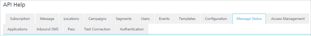

                           

Message Status
==============

From the **Adhoc** section, under **Engagement**, you can add push messages and configure them. Similarly, you can use REST APIs to add events and configure them.

From the **Settings** section, click **API Help** from the left panel. The API Access page appears with sixteen tabs: **Subscription**,**Message**, **Locations**, **Campaigns**,**Segments**, **Users**, **Events**, **Templates**, **Configuration**, **Message Status**, **Access Management**, **Applications**, **Inbound SMS**, **Pass**, **Test Connection** and **Authentication**. By default, the **Subscription** tab is set to active.

To view **Message Status** details, click the **Message Status** tab in the **API Help** screen. The **Message Status** tab displays following sections:

*   [Fetch Push Messages](#fetch-push-messages)
*   [Get Push Message Full Content](#get-push-message-full-content)
*   [Cancel Push Message Request](#cancel-push-message-request)
*   [Get Message Status by Request ID](#get-message-status-by-request-id)
*   [Get Rich Push Message Content](#get-rich-push-message-content)
*   [Fetch SMS Messages](#fetch-sms-messages)
*   [Get SMS Full Content](#get-sms-full-content)
*   [Cancel SMS Message Request](#cancel-sms-message-request)
*   [Fetch Email Messages](#fetch-email-messages)
*   [Get Email Full Content](#get-email-full-content)
*   [Cancel Email Message Request](#cancel-email-message-request)
*   [Get All File Statuses](#get-all-file-statuses)
*   [Get File Status](#get-file-status)
*   [Get All File Errors](#get-all-file-errors)

Fetch Push Messages
-------------------

*   **URL**: Displays the sample HTTP URL to fetch push messages.
*   **Http Method**: Displays the http method as POST.
*   **Content Type**: Displays the content type as application/json.
*   **Response Payload**: Displays the sample payload.

Get Push Message Full Content
-----------------------------

*   **URL**: Displays the sample HTTP URL to fetch full content of the push messages.
*   **Http Method**: Displays the http method as GET.
*   **Response Payload**: Displays the sample payload.

Cancel Push Message Request
---------------------------

*   **URL**: Displays the sample HTTP URL to cancel a push message request.
*   **Http Method**: Displays the http method as GET.
*   **Response Payload**: Displays the sample payload.

Get Message Status by Request ID
--------------------------------

*   **URL**: Displays the sample HTTP URL to get message status by request ID.
*   **Http Method**: Displays the http method as GET.
*   **Response Payload**: Displays the sample payload.

Get Rich Push Message Content
-----------------------------

*   **URL**: Displays the sample HTTP URL to get rich push message content.
*   **Http Method**: Displays the http method as GET.
*   **Response Payload**: Displays the sample payload.

Fetch SMS Messages
------------------

*   **URL**: Displays the sample HTTP URL to fetch SMS messages.
*   **Http Method**: Displays the http method as POST.
*   **Content Type**: Displays the content type as application/json.
*   **Request/Response Payload**: Displays the sample request and response payload.

Get SMS Full Content
--------------------

*   **URL**: Displays the sample HTTP URL to fetch the full SMS content.
*   **Http Method**: Displays the http method as GET.
*   **Response Payload**: Displays the sample response payload.

Cancel SMS Message Request
--------------------------

*   **URL**: Displays the sample HTTP URL to cancel the SMS request.
*   **Http Method**: Displays the http method as POST.
*   **Response Payload**: Displays the sample response payload.

Fetch Email Messages
--------------------

*   **URL**: Displays the sample HTTP URL to fetch email messages.
*   **Http Method**: Displays the http method as POST.
*   **Content Type**: Displays the content type as application /json.
*   **Request/Response Payload**: Displays the sample request and response payload.

Get Email Full Content
----------------------

*   **URL**: Displays the sample HTTP URL to fetch full email content.
*   **Http Method**: Displays the http method as GET.
*   **Response Payload**: Displays the sample response payload.

Cancel Email Message Request
----------------------------

*   **URL**: Displays the sample HTTP URL to cancel email message request.
*   **Http Method**: Displays the http method as POST
*   **Response Payload**: Displays the sample response payload.

Get All File Statuses
---------------------

*   **URL**: Displays the sample HTTP URL to get all file statuses.
*   **Http Method**: Displays the http method as GET.
*   **Response Payload**: Displays the sample response payload.

Get File Status
---------------

*   **URL**: Displays the sample HTTP URL to get the file status.
*   **Http Method**: Displays the http method as GET.
*   **Response Payload**: Displays the sample response payload.

Get All File Errors
-------------------

*   **URL**: Displays the sample HTTP URL to get the file errors.
*   **Http Method**: Displays the http method as GET.
*   **Response Payload**: Displays the sample response payload.
