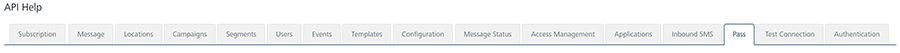

                           

Pass
====

From the **Template** section, under **Settings**, you can add passes and configure them. Similarly, you can use REST APIs to add passes and configure them.

From the **Settings** section, click **API Help** from the left panel. The API Access page appears with sixteen tabs: **Subscription**,**Message**, **Locations**, **Campaigns**,**Segments**, **Users**, **Events**, **Templates**, **Configuration**, **Message Status**, **Access Management**, **Applications**, **Inbound SMS**, **Pass**, **Test Connection** and **Authentication**. By default, the **Subscription** tab is set to active.

To view **Pass** details, click the **Pass** tab in the **API Help** screen. The **Pass** tab displays following sections:

*   [Get Pass Meta Data](#get-pass-meta-data)
*   [Get Pass Meta Data by Audience ID](#get-pass-meta-data-by-audience-id)
*   [Get Pass Status](#get-pass-status)
*   [Get Pass Content](#get-pass-content)
*   [Distribute Pass](#distribute-pass)
*   [Distribute Pass with Import](#distribute-pass-with-import)
*   [Update Pass](#update-pass)
*   [Update Pass with Import](#update-pass-with-import)
*   [Cancel Pass Request](#cancel-pass-request)

Get Pass Meta Data
------------------

*   **URL** : Displays the sample HTTP URL to get pass metadata details.
*   **Http Method**: Displays the http method as GET.
*   **Response Payload**:Displays the sample payload. for the GET method.

Get Pass Meta Data by Audience ID
---------------------------------

*   **URL** : Displays the sample HTTP URL to get pass metadata details through an audience ID.
*   **Http Method**: Displays the http method as GET.
*   **Response Payload**:Displays the sample payload. for the GET method.

Get Pass Status
---------------

*   **URL** : Displays the sample HTTP URL to get the current pass status.
*   **Http Method**: Displays the http method as GET.
*   **Response Payload**:Displays the sample payload. for the GET method.

Get Pass Content
----------------

*   **URL** : Displays the sample HTTP URL to get the pass content.
*   **Http Method**: Displays the http method as GET.
*   **Response Payload**:Displays the sample payload. for the GET method.

Distribute Pass
---------------

*   **URL** : Displays the sample HTTP URL to get the pass content.
*   **Http Method**: Displays the http method as POST.
*   **Content Type**: Displays the content trype as application/json.
*   **Response Payload**:Displays the sample payload. for the POST method.

Distribute Pass with Import
---------------------------

*   **URL** : Displays the sample HTTP URL to distribute passes with import option (pkPass file).
*   **Http Method**: Displays the http method as POST.
*   **Content Type**: Displays the content trype as application/json.
*   **Response Payload**:Displays the sample payload. for the POST method.

Update Pass
-----------

*   **URL** : Displays the sample HTTP URL to update passes.
*   **Http Method**: Displays the http method as POST.
*   **Content Type**: Displays the content trype as application/json.
*   **Response Payload**:Displays the sample payload. for the POST method.

Update Pass with Import
-----------------------

*   **URL** : Displays the sample HTTP URL to update passes with import option.
*   **Http Method**: Displays the http method as POST.
*   **Content Type**: Displays the content trype as application/json.
*   **Response Payload**:Displays the sample payload. for the POST method.

Cancel Pass Request
-------------------

*   **URL** : Displays the sample HTTP URL to cancel a pass request.
*   **Http Method**: Displays the http method as GET.
*   **Response Payload**:Displays the sample payload for the GET method.
