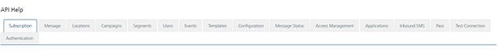

                           

Templates
=========

From the **Templates** section, under **Settings**, you can add templates and configure them. Similarly, you can use REST APIs to add templates and configure them.

From the **Settings** section, click **API Help** from the left panel. The API Access page appears with sixteen tabs: **Subscription**,**Message**, **Locations**, **Campaigns**,**Segments**, **Users**, **Events**, **Templates**, **Configuration**, **Message Status**, **Access Management**, **Applications**, **Inbound SMS**, **Pass**, **Test Connection** and **Authentication**. By default, the **Subscription** tab is set to active.

To view **Templates** details, click the **Templates** tab in the **API Help** screen. The **Templates** tab displays following sections:

*   [Get All Email Templates](#get-all-email-templates)
*   [Get Email Template By ID](#get-email-template-by-id)
*   [Create Email Template](#create-email-template)
*   [Modify Email Template](#modify-email-template)
*   [Delete Email Template By ID](#delete-email-template-by-id)
*   [Get All SMS Templates](#get-all-sms-templates)
*   [Get SMS Template by ID](#get-sms-template-by-id)
*   [Create SMS Template](#create-sms-template)
*   [Modify SMS Template](#modify-sms-template)
*   [Delete SMS Template by ID](#delete-sms-template-by-id)
*   [Get All Push Templates](#get-all-push-templates)
*   [Get Push Template by ID](#get-push-template-by-id)
*   [Create Push Template](#create-push-template)
*   [Modify Push Template](#modify-push-template)
*   [Delete Push Template by ID](#delete-push-template-by-id)
*   [Get All Pass Templates](#get-all-pass-templates)
*   [Get Pass Template by ID](#get-pass-template-by-id)
*   [Create Pass Template](#create-pass-template)
*   [Modify Pass Template](#modify-pass-template)
*   [Delete Pass Template by ID](#delete-pass-template-by-id)

Get All Email Templates
-----------------------

*   **URL**: Displays the sample HTTP URL to get all the email templates.
*   **Http Method**: Displays the http method as GET.
*   **Response Payload**:Displays the sample payload. for the GET method.

Get Email Template By ID
------------------------

*   **URL**: Displays the sample HTTP URL to get an email template by its ID.
*   **Http Method**: Displays the http method as GET.
*   **Response Payload**:Displays the sample payload. for the GET method.

Create Email Template
---------------------

*   **URL**: Displays the sample HTTP URL to create an email template.
*   **Http Method**: Displays the http method as POST.
*   **Content Type**: Displays the content type as application/json.
*   **Request/Response Payload**:Displays the sample request and response payload. for the Post method.

Modify Email Template
---------------------

*   **URL**: Displays the sample HTTP URL to modify an email template.
*   **Http Method**: Displays the http method as PUT.
*   **Content Type**: Displays the content type as application/json.
*   **Request/Response Payload**:Displays the sample request and response payload. for the PUT method.

Delete Email Template By ID
---------------------------

*   **URL**: Displays the sample HTTP URL to delete an email template through its ID.
*   **Http Method**: Displays the http method as DELETE.
*   **Request/Response Payload**:Displays the sample response payload.

Get All SMS Templates
---------------------

*   **URL**: Displays the sample HTTP URL to get all the SMS template details.
*   **Http Method**: Displays the http method as GET.
*   **Request/Response Payload**:Displays the sample response payload. for the GET method.

Get SMS Template by ID
----------------------

*   **URL**: Displays the sample HTTP URL to get all the SMS template details by specific ID.
*   **Http Method**: Displays the http method as GET.
*   **Response Payload**:Displays the sample response payload for the GET method.

Create SMS Template
-------------------

*   **URL**: Displays the sample HTTP URL to create SMS templates.
*   **Http Method**: Displays the http method as POST.
*   **Content Type**: Displays the content type as application/json.
*   **Response Payload**:Displays the sample request and response payloads for the POST method.

Modify SMS Template
-------------------

*   **URL**: Displays the sample HTTP URL to modify SMS templates.
*   **Http Method**: Displays the http method as PUT.
*   **Content Type**: Displays the content type as application/json.
*   **Response Payload**:Displays the sample request and response payloads for the PUT method.

Delete SMS Template by ID
-------------------------

*   **URL**: Displays the sample HTTP URL to delete SMS templates.
*   **Http Method**: Displays the http method as DELETE.
*   **Response Payload**:Displays the sample request and response payloads for the DELETE method.

Get All Push Templates
----------------------

*   **URL**: Displays the sample HTTP URL to get all the push templates.
*   **Http Method**: Displays the http method as GET.
*   **Response Payload**:Displays the sample response payloads for the GET method.

Get Push Template By ID
-----------------------

*   **URL**: Displays the sample HTTP URL to get all the push templates through the template ID.
*   **Http Method**: Displays the http method as GET.
*   **Response Payload**:Displays the sample response payloads for the GET method.

Create Push Template
--------------------

*   **URL**: Displays the sample HTTP URL to create push templates.
*   **Http Method**: Displays the http method as POST.
*   **Content Type**: Displays the content type as application/json.
*   **Response Payload**:Displays the sample request and response payloads for the POST method.

Modify Push Template
--------------------

*   **URL**: Displays the sample HTTP URL to modify push templates.
*   **Http Method**: Displays the http method as PUT.
*   **Content Type**: Displays the content type as application/json.
*   **Response Payload**:Displays the sample request and response payloads for the PUT method.

Delete Push Template by ID
--------------------------

*   **URL**: Displays the sample HTTP URL to delete push templates.
*   **Http Method**: Displays the http method as DELETE.
*   **Response Payload**:Displays the sample request and response payloads for the DELETE method.

Get All Pass Templates
----------------------

*   **URL**: Displays the sample HTTP URL to get all the pass templates.
*   **Http Method**: Displays the http method as GET.
*   **Response Payload**:Displays the sample response payloads for the GET method.

Get Pass Template by ID
-----------------------

*   **URL**: Displays the sample HTTP URL to get a pass template through its ID.
*   **Http Method**: Displays the http method as GET.
*   **Response Payload**:Displays the sample response payloads for the GET method.

Create Pass Template
--------------------

*   **URL**: Displays the sample HTTP URL to create a pass template.
*   **Http Method**: Displays the http method as POST.
*   **Content Type**: Displays the content type as application/json.
*   **Request/Response Payload**:Displays the sample response payloads for the POST method.

Modify Pass Template
--------------------

*   **URL**: Displays the sample HTTP URL to modify a pass template.
*   **Http Method**: Displays the http method as PUT.
*   **Content Type**: Displays the content type as application/json.
*   **Request/Response Payload**:Displays the sample response payloads for the PUT method.

Delete Pass Template By ID
--------------------------

*   **URL**: Displays the sample HTTP URL to delete a pass template.
*   **Http Method**: Displays the http method as DELETE.
*   **Response Payload**:Displays the sample response payloads for the DELETE method.
