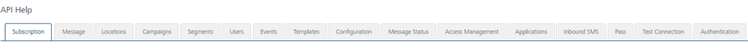

                           

Users
=====

From the **Subscribers** section, under **Overview**, you can add users. Similarly, you can use REST APIs to add users.

From the **Settings** section, click **API Help** from the left panel. The API Access page appears with sixteen tabs: **Subscription**,**Message**, **Locations**, **Campaigns**,**Segments**, **Users**, **Events**, **Templates**, **Configuration**, **Message Status**, **Access Management**, **Applications**, **Inbound SMS**, **Pass**, **Test Connection** and **Authentication**. By default, the **Subscription** tab is set to active.

To view **Users** details, click the **Users** tab in the **API Help** screen. The **Users** tab displays following sections:

*   [Get All Users](#get-all-users)
*   [Get User by ID](#get-user-by-id)
*   [Create User](#create-user)
*   [Modify User](#modify-user)
*   [Delete User by ID](#delete-user-by-id)
*   [Import Users](#import-users)
*   [Get Subscribed User by KSID](#get-subscribed-user-by-ksid)
*   [Subscribe User](#subscribe-user)

Get All Users
-------------

*   **URL**: Displays the sample HTTP URL to get all user details.
*   **Http Method**: Displays the http method as GET.
*   **Response Payload**: Displays the sample payload.

Get User by ID
--------------

*   **URL**: Displays the sample HTTP URL to get a user details by specific user ID.
*   **Http Method**: Displays the http method as GET.
*   **Response Payload**: Displays the sample payload.

Create User
-----------

*   **URL**: Displays the sample HTTP URL to create a user.
*   **Http Method**: Displays the http method as POST.
*   **Content Type**: Displays the content type as application/json.
*   **Response Payload**: Displays the sample payload.

Modify User
-----------

*   **URL**: Displays the sample HTTP URL to modify a user.
*   **Http Method**: Displays the http method as PUT.
*   **Content Type**: Displays the content type as application/json.
*   **Response Payload**: Displays the sample payload.

Delete User by ID
-----------------

*   **URL**: Displays the sample HTTP URL to delete a user by specific ID.
*   **Http Method**: Displays the http method as DELETE.
*   **Response Payload**: Displays the sample payload.

Import Users
------------

*   **URL**: Displays the sample HTTP URL to import users.
*   **Http Method**: Displays the http method as POST.
*   **Response Payload**: Displays the sample payload.

Get Subscribed User by KSID
---------------------------

*   **URL**: Displays the sample HTTP URL to subscribe users by KSID.
*   **Http Method**: Displays the http method as GET.
*   **Response Payload**: Displays the sample payload.

Subscribe User
--------------

*   **URL**: Displays the sample HTTP URL to subscribe users.
*   **Http Method**: Displays the http method as POST.
*   **Content Type**: Displays the content type as application/json.
*   **Request/Response Payload**: Displays the sample payload.
