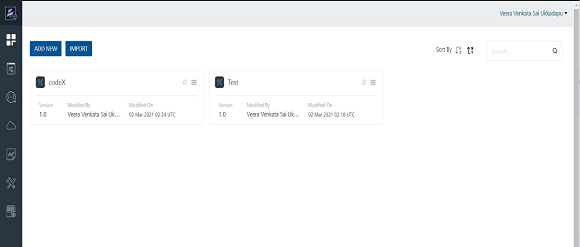
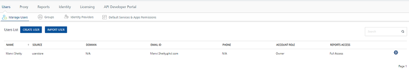
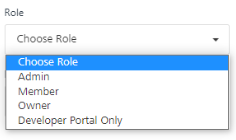
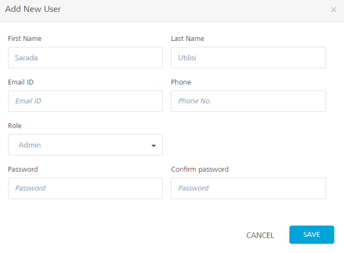
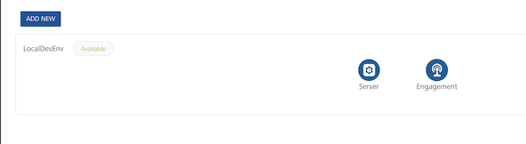
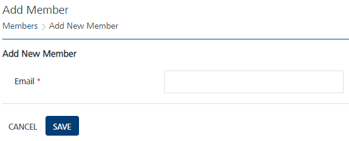
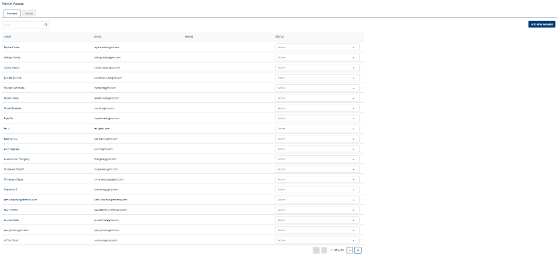

                           

Adding a Member from Volt MX Foundry Console
===========================================

When an Engagement Services user wants to access the services of Volt MX Foundry, you need to add the member through Volt MX Foundry console so the member can access the Volt MX Foundry services. There are two methods to add a member through Volt MX Foundry console.

First Method
------------

Based on requirement, you can add a member through Volt MX Foundry console and assign the role as Admin, Member or Owner. Based on assigned role the member have all the permissions to access Volt MX Engagement Services.

**To add a new member to Volt MX Foundry Engagement Services through Volt MX Foundry console, follow these steps**:

1.  Open an Internet browser.
2.  Enter the Volt MX Foundry console URL in the address field in the browser.
    
    Volt MX Foundry Console URL is `http://<IP/Hostname>:<serverport> /mfconsole`
    
3.  Press the **Enter** key.
    
    The **Sign in to Volt MX Foundry** page appears.
    
4.  Enter details for the following fields:
    1.  **Email**: Enter your email ID in the email field.
    2.  **Password**: Enter your password in the password field.
    3.  **Source**: Select the appropriate source from the drop-down list.
5.  Click the **Sign in** button.
    
    The **VoltMX Foundry** home page appears. By default, the **Applications** page is set to active.
    
    
    
6.  Click **Settings** from the left panel.
    
    The **User Management** page appears.
    
    
    
7.  Click the **Create User** button to create a new user.
    
    The **Add New User** drop-down window appears.
    
8.  To create a new user, enter details for the following fields:
    
    1.  **First Name**: Enter the first name of the member in the first name field.
    2.  **Last Name**: Enter the last name of the member in the last name field.
    3.  **Email ID**: Enter email ID of the user.
    4.  **Phone**: Enter the phone number of the user.
    5.  **Role**: Select the appropriate role from the Role drop-down list as **Admin**, **Member** or **Owner**.
        
        
        
    6.  **Password**: Enter a password for the user.
    7.  **Confirm Password**: Re-enter the password to confirm it.
        
        > **_Note:_** The password must contain at least six characters, and maximum 20 characters including upper case letters, lower case letters, and numbers.
        
    
    
    
9.  Click **Cancel** if you do not want to add the new member.
10.  Click **Save**. The newly added member appears in the **User** list view on the User Management page.
11.  Next, login into Volt MX Foundry Engagement Services console with below URL with the same credentials created for Volt MX Foundry Console.
    
    http://<IP/Hostname>:<serverport> /vpns
    
    The added member is displayed under the **Member** list on the **Admin Access** home page. The added member have all the permissions. Based on your requirements, you can add the member to a group.
    

Second Method
-------------

In this scenario the member already exists for Engagement Services. You need to create the same user with in Volt MX Foundry to map the user from Engagement Services.

To add a new member, follow these steps:

1.  Click the **Environments** link from the left panel.
    
    The **Environments** page appears. The Environments page displays a table with Environment Name with the corresponding features. Click Engagement under the Features section.
    
    
    
    The **Engagement Services** home page appears. By default it is set to **Dashboard** page.
    
2.  Click **Admin Access** link under the **Settings** section.
    
    The **Admin Access** home page appears.
    
3.  Click the **Add New Member** button.
    
    The **Add Member** page appears.
    
    
    
4.  Enter the email id of the new member in the **Email** field and click **Save**.
5.  The newly added member appears in the Member’s list view on the Member home page.
    
    
    
6.  Click the newly added member name under the **Name** column in the Member’s list view.
7.  The **Member Details** page appears. Based on requirements, you can add group and permissions to the user.
