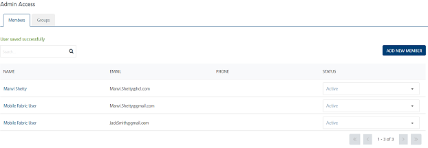

                            

Admin Access
============

The **Admin Access** section includes **Members** and **Groups**. The access to **Members** and **Groups** module is privileged only to an administrator user.

The **Members** module deals with adding members, editing member's profiles, activate or deactivate members, and assigning, or unassigning groups to the members.

Groups are a set of similar users that provide a flexible way to define compound access rights as a whole. The Admin user manages different types of user groups within an organization. Groups are useful when you have two entities to work on a common issue. For example, a campaign manager and team members can handle a campaign issue collaboratively by creating a group.

> **_Important:_** As a user, you must have the following permissions to access the Admin Access home page and perform different tasks based on the role:  
  
\- ROLE\_ADMIN\_ACCESS  

The following table explains about all permission types with their description:

  
| Permissions | Description |
| --- | --- |
| `ROLE_DASHBOARD_ALL` | The permissions enables to access the Dashboard screen and view different dashboard reports. |
| `ROLE_APPLICATIONS_ALL` | The permission enables to access the Apps home page and perform the following tasks: - Adding an Application - Publishing an Application - Viewing an Application - Modifying an Application - Deleting an Application |
| `ROLE_DEVICES_ALL` | The permission enables to access the Devices tab under the Subscribers home page and perform the following tasks:- View a device details - Activate or inactivate a subscription from a device - Delete a subscription |
| `ROLE_USERS_ALL` | The permission enables to access the Users tab under the Subscribers home page and perform the following tasks: - Adding a User - Viewing a User - Modifying a User - Deleting a User - Importing Users - Activating or Inactivating a User - Subscribing or Unsubscribing a Channel |
| `ROLE_CREATE_ATTRIBUTES` | The permission enables to access the User Attributes tab under the Configuration home page and perform the following task: - Adding a User Attribute- Modifying a User Attribute |
| `ROLE_CAMPAIGNS_ALL` | The permission enables to access the Campaigns home page and perform the following tasks: - Adding a Campaign - Pausing a Campaign - Resuming a Campaign - Setting Message Priority - Modifying a Campaign - Viewing Campaign Reports - Deleting a Campaign |
| `ROLE_CAMPAIGNS_EXECUTIVE` | The permission enables to access the Campaigns home page and start a campaign. |
| `ROLE_CAMPAIGNS_TERMINATE` | The permission enables to access the Campaigns home page and terminate the campaign. |
| `ROLE_EVENTS_ALL` | The permission enables to access the Events home page and perform the following tasks: - Adding an Event - Activating an Event - Modifying an Event - Reactivating Modified Events - Exporting Events - Importing Events- Viewing Event Reports - Deleting an Event |
| `ROLE_EVENTS_PUBLISH` | The permission enables to access the Events home page and publish events. |
| `ROLE_SEGMENTS_ALL` | The permission enables to access the Segments and Location home page and perform the following tasks: - Adding a Segment - Modifying a Segment - Deleting a Segment - Adding a Geofence - Importing Geofences - Exporting Geofences - Modifying a Geofence - Deleting a Geofence - Adding a Beacon - Modifying a Beacon - Deleting a Beacon |
| `ROLE_TEMPLATES_ALL` | The permission enables to access the Templates home page and perform the following tasks: - Adding Templates (push, email, SMS, and pass) - Modifying Templates (push, email, SMS, and pass)- Exporting Templates (push, email, SMS, and pass)- Importing Templates (push, email, SMS, and pass)- Deleting Templates (push, email, SMS, and pass) |
| `ROLE_ADHOC_EMAIL` | The permission enables to access the Adhoc home page and perform the following tasks: - Sending email message to users and segments |
| `ROLE_ADHOC_PASS` | The permission enables to access the Adhoc home page and perform the following tasks: - Sending pass message to users and segments |
| `ROLE_ADHOC_PUSH` | The permission enables to access the Adhoc home page and perform the following tasks: 1. Sending push message to Users OR Segments. 2\. You can specify or provide access to specific application to the users to which the user can send push messages. |
| `ROLE_ADHOC_SMS` | The permission enables to access the Adhoc home page and perform the following tasks: - Sending SMS message to users and segments |
| `ROLE_ADMIN_ACCESS` | The permission enables to access the Admin Access home page to perform the following tasks: - Adding a Member - Adding a Member from Volt MX Foundry Console - Inactivating a Member - Modifying a Member - Assigning or Unassigning Groups to a Member - Assigning or Unassigning Permissions to a Member - Resetting a Member Password - Deleting a Member - Adding a Group - Modifying a Group - Assigning or Unassigning Users to a Group - Assigning or Unassigning Permissions to a Group- Deleting a Group |
| `ROLE_CONFIGURATIONS` | The permission enables to access the Configuration home page to configure the following tasks: - User Attributes - General Configuration - Email Configuration - SMS Configuration - Pass Configuration The permission enables to access the Configuration home page to view the following pages: - Audit Trail\- Logging - Health Check - Job Monitor The permission to access the Configuration page enables to access the Status page and view: - Push Queue - Email Queue - SMS Queue - Pass Queue - File Upload - Inbound SMS |
| `ROLE_LOGGING_ALL` | The permission is not required for cloud version. It allows you to have access to change the log levels. |

  
From the **Settings** section, click **Admin Access** from the left panel. The **Admin Access** page appears with two tabs: **Members** and **Groups**. By default the **Members** tab is set to active.

Select a link in the list to view:

*   [Members](Users.md)
*   [Groups](Groups.md)
