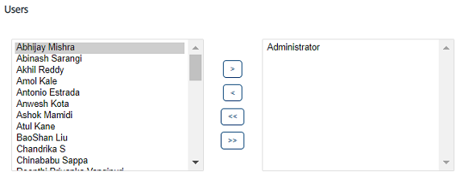

                             

Assigning or Unassigning Members to a Group
===========================================

Based on requirements, you can assign or unassign members to a group.

To assign or unassign members to a group, follow these steps:

1.  On the **Groups** home page ,under the **Group Name** column, click the required group name.
    
    The **Group Details** page appears.
    
    
    
2.  Select a member from the left pane, and click the **right arrow** to assign the selected member. You can click the **double-right arrow** to assign all the members from the left pane to the group.
3.  Select a member from the right pane, and then click **left arrow** to unassign the selected member. You can click the **double-right arrow** to unassign all the members from the group.
4.  Click the **Cancel** button if you do not want to assign or unassign members to a group. The system displays the **Groups** page without saving any information.
5.  Click the **Save** button.  
    The updated group appears in the Groups list view with a confirmation message that the group updated successfully.
