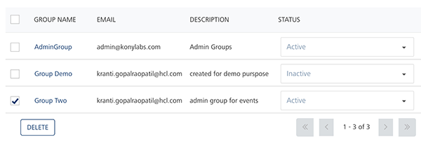
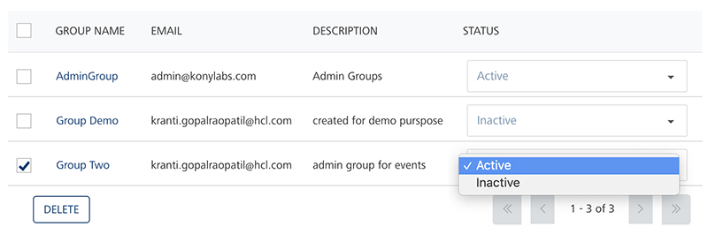
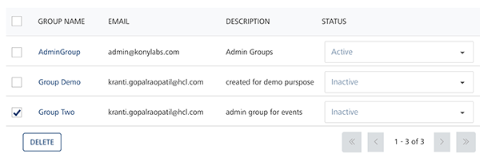

                             

Deleting a Group
================

Based on requirement, you can delete a group. You can delete only those group with status as Inactive from Volt MX Foundry Engagement Services. You can either select any one group to delete or all the listed groups at one go and delete them.

To delete a group, follow these steps:

1.  On the Groups page, select the check box next to the Group name from the list view.
    
    
    
2.  Under the **Status** column, select the status from **Active** to **Inactive**.
    
    
    
3.  The system displays the notification dialog box that the group inactivated successfully. Click **Ok** to continue.
    
    The group status changes to inactive.
    
    
    
4.  Click the **Delete** button.
    
    The system displays the **Confirm Delete** dialog box, asking if you want to delete the selected group(s).
    
5.  Click the **Cancel** button to close the **Confirm Delete** dialog. The system displays the **Groups** page.
6.  Click **OK** to continue.
    
    The system displays the confirmation message that the group with inactive status deleted successfully.
