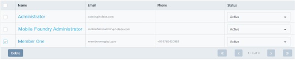
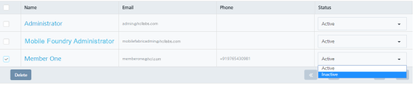
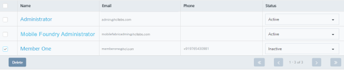

                             

Deleting a Member
=================

Based on requirement, you can delete a member. Members configured with status as Inactive only are allowed to be deleted from Volt MX Foundry Engagement Services. You can either select any one member to delete or all the listed members at one go and delete them.

To delete a member, follow these steps:

1.  On the **Members** page, select the check box next to the **Member** name from the list view.
    
    
    
2.  Under the **Status** column, select the status from **Active** to **Inactive**.
    
    
    
3.  The system displays the notification dialog box that the member inactivated successfully. Click **Ok** to continue.
    
    The member status changes to inactive.
    
    
    
4.  Click the **Delete** button.
    
    The system displays the **Confirm Delete** dialog box, asking if you want to delete the selected member.
    
5.  Click the **Cancel** button to close the **Confirm Delete** dialog. The system displays the **Members** page.
6.  Click **OK** to continue.
    
    The system displays the confirmation message that members with inactive status deleted successfully.
