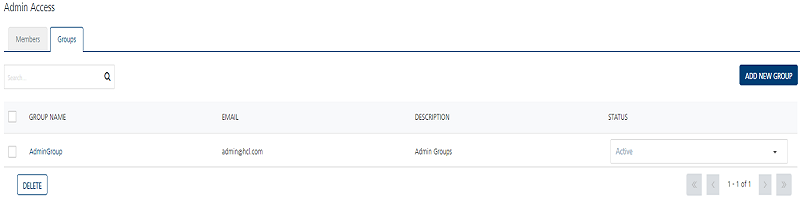
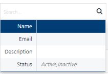
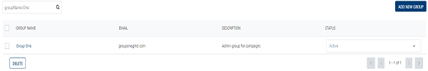
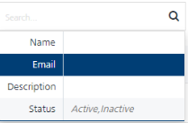
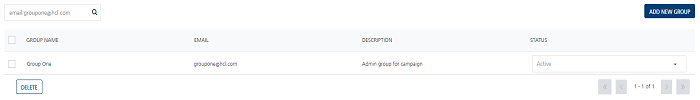
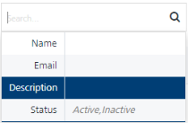
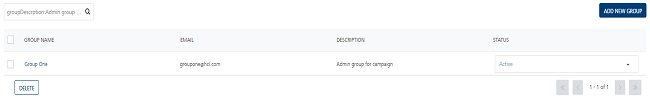
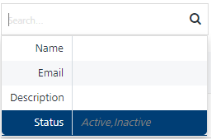
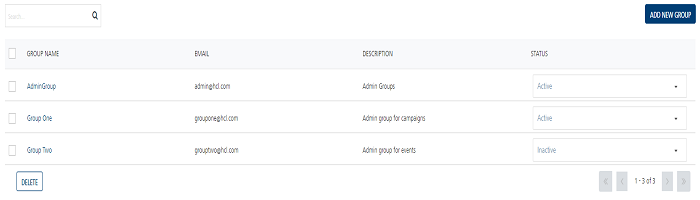

                              

Groups
======

The **Admin Access** home page displays two tabs: **Members** and **Groups**. By default the **Members** tab is set to active.

The **Groups** page displays the following details:

*   **Add New Group** button: The button helps you add new groups to the list.
*   **Search** field: Click in the **Search** field to view options to search a group. You can search groups based on the following search criteria:
    *   **Group Name**: Enter the group name in the Search field and click **Enter**.
        
        
        
        The required group’s information appears in the list view.
        
        
        
    *   **Email**: Enter the group's email address in the Search field and click **Enter**.
        
        
        
        The required group’s information appears in the list view.
        
        
        
    *   **Description**: Enter the description of the group in the Search field and click **Enter**.
        
        
        
        The required group’s information appears in the list view.
        
        
        
    *   **Status**: Enter the status as active or inactive in the search field and click **Enter**.
        
        
        
        The required groups appear in the list view.
        
        
        

The Groups list view contains the following details:

  
| Group Columns | Description |
| --- | --- |
| Group Name | The column displays the group name.  |
| Email | The column displays emails of the groups. |
| Description | The column displays description of the groups. |
| Status | The status column displays status of the groups as Active or Inactive.  |
| Delete button | The button helps you delete a group from the list. |
| Display controls | By default, the number range is set to 20 so that only 20 rows are displayed in the grid. You can view more screens by navigating through the forward arrow icon. You can move back through the back arrow icon. |

  
You can perform the following tasks from the Groups page.

*   [Adding a Group](Adding_a_Group.md)
*   [Modifying a Group](Modifying_a_Group.md)
*   [Assigning or Unassigning Users to a Group](Assigning_or_Unassigning_Users_to_Groups.md)
*   [Assigning or Unassigning Permissions to a Group](Assigning_or_Unassigning_Permissions_to_a_Group.md)
*   [Deleting a Group](Deleting_a_Group.md)
