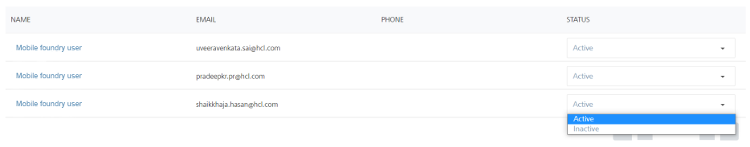

                           

Inactivating Members
====================

Based on your requirement, you can inactivate a member. You cannot bind an inactivated member to directory as the authentication operation fails.

To inactivate a member, follow these steps:

1.  To inactivate a member, under the **Status** column, select the check box next to the Member's name in the list view.
2.  Under the **Status** column, select the status as **Inactive**, from the drop-down list.
    
    
    
    The system displays the confirmation message that the member is inactivated successfully.
    
3.  To activate a member, under the **Status** column, select the check box next to the Member's name in the list view.
4.  Under the **Status** column, select the status as active, from the drop-down list.
    
    The system displays the confirmation message that the member is activated successfully.
