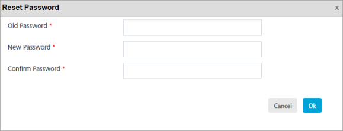

                             

Resetting a Member Password
===========================

Based on requirement, you can reset the password of a member. A valid password is must to access Volt MX Foundry Engagement Services console.

To reset a password, follow these steps:

1.  On the **Member Details** page, click the **Reset Password** button.
    
    The **Reset Password** window appears.
    
    
2.  Enter details for the following fields:
    *   **Old Password**: Enter your existing password in the **Old Password** text box.
    *   **New Password**: Enter your new password in the **New Password** text box.
    *   **Confirm Password**: Re-enter the new password in the **Confirm Password** text box.
        
        > **_Note:_** The fields with a red asterisk are mandatory.
        
3.  If you do not want to update the password, click the **Cancel** button.
    
    The system displays the **Member Details** page without saving any information.
    
4.  Click the **OK** button.
    
    The system resets the password and displays the **Member Details** page.
