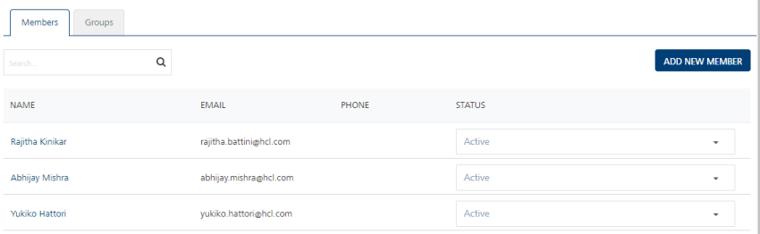
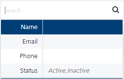
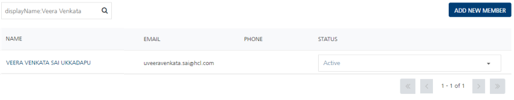
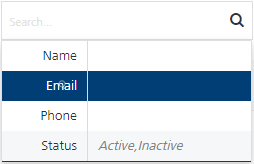
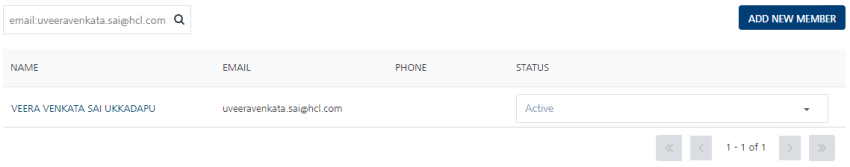
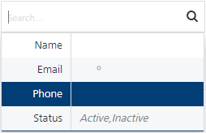
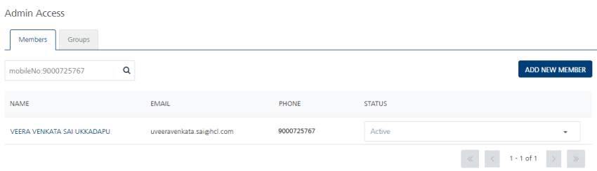
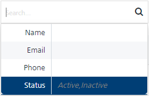
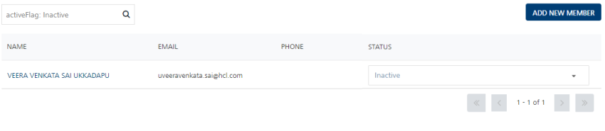

                              

Members
=======

By default the **Members** tab is set to active.

The **Members** page displays the following details:

*   **Add New Member** button: The button helps you add new members to the list.
*   **Search** field: Click in the **Search** field to view options to search a member. You can search members based on the following criteria:
    *   **Name**: Enter the member name in the Search field and click **Enter**.
        
        
        
        The required member's information appears in the list view.
        
        
        
    *   **Email**: Enter the email ID of the member in the Search field and click **Enter**.
        
        
        
        The required member's information appears in the list view.
        
        
        
    *   **Phone**: Enter the phone number of the member in the Search field and click **Enter**.
        
        
        
        The required member's information appears in the list view.
        
        
        
    *   **Status**: Enter the member status in the search field and click **Enter**.
        
        
        
        The required member's information appears in the list view.
        
        
        
        > **_Note:_** To clear your search result, click in the Search field to view the Members page.
        

The Members list view contains the following details:

  
| Member Columns | Description |
| --- | --- |
| Name | The column displays names of the members who are added into the list. |
| Email | The column displays email addresses of the members. |
| Phone | The column displays the phone numbers of the members. |
| Status | The column displays status of the members as Active or Inactive. |
| Delete button | The button helps you delete users from the console. |
| Display controls | By default, the number range is set to 20 so that only 20 rows are displayed in the grid. You can view more members through the forward arrow icon. You can navigate back through the backward arrow icon. |

  
You can perform the following tasks from the Members page:

*   [Adding a Member](Adding_a_User.md)
*   [Adding a Member from Volt MX Foundry Console](Adding_a_Member_from_Foundry_Console.md)
*   [Inactivating a Member](Inactivating_Users.md)
*   [Modifying a Member](Modifying_a_User.md)
*   [Assigning or Unassigning Groups to a Member](Assigning_or_Unassigning_Groups_to_Users.md)
*   [Assigning or Unassigning Permissions to a Member](Assigning_or_Unassigning_Permissions_to_a_User.md)
*   [Resetting a Member Password](Resetting_User_Password.md)
*   [Deleting a Member](Deleting_a_User.md)
