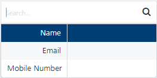
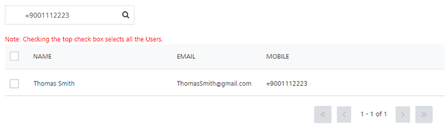
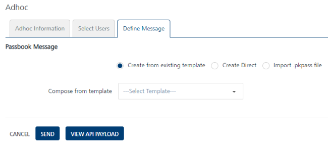

                             

Passbook Message
================

Passes can be distributed to customers through a link provided in email or SMS. Most passes are redeemable by scanning a barcode on the front of the pass. If a user subscribes for pass updates, then the user will also get latest pass by a push message. Clicking on the push message, will auto install latest passes. You can write messages through the Passbook Message screen that can be used for coupons, boarding passes, and tickets.

You can do following in Passbook Message View:

*   Send passbook message with an option to use or edit an existing passbook template.
*   Select segments or users to whom the passbook message will need to be sent.
*   Set start and expiry time.

To add a Passbook message for users, follow these steps:

1.  From the **Engagement** section, click **Adhoc** from the left panel. The Adhoc screen appears with three tabs including:
    
    *   [Adhoc Information](#adhoc-information)
    *   [Select User](#select-user)
    *   [Define Message](#define-pass-message)
    
    Adhoc Information
    -----------------
    
    By default, the Adhoc Information tab is set to active.
    
2.  **Select Channel**: Select the pass message channel from the drop-down list.
    
    
    
3.  Send Message: By default, the send message option is set to Now. If you want to send the pass message on a specific date, then you need to choose the Later option. For more details [see](Set_Start_and_Expiry_Time_-_pass.md)
4.  Click the **Next -Select Users** button to continue.
    
    Select User
    -----------
    
    The Select Users tab becomes active.
    
    Since a pass is distributed by SMS and/or email, users who have opted in for those channels are the target users. If a pass is distributed by email, then users should have opted in for emails also to receive the pass.
    
5.  Based on your requirement, select the option as **Users** or **Segment**. By default, the User Information option button is set to Users. The User's list view is populated with the existing list of users.
    
    *   [Users](#users)
    *   [Segments](passsegment.md)
    
    ### Users
    
6.  When you select the option as users, the system displays the user's list view with following details:
    
    
    
    > **_Note:_** If no user is added to the console, then the user screen displays the following message: No User Found.
    
    The Users list view includes the Name, Email and Mobile columns. There is a search field to search users.
    
    *   **Search** field: Click in the search field to view available options to search for a user. You can search users based on the following search criteria:

        
    *   **Name**: Enter the required name in the search field and click **Enter**.

            
        

            
        The users appears on the home page. To view the select users’ page, clear the search field and click Enter.

            
        

            
        *   **Email:** Enter the email ID of the required user in the search field and click **Enter**.

            
        

            
        The users appears on the home page. To view the select users’ page, clear the search field and click Enter.

            
        

            
        *   **Mobile Number**: Enter the mobile number of the required user.

            
        

            
        The users appears on the home page. To view the select users’ page, clear the search field and click Enter.

            
        
            
        
        The Users list view displays the following details:
        
        | Users Element | Description |
        | --- | --- |
        | Name | The name column displays names of the added users. The Name column contains a combination of the First Name and the Last Name of the added users. |
        | Email | The email column displays the email addresses of the added users. |
        | Mobile | The mobile column displays the mobile numbers of the added users. |
        | Display controls: | By default, only 20 users are displayed in the list view. You can view more screens by navigating through the forward arrow icon. You can navigate back through the backward arrow icon. |
        
7.  Click **Cancel** if you do not want to create a pass message.
8.  Select the required users from the list view to send pass message.
9.  Click **Next -Define Message** to continue.
    
    Define Pass Message
    -------------------
    
10. You can create a passbook message through following options:
    
    *   [Create from existing template](#create-from-existing-template)
    *   [Create Direct](#create-direct)
    *   [Import .pkpass file](#import-pkpass-file)
    
    
    
    ### Create from existing template
    
11. **Create from existing template**: By default, this option is set to active. Select the required template from the **Compose from template** drop-down list.
    
    
    
12. The selected template details appears on the screen.
    
    
    
13. Based on your requirement, you can update the existing template. To know more about how to update an existing template, refer [Adding a Passbook Template](../PassBook_Template/Passbook_Template.md#dding_a_Passbook_Template)
    
    ### Create Direct
    
14. **Create Direct**: Select the option as **Create Direct**.
    
    Details pertaining to add a new pass template appears on screen.
    
    
    
15. Based on your requirement, you can select a pass type and create a new passbook template. To know more about, how to create a new passbook template refer [Adding a Passbook Template](../PassBook_Template/Passbook_Template.md#dding_a_Passbook_Template)
    
    ### Import .pkpass file
    
16. **Import .pkpass file**:Click the option as Import .pkpass file.
    
    
    
    The related fields appears.
    
    1.   Click **Browse** to navigate to the file location and select it.
        
        > **_Note:_** The .pkpass file can be prepared externally and it can be distributed using Volt MX Foundry Engagement Services distribution mechanism. Since the .pkpass file is generated externally, the pass callbacks are received by the application that are mentioned in the .pkpass file. If you want Volt MX Foundry Engagement Services to handle the passbook call backs, then `.pkpass` should point to Volt MX Foundry Engagement Services URL. The sample format of the URL for Volt MX Foundry Engagement Services to handle pass callbacks is <protocol>://<VoltMX Foundry Engagement Servicesurl>/api
        
17. **Send Notification when Pass Issued**: Based on your requirement, select the notification mode as **SMS** or **Email** when a pass is issued.
    *   **SMS**:If you select the SMS option, **SMS Template** drop-down list and **SMS Message** text field appears as shown below:
        
        1.  **SMS Template**: Select the required template from the drop-down list.
        2.  **SMS Message**: Enter the message.
        
        
        
    *   **Email**: If you select the Email option, **Email Template** drop-down list, **Email Subject** text field and **Email Message** text field appears as shown below:
        
        1.  **Email Template**: Select the required template from the drop-down list.
        2.  **Email Subject**: Enter an appropriate subject for the email message.
        3.  **Email Message**: Enter the message.
        
        
        
18. Click **Cancel**, if you do not want to add a pass message.
19. Click **Send** to continue.The system displays the confirmation message that message queued with a request ID for reference.
    
    
    
20. Click OK to continue.
    
    ### API Payload
    
21. **API Payload**: Click the **View API Payload** button to get details of the API call that can be used by a third party system to send notifications.
    
    
    
    > **_Note:_** Refer the payload drop-down window details as a sample only.
