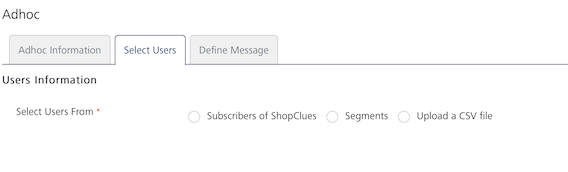
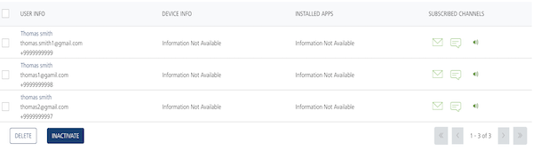
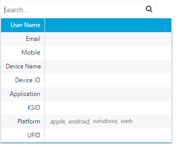
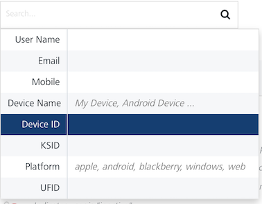
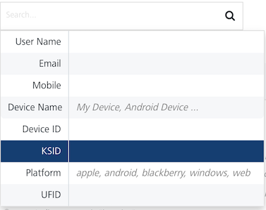
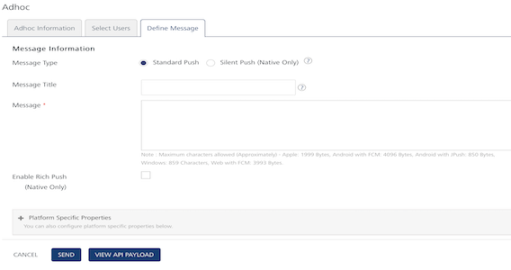
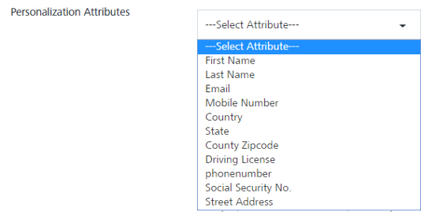
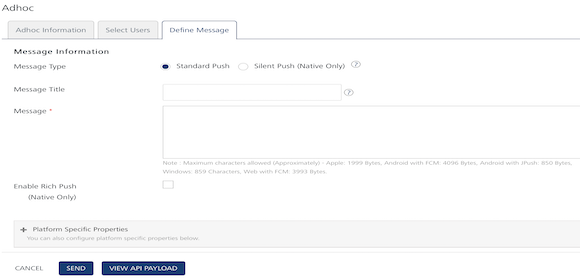
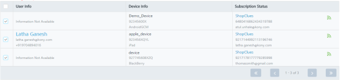
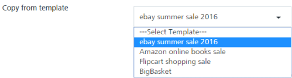

                             

Push Message
============

Push messages is one of the most important features of Volt MX Foundry Engagement Services. The **Push Message** feature allows you to configure and send push messages based on the preferences and personalization attributes for the targeted subscribers or segments. Push messages are sent only to subscribed apps that are active and installed on mobile devices.

To configure a push message follow these steps:

1.  From the **Engagement** section, click **Adhoc** from the left panel. The **Adhoc** screen appears with three tabs including
    
    *   [Adhoc Information](#adhoc-information)
    *   [Select Users](#select-users)
    *   [Define Message](#define-message)
    
    Adhoc Information
    -----------------
    
    By default, the **Adhoc Information** tab is set to active.
    
2.  **Select Channel**: Select the **Push Message** channel from the drop-down list.
    
    
    
    The **Select Application** drop-down list appears.
    
3.  Select the required application from the drop-down list.  
    
    
    > **_Note:_** When you select an app from the Select Application drop-down list, the system displays an introductory message that push messages are sent only to platforms whose configuration details are provided.
    
4.  **Send Message**: By default, the send message option is set to **Now**. To send the push message on a specific date, choose the **Later** option. For more details, see [Send Message](Set_Start_and_Expiry_Time.md).
5.  Click the **Next -Select Users** button to continue.
    
    Select Users
    ------------
    
    The **Select Users** tab becomes active.
    
    
    
    Based on your requirement, select the option as **Subscribers**, **Segment**. or **Upload a CSV file**
    
    *   [Subscribers](#subscribers)
    *   [Segments](psegment.md)
    *   [Upload a CSV File](UploadaCSVfile.md)
    
    ### Subscribers
    
6.  When you select the option as subscribers, the system displays the subscriber's list view with following details:

    
    The Subscribers list view includes the **User Info**, **Device Info** and the **Subscription Status** columns. There is a search field to search subscribers.

    
    

    
    *   **Search** field: Click in the search field to view available options to search for a subscriber. You can search subscribers based on the following search criteria.

        
    *   **User Name**: Enter the user name in the search field and click Enter.

            
    

            
    The subscriber appears on the home page. To view the select users’ page, clear the search field and click Enter.

            
    

            
    *   **Email:** Enter the email in the search field and click Enter.

            
    

            
    The subscriber appears on the home page. To view the select users’ page, clear the search field and click Enter.

            
    

            
    *   **Mobile**: Enter the mobile number in the search field and click Enter.

            
    

            
    The subscriber appears on the home page.To view the select users’ page, clear the search field and click Enter.

            
    

            
    *   **Device Name**: Enter the device name in the search field and click Enter.

            
    

            
    The subscriber appears on the home page. To view the select users’ page, clear the search field and click Enter.

            
    

            
    *   **Device ID**: Enter the device ID in the search field and click Enter.

            
    

            
    The subscriber appears on the home page. To view the select users’ page, clear the search field and click Enter.

            
    

            
    *   **KSID**: Enter the KSID in the search field and click Enter.

            
    

            
    The subscriber appears on the home page. To view the select users’ page, clear the search field and click Enter.

            
    

            
    *   **Platform**: Enter the platform name in the search field and click Enter.

            
    

            
    The subscriber appears on the home page.To view the select users’ page, clear the search field and click Enter.

            
    

            
    *   **UFID**: Enter the ufid in the search field and click Enter.

            
    

            
    The subscriber appears on the home page.To view the select users’ page, clear the search field and click Enter.

            
    

            
    *   **Searching without Labelling with Multiple Parameters**: Enter the required parameters with a space in the search field. For example, the following image displays search result for two users based on entered parameters.  
        
            
    
            
        
    The User Information list view displays the following details:
        
| Subscribers Element | Description |
| --- | --- |
| User Info | The column displays the following details:  - User name   - User email ID   - User mobile number |
| Device Info | The column displays the following details:  - Device name  - Device ID: When an application registers for push notifications, the device ID of the mobile device is registered in the Push Notification Service (PNS). When PNS wants to send a push message, the cloud uses the device token to locate the device on which the client application is installed. The push notification is then sent.  - Platform: The platform field displays a list of targeted platforms configured for the application. |
| Subscription Status | The column displays the following details:  - Subscribed app name  - KSID: This is the Volt MX Subscription Identification serial numbers of the application. KSID is found below the app name and used to communicate with Volt MX Foundry Engagement server. Volt MX Foundry Engagement Services generates the KSID based on your request for a subscription.  The subscription status also indicates if the device is active for that application and can receive notifications.  \- UFID: The User Friendly Identifier or UFID is used when you subscribe to Volt MX Foundry Engagement Services. Based on your requirement, you can provide a UFID. It is alphanumeric- for example xxx@VoltMX.com or 2890XZCY. UFID can be used to map devices to the user using the value as a reconciliation key. |
| Display Controls | By default, only 20 users are displayed in the grid. You can view more screens by navigating through the Forward arrow icon. You can navigate back through the Backward arrow icon. |

        
7.  Select the check box adjacent to the **User Info** column to select users from the list view.
8.  Click **Cancel** if you do not want to create a push message.
9.  Click **Next -Define Message** to continue.
    
    ### Define Message
    
    The Define Message page appears.
    
    
    
    The Define Message page includes the Message Information section to add a new push message.
    
    The Message Type field includes two options to add a new push message:
    
    *   [Silent Push](#silent-push)
    *   [Standard Push](#standard-push)
    
    By default, the message type option is set to standard push.
    
    #### Silent Push
    
10.  **Silent Push**: To enable silent push, select this option.
    
> **_Note:_** When a silent push notification reaches a device, you do not know about the notification but your app may process the notification and perform an action like downloading new content. In a real - world scenario, silent push notification can be used to read online newspapers, shopping cart syncing and so on.

    
When you check the is silent push option, system displays platform specific properties fields only. This is because the Message Title and the Message Text are not applicable for silent push.

    

    
#### Platform Specific Properties
    
1.  **Platform Specific Properties**: To add platform-specific properties follow these steps:
*   Click the plus icon next to the Platform-Specific Properties label.
            
The system displays four tabs for iOS, Android, Windows, and Web platforms. By default, the iOS platform tab is set to active.

            

            
To configure platform specific properties, click the respective link below:

            
*   [iOS](../Campaigns/camppushios.md)
*   [Android](../Campaigns/camp_push_android.md)
*   [Windows](../Campaigns/camp_push_window7and8.md)
*   [Web](../Campaigns/camp_push_Web.md)

            
> **_Important:_** Only iOS and Android devices are supported for silent push. A user can send the silent push messages to the Apple or Android applications that are deployed using Engagement Services console. The device user is not notified when the silent push comes in, however the application can perform any needed actions.

            
> **_Note:_** Silent Push is not applicable for Subscriptions of the Web channel. If the Web subscriptions are selected as part of Silent Push, the status of the push messages is marked as [Not Applicable](../Status/Message_Queue_tab.md#NA).
            
    
#### Standard Push
    
> **_Important:_** If a subscriber has a mapped user, the Define Message page displays the Copy from Template and Personalization Attributes options.

    
11.   To define a standard push message for a subscriber with a mapped user, enter details for the following fields:
    
1.  **Copy from Template**: To use an already created push template, then select the required template from the drop-down list.

        

        
The associated personalization attributes and push message, if any appears in the message box.
        
2.  **Personalization Attributes**: Based on your requirement, select the required attributes from the drop-down list. The personalization attributes drop-down list displays a combination of mandatory and optional attributes.

        

        
3.  **Message Title**: The Message Title automatically gets populated from the Push Template you select.  

If there is no Message Title associated with the Push Template, enter an appropriate title.
4.  **Message Box**: Enter your message in the **Message Box** text area.
    
> **_Note:_** Maximum characters allowed -  
Apple: 1999 Bytes,  
Android with GCM: 4044 Characters,  
Android with JPush: 850 Bytes,  
Windows: 859 Characters,      
Web with FCM: 4044 Characters  
Apple has increased its payload size from 255 bytes to 2 kb. 

    

    
12.  If a subscriber does not have mapped users, the **Define Message** page displays **Message Title** and **Message options**.
    

    
> **_Important:_** If you take a combination of subscribers with mapped user and subscribers with unmapped user, the Define Message page displays Message Title and Message options only.

    

    
#### Associate Rich Push

    
To associate rich push content, follow these steps:

    
13.  **Associate Rich Push**: Select the checkbox if you want to associate the rich push.
    1.  **Rich Message** box: If a subscriber does not have mapped users, the system displays the Rich Message box. To customize your text, you can use the Rich Text Editor tool bar available at the top of Rich Content box.
        
        
        
        > **_Note:_** If a subscriber has a mapped user, the Define Message page displays the Copy from Template and Personalization Attributes options.
        
     2.  To define a rich push message for a subscriber with a mapped user, enter details for the following fields:

     *   Copy from Template: To use an already created push template, select the required template from the drop-down list.

            
     

            
     The associated personalization attributes and rich push message, if any appears in the message box.

            
     

            
     *   **Personalization Attributes**: Based on your requirement, select the required attributes from the drop down list. The personalization attributes drop down list displays a combination of mandatory and optional attributes.
        *   **Rich Message** box: To customize your text, you can use the Rich Text Editor tool bar available at the top of Rich Message box.

     14.  **Platform Specific Properties**: To set platform specific properties, [click here](#platform-specific-properties)

    
     #### API Payload

    
     15.  **API Payload**: Click the **View API Payload** button to get details of the API call that can be used by a third-party system to send notifications.
    
     The Payload drop-down window appears.

    
     

    
     > **_Note:_** Refer the above payload as a sample only.
    

     16.  Click **Cancel** if you do not want to send a push message. The system displays the Adhoc Information page without sending the push message.
     17.  Click **Send**.

    
     The system displays the confirmation message that message queued with a request ID to view the status of the push message. You can use this request ID to view the current status of the push message under Settings > Status > Push Queue.

    
     

    
     18.  Click OK to continue.
