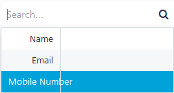
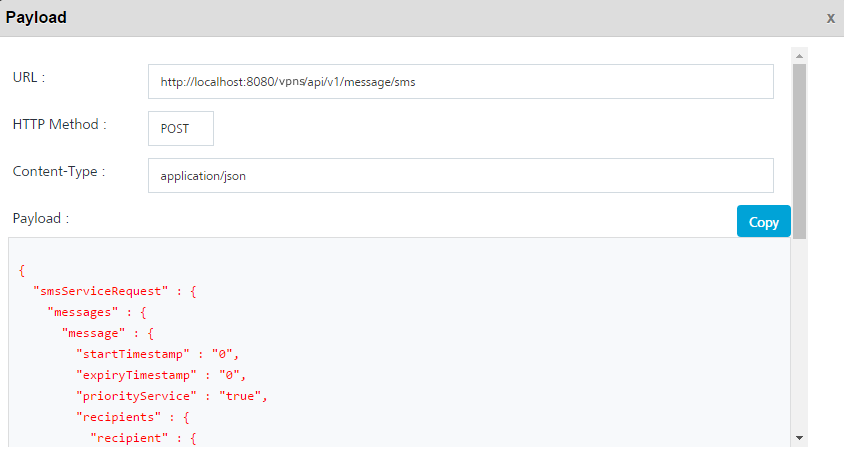

                             

SMS Message
===========

You can send a Text and Voice Short Message Service (SMS) to users through users or segments. The primary purpose of this feature is to allow the Engagement server to send Text or Voice SMS messages to the opted in users. An Engagement server user can use a SMS template and set new attributes, set the recipients to receive SMS, and even set time for SMS to be sent.

You can do the following from SMS Message screen:

*   Send a SMS message with an option to use or edit existing SMS template.
*   Select a SMS user using the users or segments option
*   Send SMS messages using templates and personalized attributes if needed
*   Set start and expiry time.

To add a SMS message to users, follow these steps:

1.  From the **Engagement** section, click **Adhoc** from the left panel. The Adhoc screen appears with three tabs including:
    
    *   [Adhoc Information](#adhoc-information)
    *   [Select Users](#select-users)
    *   [Define Message](#define-message)
    
    Adhoc Information
    -----------------
    
    By default, the Adhoc Information tab is set to active.
    
2.  **Select Channel**: Select the SMS Text Message or SMS Voice Message channel from the drop down list.
    
    
    
3.  **Send Message**: By default, the send message option is set to Now. If you want to send the SMS message on a specific date, then you need to choose the Later option. For more details [see](Set_Start_and_Expiry_Time_-_sms.md).
4.  Click the **Next -Select Users** button to continue.
    
    Select Users
    ------------
    
    The Select Users tab becomes active.
    
5.  Based on your requirement, select the option as Users or Segment.By default, the User Information option button is set to Users. The User's list view is populated with the existing list of users.
    
    *   [Users](#users)
        
    *   [Segments](sms_message_segment_-_Copy.md)
    
    ### Users
    
6.  By default, the **To** option button is set to users. The **User** list-view is populated with the existing list of users.
    
    > **_Note:_** If no user is added to the console, then the user screen displays the following message: 'No Users Found '.
    
    The Users list view includes the Name, Email and Mobile columns. There is a search field to search users.

    
    
    
    
7.  The user list view contains the following details:
    *   **Search** field: Click in the search field to view available options to search for a user. You can search users based on the following search criteria:
        
        *   **Name**: Enter the required name in the search field and click **Enter**.

            
        

            
        The users appears on the home page. To view the select users’ page, clear the search field and click Enter.

            
        

            
        *   **Email**: Enter the email ID of the required user in the search field and click **Enter**.

            
        

            
        The users appears on the home page. To view the select users’ page, clear the search field and click Enter.

            
        

            
        *   **Mobile Number**: Enter the mobile number of the required user in the search field and click **Enter**.

            
        

            
        The users appears on the home page. To view the select users’ page, clear the search field and click Enter.

            
        
            
        
        The Users list view displays the following details:
        
        | Users Element | Description |
        | --- | --- |
        | Name | The name column displays names of the added users. The **Name** column contains a combination of the **First Name** and the **Last Name** of the added users.. |
        | Email | The email column displays the emails of the added users. |
        | Mobile | The mobile column displays the mobile numbers of the added users. |
        | Display controls | By default, only 20 users are displayed in the list view. You can view more screens by navigating through the **Forward** arrow icon. You can navigate back through the **Backward** arrow icon. |
        
8.  Click **Cancel** if you do not want to create a SMS message.
9.  Select the required users from the list view to send SMS message.
10. Click **Next -Define** Message to continue.
    
    Define Message
    --------------
    
    The Define Message page appears. The Message section includes Compose from Template drop down list, Personalization Attributes drop down list and Message box text area.
    
11. To compose the SMS message follow these steps:
    1.  **Compose from Template**: Select the required SMS template from the **Compose from template** drop down list.
        
        
        
        The Message box area is populated with the text from the chosen template.
        
        
        
    2.  **Personalization Attributes**: If required select more attributes from the drop-down list to customize the SMS message.
        
        The system inserts the selected attributes at the cursor position in the **Message Box** text area.
        
        
        
        > **_Note:_** You can click X button next to each attribute to remove the attribute from the message box. You can insert any attribute anywhere in the text message as required for your push notification message.
        
    3.  **Message Box**: If required, you can customize the SMS text message.
        
        > **_Note:_** Maximum characters allowed - Apple: 255 Bytes, Android: 4096 Bytes, Windows: 1024 Bytes.
        
12. Click **Cancel**, if you do not want to add a SMS message.
13. Click **Send** to continue.
    
    The system displays the confirmation message that message queued with a message ID for reference. You can use this request ID to view the current status of the SMS message under Settings > Status > SMS Queue.
    
    
    
14. Click **OK** to continue.
    
    ### API Payload
    
15. **API Payload**: Click the **View API Payload** button to get details of the API call that can be used by a third party system to send notifications.
    
    The Payload drop-down window appears.
    
    
    
    > **_Note:_** Refer the payload drop-down window details as a sample only.
