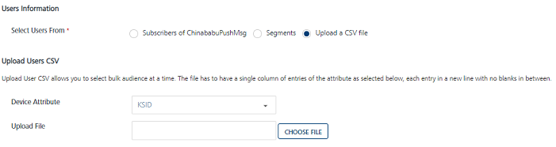
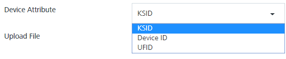
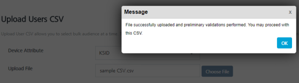

                           

Upload Users CSV File
---------------------

If you select the user option as **Upload a CSV file**, the **User Information** page displays the **Device Attribute** drop-down list and **Upload File** option, and **Choose File** to select the file from your system. By default, the **Device Attribute** list is set to **KSID**.

The **Upload User CSV** option allows you to select bulk audience at a time. The `CSV` file needs to have a single column of entries of the attribute. Each entry should be in a new line with no space in between.

To upload a Users CSV file, follow the steps given below:

1.  **Device Attribute**: Select the option as **KSID**, **Device ID**, or **UFID**.
    
    
    
2.  Click **Choose File** to select the `CSV file` from your system.
    
    The system displays the confirmation message that the file is uploaded successfully and preliminary validation is performed.
    
    
    
3.  Click Ok to continue.
4.  Click Next -Define Message to continue.

Define Message
--------------

For more details, see [Define Message](General_Channel_Type_Push_Message.md#define-message)
