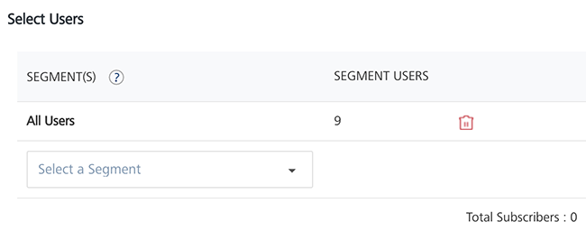
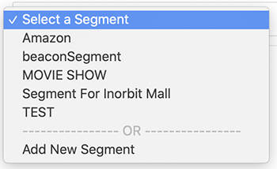
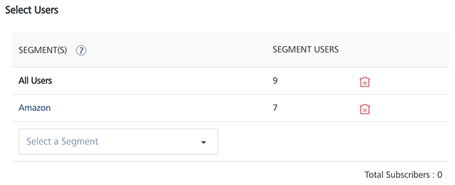
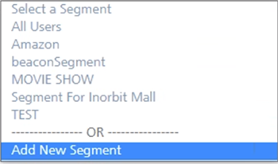
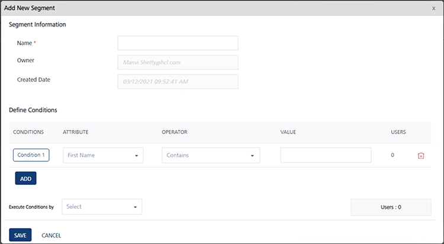

                            

Segment
-------

1.  If you select the **user** option as **Segments**, the User Information page displays the **Select Users** list view including the **Segment(s)**, and the **Segment Users** columns. There is a **Select a Segment** drop down list view to add segments at the bottom of the list view on the home page. By default, the system displays the **All Users** segment with total number of users.
    
    
    
    The Segments list view displays the following details:  
    
    | Segments Element | Description |
    | --- | --- |
    | Segment(s) | Displays the segment name. |
    | Segment Users | Displays the number of associated users with a segment |
    | Delete icon | Click the Delete icon to remove a segment from the Select Users list view |
    | Total Subscribers | Displays the number of associated subscribers with a segment |
    
2.  There are two options to add a segment:
    
    *   [Add an Already Created Segment](#add-an-already-created-segment)
    *   [Add a New Segment](#add-a-new-segment)
    
    Add an Already Created Segment
    ------------------------------
    
3.   Click the **Select a Segment** drop down list to select a segment.
    
    
    
4.  The selected segment is appended in the **Select Users** list view.
    
    
    
    > **_Note:_** Click the delete icon to remove an added segment.
    
    Add a New Segment
    -----------------
    
5.  **Select a Segment**: Select the add new segment option from the drop down list.
    
    
    
    The **Add New Segment** window appears.
    
    
    
    For more information about how to add Segments, see [Adding Segments](../Segments/Adding_a_Segment.md).
    
6.  Click **Next -Define Message** to continue.

Define Message
--------------

For more details, see [Define Message](General_Channel_Type_Push_Message.md#define-message)
