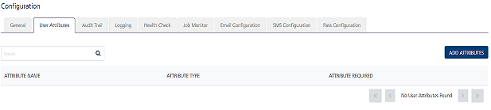
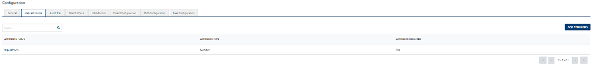
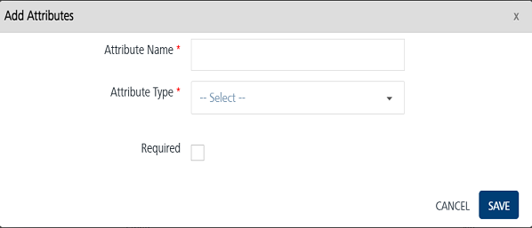
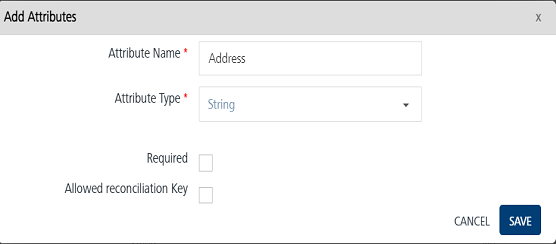
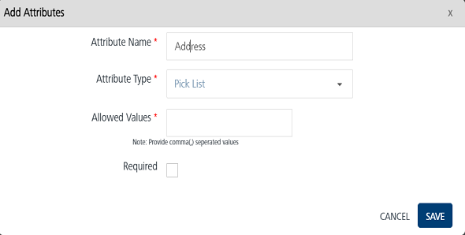
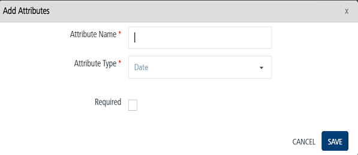
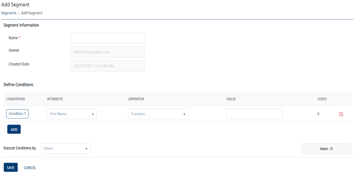

                             

Adding User Attributes
======================

You can add a custom user attribute only if the Admin has assigned the following permissions to you:

`ROLE_CONFIGURATIONS,  
ROLE_CREATE_ATTRIBUTES`

If the Admin has not assigned, you the permission to add custom user attributes and you access the **User Attributes** page, the system hides the **Add Attributes** button on the home page.

If the Admin has assigned, you the permission to add custom user attributes and you access the **User Attributes** page, the system displays the **Add Attributes** button on the home page.

To add attributes, follow these steps:

1.  In the **User Attributes** home page, click the **Add Attributes** button to add new user attributes.
2.  The **Add Attributes** drop-down window appears.
    
    
    
    > **_Important:_** You can add 30 audience attributes. Once added, you cannot delete any of the audience attributes.
    
3.  Enter details for the following fields:
    *   **Attribute Name**: Enter the attribute name in the **Attribute Name** field, such as Address.
    *   **Attribute Type**: Based on your requirement, select the attribute type from the drop-down list as string, number, pick list or date.
    *   **Required**: Select the required check box to make the new attribute mandatory while adding the users.
4.  Based on the selected attribute type, system displays additional fields to configure as part of the **Add Attribute** details.
    
    #### Attribute Types: String and Number
    
5.  If you select the attribute type as **String** or **Number**, then following fields appears:
    
    *   **Allowed Reconciliation Key**: You can also configure the new field as new reconciliation key only if the new field is enabled as mandatory field. Volt MX Foundry Engagement Services allows you to configure only one reconciliation key. When you configure a new reconciliation key, the system replaces the old key (for example: _email_) with the new reconciliation key. To set the new field as reconciliation key, select the **Allowed reconciliation Key** check box.
    
    
    #### Attribute Type: Pick List
    
6.  **Pick List**: If you have selected attribute type as the **Pick List**, the **Allowed Values** text field appears. In the **Allowed Values** text field, enter the multiple values according to your attribute name, such as _Sales, Finance, MIS._
    
    
    
    #### Date
    
7.  **Date**: Select the **Required** check box to make the date attribute mandatory while adding the users.
    
    
    
8.  Click the **Cancel** button if you want to close the dialog without saving any details. The system displays the Administration screen.
9.  Click the **Save Change**s button to save the details.
    
    > **_Note:_** The fields marked with a red asterisk sign are mandatory fields.
    
10. The newly added attribute appears in user attribute list view. The system displays a message confirming the attribute is saved.
    
    The added user attribute appears in Engagement >Segment > Add Segment.
    
    
