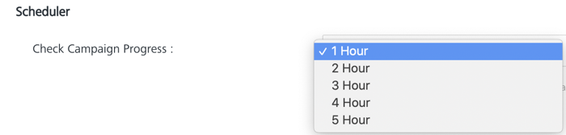

                              

General
=======

As an administrator, you can set all the generic functionalities related with Volt MX Foundry Engagement Services from the **Configuration** screen.

From the **Settings** section, click **Configuration** from the left panel. The **Configuration** page appears with nine tabs including **General**, **User Attributes**, **Audit Trail**, **Logging**, **Health** **Check**, **Job Monitor**, **Email Configuration**, **SMS Configuration**, and **Pass** **Configuration**. By default, the **General** page is set to active.

The General tab includes following sections:

*   [Basic](#basic)
*   [Campaign](#campaign)
*   [Events](#event)
*   [Scheduler](#scheduler)
*   [Security](#security)
*   [Apple Pass Intermediate Certificate](#apple-pass-intermediate-certificate)
*   [Disabling Concurrent Sessions](#disabling-concurrent-sessions)

To set the generic functionalities, follow these steps:

Basic
-----

1.  To set basic details enter details for the following fields:
    
    1.  **Retries per Notification**: Select the retries value per notification from the drop-down list. By default, the value is set to ten.
        
        > **_Note:_** When push notifications delivery fails, you can attempt to deliver the notifications again. You configure a retry schedule for each delivery. You can retry delivery at a later time, according to the specified schedule.  
        When you retry, only the notifications that could not be delivered during the previous delivery attempt are sent again.  
        When you configure a retry schedule, you specify one or more retry delay values. If a notification delivery fails, you wait to pick up the work item again until the amount of interval specified by the first retry delay value elapses. This process continues until all retry delay values have been exhausted, or until the undelivered notifications expire, whichever comes first.
        
        
    2.  **Reconciliation Key**: Select the reconciliation key from the drop-down list.
    3.  **Preferred Time Zone**: Select the time zone from the drop-down list as required.
    4.  **Google API Client ID for Business**: To access the special features of the Google Maps API for business, you must provide a client ID when accessing the API libraries or services. When registering for Google Maps API for Business, you will receive this client ID from Google Enterprise Support. All client IDs begin with a gme- prefix.
    5.  **Application Logo for Closed Menu (38X38)**: Click the **+Add** button to select the logo from your local system, and click Open.
        
        The selected logo appears in the **+Add** button position.
        
        
        
        > **_Note:_**  Click the cross icon on the displayed logo to remove it from console.
        
    6.  **Application Logo for Expanded Menu (126X38)**: Click the **+Add** button to select the logo from your local system, and click Open.  
        The selected logo appears in the **+Add** button position.
        
        
        
        > **_Note:_**  Click the cross icon on the displayed logo to remove it from console.
        
        *   Click the **Save** button to add logos. The system displays the confirmation message that General details are saved successfully. The closed menu logo appear in the left panel.
            
            
            
            When logos are uploaded in console, the **Delete** button and the **Download** button appears next to the details of the uploaded logos.
            
        *   Click the **Delete** button to remove the selected icon. The Confirm delete pop-up window appears asking if you really want to remove the displayed logo.
        *   Click **Cancel**, if you do not want to delete the selected icon.
        *   Click **Ok** to continue. The system displays the confirmation message that icon removed successfully.
        
        
        
    7.  **Payload Type For Android**:
        
        The FCM standard of Google now provides an option to send both Notification Messages and Data Messages. The Notification Message has an option to send data payload and notification payload. Whereas, the Data Message will send only the data payload.
        
        *   **FCM (Notification Message)**: Choose this option to send Notification Message to the client application by the Engagement server. However, both notification and data payloads will be sent.
        *   **FCM (Notification Message) / GCM v2**: This option is provided for backward compatibility. Currently we support GCM v2 in the Engagement server. If you choose this option, the notification payload is copied into the data payload. This will work like both the FCM (Notification Message) and FCM (Data Message) options as discussed above.
        *   **FCM (Data Message)**: Choose this option to send Data message to the client application by the Engagement server. Only the data payload will be sent.
        
        
        
        The scenario where users will need to use backward compatibility are as follows:
        
        *   When a user has existing apps that use the Data payload and if they want to use the Notification payload for their new apps.
        
        > **_Note:_** For new users, by default the FCM (Notification Message) option is chosen.
        
        For more information on Notification and Data messages refer to [About FCM messages](https://firebase.google.com/docs/cloud-messaging/concept-options#notifications_and_data_messages).
        
    8.  **Enable Token Based APNS**: To Enable `Token-Based Connection`, provide the following details from your Apple Developer Account:
        
        *   **Key ID**: It is a 10-character string. Follow these steps to get the Key ID of your App:
            1.  Log on to your [Apple Developer Account](https://developer.apple.com/).
            2.  On the left pane, select  `Certificates, Identifiers & Profiles`.
            3.   Navigate to `Keys` on the left pane, and select  `All`. A list of keys is displayed.
            4.  Create a new key with APNS enabled, or select the required key from the list to view the Key ID.  
                
        *   **Team ID**: It is a unique 10-character string associated with an Apple Developer Account. Follow these steps to get the Team ID of your App:
            1.  Log on to your [Apple Developer Account](https://developer.apple.com/)
            2.  On the left pane, select `Membership` to view the team ID associated with your Membership.  
                
        *   **Provider Private Key**: It is a unique key that is generated when you create an APNS certificate. Follow these steps to get the Provider Private Key of your App:
            1.  Log on to your [Apple Developer Account](https://developer.apple.com/)
            2.  On the left pane, select  `Certificates, Identifiers & Profiles`.
            3.   Navigate to `Keys` on the left pane, and select  `All`.
            4.  Create a new key with APNS enabled and click on the Download button. A `.p8` file with the Provider Private Key gets downloaded.  
                
        *   Click **Test Connectivity with Cloud**.
            
            The system displays a **Notification** dialog box stating that the Apple cloud test is successful for iPhone. Click **Ok** to continue.
            
        
        
        
    9.  **Archival** **Frequency**: Select the frequency for Archiving the push data. The default value for Archival Frequency is 90 days. You can change the value of the Archival Frequency to 7,15,30, or 60 days if you have an Admin account.  
        
        
        
        Using the archiving feature of Volt MX Foundry Engagement Services in the On-Premises environment, you can delete data from the database to optimize the performance of the database. Execute the following OPTIMIZE commands on the Database at non peak hours to free up space:
        
        *   OPTIMIZE TABLE MessageRequest;
        *   OPTIMIZE TABLE MessageEntry;
        *   OPTIMIZE TABLE messageentry\_status;
        *   OPTIMIZE TABLE DeviceSpecificProps;
        *   OPTIMIZE TABLE messageprocess\_status;
    10.  **Archival Storage Location**: It is the path on the system or a shared location where you want to store the archived data in .csv format. This path must be accessible from the server.
    
    > **_Note:_** This feature is only available on the Volt MX Foundry On-Premises Environment.
    
    12.  **Enable Data Archival**: This checkbox is enabled by default. If you disable this checkbox the data is not archived to the files and gets deleted from the table.
    
    > **_Note:_** This feature is only available on the Volt MX Foundry On-Premises Environment.
    
    You must configure the following -D parameters for the Archival Feature to work in the On-Premises Environment:
    
    *   **ARCH\_MAX\_REC\_PER\_DAY**: The maximum number of records to be archived per day. Override this parameter to increase or decrease the maximum number of records to be archived per day.
    *   **ARCH\_ITER\_FOR\_BATCH**: Number of records to be archived per iteration in a batch.
    *   **ARCH\_BATCH\_SIZE**: Number of records to be archived from a batch in .csv format.
    
    > **_Note:_** Downtime is required when you modify the -D parameters.  
    
    > **_Important:_** Ensure that the value of **ARCH\_ITER\_FOR\_BATCH** is less than the value of **ARCH\_MAX\_REC\_PER\_DAY**.
    
    > **Note:**      
    *   Push data older than 90 days is automatically archived.  
    *   If you currently have any applications that display the past push messages sent, such applications may not be able to display the data after the archive.  
    *   Every archive impacts the **Total Pushes Sent** field on the Engagement Services Dashboard.  
        
    Campaign
    --------
    
2.  To set the **Campaign** details, enter details for the following fields:
    1.  **Campaign Type**: Enter a campaign name, which is limited to 255 characters.
    2.  Click the **\+ blue** button to add a new Campaign Type.
    3.  Click the **– blue** button to remove a Campaign Type.
        
        
        
        > **_Note:_** You can delete only unused campaign types.
        
        > **_Important:_** To add a new campaign, click **Add Campaign** on Engagement > Campaign screen. This action opens the **Add Campaign** screen. Under the Campaign Information tab, you need to select the Campaign Type from the drop down list. The campaign type(s) added from the **Settings** > **Configuration** > **General** screen appears in the Campaign Type drop-down list.
        
        Event
        -----
        
3.  To set the **Event** details, enter details for the following fields:
    1.  **Event Type**: Enter the event name, which is limited to 50 characters.
    2.  Click the **\+ blue** button to add an **Event Type**.
    3.  Click the **– blue** button to remove an **Event Type**.
        
        
        
        > **_Important:_** To add a new Event, you click Add Event on **Engagement > Event** screen. This action opens **Add Event** screen. The event type added from **Settings** > **Configuration** > **General** appears in the **Event Type** drop-down list.
        
        Scheduler
        ---------
        
4.  **Check Campaign Progress**: The **Check Campaign Progress** Scheduler enables scheduling and running campaigns within a particular time frame. The campaign runs at every one hour to send campaign messages to newly added reconciled users. Select the required value from the drop-down list to change the scheduler run time frame. 
    
    > **_Note:_** The updated scheduled time frame will not be applicable for an existing campaign.
    
    Security
    --------
    
    The security mechanism of the Engagement APIs is based on whether the invoked APIs are device side APIs (subscription creation or geolocation update) or third party app integration APIs.
    
5.  To set security, enter details for any of the following fields as required:
    
    1.  **Enable App API Key Authentication**: Select the check box to enable invoking all Application side APIs through App API Key. By default, this setting is disabled. If the value is set, the security is enabled for the application side APIs and the invoking application needs to pass a header: **X-VoltMX-App-API-Key** with the App API Key value. For more information refer to [Authentication section](../../../../Foundry/engagement_api_guide/Content/APIs_for_VoltMX_Messaging_Services/Authentication_API.md).
    2.  **Auth Token for Device Side API**: The **Auth Token** when set is applicable for device side APIs only. Enter the auth token in the text field which can be any alphanumeric value such as **1234abc**. If the value is set, the security is enabled for the device side APIs and the invoking application needs to pass a header: **X-Device-AuthToken** with the value as **1234abc**.
    3.  **Identity Token for Device Side API**: The **Identity Token** when set is applicable for device side APIs only. Select the check box to display the identity token reference attribute drop-down. The drop-down displays any attribute defined as a reconciliation key.
        
        The Identify token reference attributes drop-down list appears.
        
        
        
        You need to pass three headers to use the identity token security mechanism. The three headers are: **X-User-Id**, **X-User-IdType**, and the **X-Identity-Token**.
        
        The **X-User-Id** and **X-User-IdType** identify you as the valid user invoking the API. The **X-Identity-Token** contains the value of the **Identity Reference Attribute** defined for the user identified by the **X-User-Id** and **X-User-IdType**.
        
        Let us assume that **test** is a custom attribute defined in the Engagement server and marked as a reconciliation key. Let us also assume that a user with an email address of abc@test.com is created in the Engagement server with a value abc123 for the **test** variable.
        
        To use the identity token security mechanism with the device APIs, you need to pass three headers with the values as below:
        
        | Header Name | Header Value |
        | --- | --- |
        | X-User-Id | abc@test.com |
        | X-User-IdType | email |
        | X-Identity-Token | abc123 |
        
    4.  **Identity token reference attribute**: Select the required attribute from the drop-down list.
    5.  **Authentication for Message API**: Select the check box to provide authentication for message APIs such as, the push messaging audience creation APIs. Once this option is checked you can use the Oauth or MbaaS authentication with the associated security headers. For more information refer to [Authentication section](../../../../Foundry/engagement_api_guide/Content/APIs_for_VoltMX_Messaging_Services/Authentication_API.md).
    6.  **Allow Cross Domain Access**: Select the checkbox to provide cross domain access.
    7.  The text box appears. You can list allowed domains (comma separated values) for CORS.  
        Example: www.google.com, www.hcl.com.
        
        > **_Important:_** Cross-origin resource sharing (CORS) is a mechanism that allows many resources (for example, fonts, JavaScript) on a web page to be requested from another domain outside the domain from which the resource originated. In particular, JavaScript's AJAX calls can use the XMLHttpRequest mechanism.  
        By default, Volt MX Foundry Engagement Services will disable this feature. You can enable this feature by enabling the CORS section (Allow Cross Domains Access).  
        You can list allowed domains (comma separated values) for CORS using Volt MX Foundry Engagement Services console with below option.  
        Example: www.google.com, www.hcl.com.  
        It also supports wildcard characters for allowing subdomains.  
        Ex: \*.google.com, \*, \*.com, \*.in
        
        > **_Note:_** You must obtain an auth token to use the Subscription and Message APIs. The access token is passed with each API call and is used to authenticate you when accessing the APIs. It provides a secure access to the APIs and allows the APIs to associate your application’s requests.  
        
        
        
    
    Apple Pass Intermediate Certificate
    -----------------------------------
    
6.  **Apple's World Wide Developer Relations (WWDR) Certificate**: Click **Certificate Details** to view the certificate details.
    
    > **_Important:_** The Apple Pass Intermediate Certificate option is available for on-premises version only.
    
    
    
    The Apple Pass Intermediate Certificate displays the following details:
    
    *   **Issuer**: Displays the name of the issuer who issued the WWDR certificate.
    *   **Organization**: Displays the name of the organization who issued the WWDR certificate.
    *   **Valid from**: Displays the date and the time stamp, till the pass is valid.
    *   **Expiry**: Displays the date and the time stamp, when the pass will be expired.
    
    
    
    > **_Note:_** To sign your pass bundle you need the WWDR Intermediate certificate. You can access the WWDR Intermediate certificate in Keychain Access> Certificate category> Apple Worldwide Developer Relations Certification Authority. For more details, [see](https://idmsa.apple.com/IDMSWebAuth/login?appIdKey=3fbfc9ad8dfedeb78be1d37f6458e72adc3160d1ad5b323a9e5c5eb2f8e7e3e2&rv=2)
    
7.  Click **Cancel** to clear the field values.
8.  Click **Save.**
    
    The system displays the conformation message that general details are saved successfully.
    

Disabling Concurrent Sessions
-----------------------------

If you want to disable concurrent sessions then disable.concurrent.sessions key should be true.

Use the [Update Config Resources](../../../../Foundry/engagement_api_guide/Content/REST_API_Administration/Update_Config_Resources.md) API to update the value as true. This option is applicable only when Engagement Services (on-premises) is attached to Volt MX Foundry.

  

