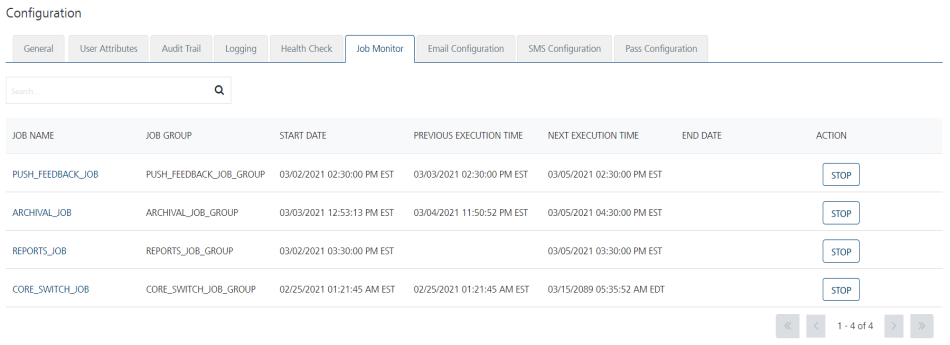
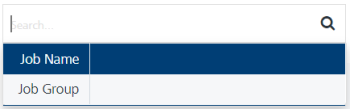
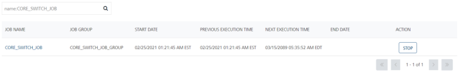
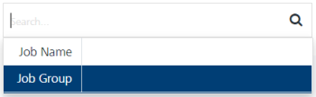
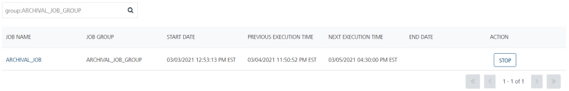

                              

Job Monitor
===========

The Job Monitor screen displays different job types performed within the console by different job groups. A job is a kind of service, which is related to the notifications started based on schedules set by the Administrator, and the jobs that can be stopped, if required. The jobs are categorized into five groups.

> **_Important:_** When the _PUSH\_FEEDBACK\_JOB, PUSH\_MESSAGES\_JOB,_ and _REPORTS\_JOB_ in the **Configuration > Job Monitor** list view appears as running successfully, only then the system will set the status as **PASSED** for the **Quartz jobs** item in the **Configuration > Health Check** section.

*   **PUSH\_MESSAGES\_JOB**: The `PUSH_MESSAGES_JOB` runs in every 30 seconds to pick up a batch for messages and processes for Apple, Android, and Windows.
*   **REPORTS\_JOB**: The `REPORTS_JOB` runs once in every 24 hours at 2 a.m. and populates data for different graphical reports.
*   **FEEDBACK\_JOB**: The `FEEDBACK_JOB` runs once in every 24 hours at 1 a.m. to get the status whether a device is unsubscribed from Apple cloud.  
    
    > **_Note:_** Only Apple sends FEEDBACK\_JOB type message to Volt MX Foundry Engagement Services.
    
*   **CAMPAIGN\_JOB**: The `CAMPAIGN_JOB` runs at every _one hour_ to send campaign messages to newly added reconciled users. You can change the value in the **Administration** **\>** **General** **\>** **Scheduler** section.
*   **ARCHIVAL\_JOB**: The `ARCHIVAL_JOB` runs archiving multiple times per day. It is used to run archive scripts based on time zone. By default, the `ARCHIVAL_JOB` runs at 03:00 a.m. local time, based on the time zone.  
    You can modify the **ARCH\_QUARTZ\_CRON\_TRIGGER\_TIME** -D parameter to set a time for archiving.  
    The following are the sample Cron expressions to run archiving multiple times per day:
    
    *   Run a Cron job for every 15 minutes : 0 \*/15 \* ? \* \*
    *   Run a Cron job for every 6 hours : 0 0 \*/6 ? \* \*
    *   Run a Cron job for every 12 hours : 0 0 \*/12 ? \* \*
    *   Run a Cron job every day at 3 AM : 0 0 3 \* \* ? (This is the default occurrence.)  
        
        > **_Note:_** In a Linux System to update the -D parameter, adhere to the following format:  
        To run a Cron job for every 20 minutes: **\\"0 "\*"/20 "\*" ? "\*" "\*"\\"**  
          
        For example, **\-DARCH\_QUARTZ\_CRON\_TRIGGER\_TIME=\\"0 "\*"/20 "\*" ? "\*" "\*"\\"**
        
    
    To find a reference for Quartz Cron expressions, refer to [Cron expression generator](https://www.freeformatter.com/cron-expression-generator-quartz.md).
    

In the **Configuration** screen, click the **Job Monitor** tab. The system displays the **Job Monitor** screen.

The **Job Monitor** home page displays the list view including **Job Name**, **Job Group**, **Start Date**, **Previous Execution Time**, **Next Execution Time**, **End Date** and **Action** columns. There is a **Search** field to search for job details.

*   **Search**: Click in the search field to view options to find a job's details. You can search jobs based on the following search criteria:
    *   **Job Name**: Enter the job name in the search field and click **Enter**.
        
        
        
        The job details appear on the home page. To clear your search result, click in the search field.
        
        
        
    *   **Job Group**: Enter the job group in the search field and click **Enter**.
        
        
        
        The job details appear on the home page. To clear your search result, click in the search field.
        
        
        

The Job Monitor list view contains the following details:

  
| Job Monitor Columns | Description |
| --- | --- |
| Job Name | The job name column displays name of the jobs. |
| Job Group | The job group column displays the job groups. |
| Start Date | The date on which a job has started. |
| Previous Execution Time | The date and time on which the jobs were executed previously. |
| Next Execution Time | The date and time on which the next job is to be executed. |
| End Date | The end date of the jobs. |
| Action | The type of action initiated by the admin. By default, the action is set to Start. If you want to start or stop any job, click the Start button that turns the action button into Stop. When the admin takes an action, the system displays the status message above the grid that, 'Job with job name 'XXXXX\_XXX' has been started /stopped successfully'. |
| Display controls | By default, only 20 rows are displayed in the grid. You can view more screens by clicking on the forward arrow icon. You can move back using the backward arrow icon. |
