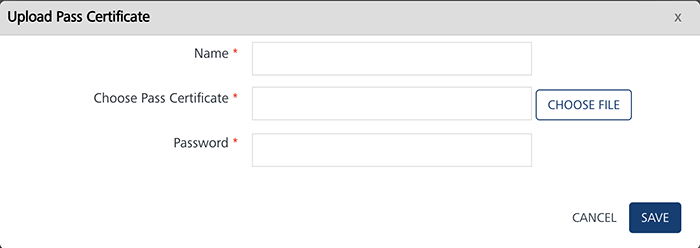

                             

Pass Configuration
==================

As an administrator, you need to upload Pass certificate, if passes are to be created and sent to users. The Pass certificate is used for pass signing and sending pass updates.

In the **Configuration** page, click the **Pass Configuration** tab. The system displays the **Pass Configuration** page. The Pass Configuration home page displays the list view including Pass Certificate, Pass Type Identifier, Pass Team Identifier, Created Date and Expiry Date column. There is a button to upload pass certificates in the top right corner of the home page and a search field to search pass certificates.

*   **Upload Pass Certificates** button: The button helps you to add new pass certificates in console.
*   **Search** field: Click in the search field to view options to search pass certificates. You can search pass certificates based on the following criteria:
    *   **Certificate**: Enter the certificate name in the search field and click **Enter**.
        
        
        
        The pass certificate details appears on the home page. To clear your search result, click in the search field.
        
        
        
    *   **Type Identifier**: Enter the type identifier details in the search field and click **Enter**.
        
        
        
        The pass certificate details appears on the home page. To clear your search result, click in the search field.
        
        
        
    *   **Team Identifier**: Enter the team identifier in the search field and click **Enter.**
        
        
        
        The pass certificate details appears on the home page. To clear your search result, click in the search field.
        
        
        

The **Pass Configuration** list view displays the following details:

  
| Pass Configuration Elements | Description |
| --- | --- |
| Pass Certificate | The pass certificate column displays the uploaded pass certificate names.You can use the search option under the Pass Certificate column to search passes based on names of pass certificates. |
| Pass Type Identifier | The pass type identifier column displays the Pass Type Identifiers. Pass Type Identifier is a string chosen by you, that defines a class or category of passes. It always begins with pass and uses reverse DNS style—for example, pass.com.example.membership-card. The pass type identifier must match the certificate used to sign the pass. A different certificate is used for signing passes with different pass type identifiers. and the value for the Pass Type Identifier key in the pass specifies the Pass Type Identifier. |
| Pass Team Identifier | The pass team identifier column displays the Pass Team Identifiers. Pass Team Identifier is the unique 10-character identifier Apple assigns to you as an iOS developer. To find your team identifier, log onto the iOS Member Center and click the name of your organization. You will find it there next to a label titled Company/Organization ID. |
| Created Date | The created date column displays the date when a pass certificate was created. |
| Expiry Date | The expiry date column displays the date when the pass certificate will be expired. |
| Display controls | By default, the number range is set to 20 so that only20 templates are displayed in the list view. You can view more screen through the forward arrow icon. You can move back through the backward arrow icon. |

You can do the following tasks from the **Pass Configuration** screen:

*   [Uploading a Pass Certificate](#uploading-a-pass-certificate)
*   [Deleting a Pass Certificate](#deleting-a-pass-certificate)

Uploading a Pass Certificate
----------------------------

To upload a Pass Certificate, follow these steps:

1.  Click the **Upload Pass Certificate** button.
    
    The **Upload Pass Certificate** drop-down window appears.
    
    
    
2.  Enter details for the following fields:
    *   **Name**: Enter an appropriate name for the pass certificate.
    *   **Choose Pass Certificate**: Click **Choose File** to locate the pass certificate from its location to upload it.
    *   **Password**: Enter the correct password.
        
        If the uploaded pass certificate or the entered password is invalid, then system displays a warning message that invalid certificate or certificate pass phrase.
        
3.  Click **Cancel** to close the window.
4.  Click **Save**.
    
    
    
5.  The uploaded certificate appears in the **Pass Configuration** list view and system displays the confirmation message that details added successfully.  
      
    
    

Deleting a Pass Certificate
---------------------------

To delete a Pass Certificate, follow these steps:

1.  Select the checkbox adjacent to the **Pass Certificate**, you want to delete, under the Pass Certificate column.
    
    
    
2.  Click the **Delete** button.
    
    The system displays the **Confirm Delete** dialog, asking if you really wants to delete the pass certificate(s).
    
3.  If you do not want to delete the pass certificate, then click **Cancel** to close the **Confirm Delete** dialog.
4.  Click **OK** to continue.
    
    The system displays the confirmation message stating that pass certificate(s) not assigned to pass campaigns or segments are deleted successfully. The deleted **Pass Certificate** is no longer displayed in the list view.
