                             


SMS Configuration
=================

To send and receive Short Message Service (SMS), you need an SMS service provider to communicate with Volt MX Engagement server. Volt MX Engagement server currently supports three SMS service providers TWILIO, NEXMO, CLICKATELL, and SALESFORCE for **Text SMS** and two SMS service providers TWILIO and NEXMO for **Voice SMS**. The **SMS Configuration** page enables you select the required service provider and enter the associated properties details.

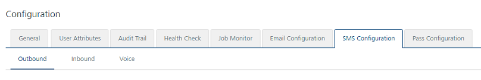

To send and receive **Text SMS**, NEXMO and CLICKATELL support the following protocols:

**HTTP** : The Hypertext Transfer Protocol (HTTP) is an application-level protocol for distributed and collaborative information systems. It is a generic, stateless, protocol that use request methods, error codes, and headers.

**SMPP** : The Short Message Peer-to-Peer (SMPP) protocol is an open, industry standard protocol. SMPP sends and receives medium-to-high volumes of SMS texts. VoltMX Engagement services supports SMPP version 3.4 (transceiver mode of communication).

> **_Note:_** TWILIO and SALESFORCE supports HTTP protocol only.

To configure SMS notification, follow these steps:

1.  From the **Settings** section, click **Configuration** from the left panel.
    
    The **Configuration** page appears. By default, the **General** tab is set to active.
    
2.  Click the **SMS Configuration** tab.
    
    The **SMS Configuration** page appears. The **SMS Configuration** page includes two tabs:
    
    *   [Outbound](#outbound)
    *   [Inbound](#inbound)
    *   [Voice](#voice)
    
    Outbound
    --------
    
    The **Outbound** tab includes SMS configuration and provider properties sections.
    
    ### SMS Configuration
    
    The SMS Configuration section includes the **Provider** drop-down list. You can select the required SMS service provider as TWILIO, NEXMO, CLICKATELL, or SALESFORCE. By default, the service provider is set to TWILIO.
    
    
    
3.  Based on your requirement, choose the service provider as:
    
    *   [TWILIO](#twilio)
    *   [NEXMO](#nexmo)
    *   [CLICKATELL](#clickatell)
    *   [SALESFORCE](#salesforce)
    
    ### Provider Properties
    
    #### TWILIO
    
    If you select the service provider as TWILIO, enter details for the following fields:
    
    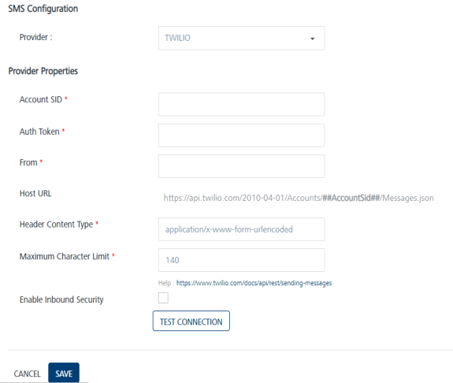
    
    *   **Account SID**: TWILIO provides you a unique Account SID for your account. Enter the Account SID in the Account SID field.  
        
    *   **Auth Token**: TWILIO provides you a unique Auth Token for your account. Enter the Auth Token in the Auth Token field.
        
        > **_Note:_** TWILIO uses an Account SID and an Auth Token to authenticate you with its servers. Your Account SID and Auth Token are only known to you and TWILIO. It is important to keep both the keys confidential to protect your account.
        
    *   **From**: Enter the phone number or client identifier that initiated the call. The phone numbers are formatted with a + sign and a country code such as +16175551212. The client identifiers begin with the client URL scheme. For example, for a call from a client named xxxx, the From parameter is client:xxxx.
    *   **Host URL**: Based on a selected provider, the field is populated with the **Host URL** details.
    *   **Header Content Type**: Based on a selected provider, the field is populated with the header content type as `application/x-www-form-urlencoded.`
        
        > **_Note:_** The `application/x-www-form-urlencoded` is the content-type header  for HTTP POST requests that browsers must support.  
        The request sends a list of name-value pairs to the server.
        
    *   **Maximum Character Limit**: Based on a selected provider, the field is populated with the maximum number of characters allowed in an SMS message.
    *   **Enable Inbound Security**: Select the check box, if you want to enable inbound security. The inbound security is applicable only for HTTP and not for SMPP. For SMPP, the request origin is always from a trusted source.
        
        If **Enable Inbound Security** option is enabled, all the inbound SMS requests are validated to check, if the request is from a valid source. For TWILIO, a header that TWILIO sends validates SMS requests.  
        For CLICKATELL or NEXMO, SMS requests are validated by the IP address of the request origin. So for CLICKATELL or NEXMO you need to provide a list of white listed IPs.
        
        For White listing IPs, the load balance or reverse proxy server IP must be white listed. Volt MX Engagement Services accepts inbound requests from providers without any authentication (as provider do not have facility of authentication).  
        In this scenario, any user can misuse and spend all the SMS credits. Thus to ensure security and check the authenticity of the request origin, inbound security option is enabled.
        
    *   Click the **Test Connection** button to check if the connectivity is successful.  
        The system displays the notification that the connection is successful. Click **OK** to continue.
        
        > **_Note:_** The fields with a red asterisk are mandatory.
        
    
    #### NEXMO
    
    The NEXMO service provider supports the following protocols:  
    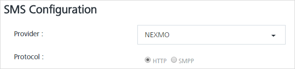  
    
    Based on your requirement, select the protocol as HTTP or SMPP.
    
    *   [HTTP](#HTTP)
    *   [SMPP](#SMPP)
    
    **HTTP**
    
    By default, the protocol is set to HTTP.
    
    Provider Properties
    
    For HTTP protocol, enter details for the following properties:
    
    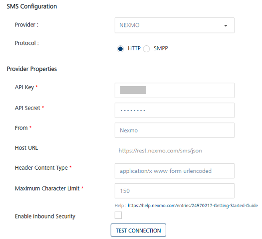
    
    *   **API Key**: NEXMO provides you a unique **API Key** for your account. Enter the provided API Key in the **API Key** field.  
        The API keys track and prevents malicious use of an API. The API key acts as a unique identifier for authentication, and can be based on the Universally Unique Identifier (UUID) system to ensure that each API key is unique to each user. For example api\_key=`n3xm0rocks`
    *   **API Secret**: Enter the API Secret in the **API Secret** field.  
        To sign up for API requests, NEXMO provides you an account API Secret. It is a pair of alphanumeric characters. For example, api\_secret=`12ab34cd`
    *   **From**: Enter the sender address in the **From** field. The sender address can be alphanumeric. For example, from=`MyCompany20`.
    *   **Host URL**: Based on a selected provider, the field is populated with the Host URL details.
    *   **Header Content Type**: Based on a selected provider, the field is populated with the header content type as `application/x-www-form-urlencoded`
        
        > **_Note:_** The `application/x-www-form-urlencoded` is the content-type header for HTTP POST requests that browsers must support.  
        The request sends a list of name-value pairs to the server.
        
    *   **Maximum Character Limit**: Based on a selected provider, the field is populated with the maximum number of characters allowed in an SMS message. If the SMS message length exceeds the defined limit, Volt MX Engagement services truncates the SMS to the defined limit.
    *   **Enable Inbound Security**: Select the checkbox, if you want to enable inbound security.
        
        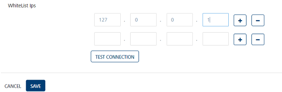
        
        If you enable the **Enable Inbound Security** option, all the inbound SMS requests are validated if the request is from a valid source. For TWILIO, a header that TWILIO sends validates SMS requests.  
        For CLICKATELL or NEXMO, SMS requests are validated by the IP address of the request origin. So for CLICATELL or NEXMO you need to provide a list of white listed IPs.
        
        For White listing IPs, load balance or reverse proxy server IP must also be white listed. Volt MX Engagement Services accepts inbound requests from providers without any authentication (as provider do not have facility of authentication).  
        In this scenario, any user can misuse and spend all the SMS credits. Thus to ensure security and check the authenticity of the request origin, the inbound security option is enabled.
        
    *   Click **Test Connection** to check if the connectivity is successful.  
        The system displays the notification that the connection is successful. Click **OK** to continue.
    
    **SMPP**
    
    For SMPP protocol, enter details for the following properties:
    
    *   [Provider Properties](#Provider_Properties_Nexmo)
    *   [SMPP Properties](#SMPP_Properties_Nexmo)
    
    **Provider Properties**
    
    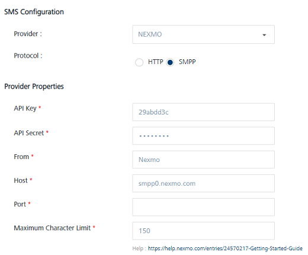
    
    For more details about **API Key**, **API Secret**, **From**,and **Maximum Character Limit** fields, see [Provider Properties](#Provider_Properties_http1) under HTTP section.
    
    *   **Host:** By default, this field is populated with the Nexmo SMPP host address.
    *   **Port**: By default, this field is populated with the port number of the Nexmo SMPP host.
    
    **SMPP Properties**
    
    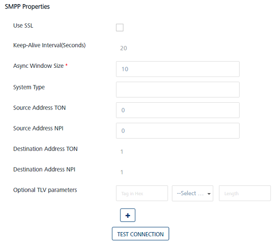
    
    *   **Use SSL**: Select the check box to use the Secure Sockets Layer (SSL). When SSL is enabled, you may also need to change the port number.
    *   **Keep-Alive Interval(Seconds)**: The field populates with an already set value for the Keep-Alive interval.  
        As SMPP protocol uses persistent socket connection, you need to periodically send ENQUIRE\_LINK commands to the gateway. The Keep-Alive interval value determines how frequently Volt MX Engagement server needs to send the `ENQUIRE_LINK` commands.  
        To keep the session alive for Nexmo, Volt MX Engagement server periodically sends ENQUIRE\_LINK commands to the gateway every 20 seconds.
    *   **Async Window Size**: The typical SMPP message flow involves the sender submitting a message to the server, and the receiver returning a response to acknowledge receipt of the message.
        
        Volt MX Engagement Services uses the asynchronous mode for submitting the messages to the gateway. For example, Volt MX Engagement Services does not need to wait for an acknowledgment of the previous message before submitting the next message. Instead, Volt MX Engagement Services sends the defined **Window Size** number of messages without receiving an acknowledgment.
        
        Based on SMPP specification, a default value of 10 is recommended, but you can increase this value if the network latency is high.
        
    *   **System Type**: This value identifies the type of the system connecting to the gateway. Some providers may want the clients to send a specific value.
    *   **Source Address TON**: For SMPP environment, you need to specify the Type of Number(TON) value for source address.
    *   **Source Address NPI**: For the SMPP environment, you need to specify specific Numbering Plan Identification (NPI) values for the source address.
        
        > **_Note:_** Source Address TON and Source Address NPI:These settings are applied to the sender address that is associated with messages submitted by Volt MX Engagement server.  
        If a sender ID is in the international format (starts with a + character), provide a value 1  for TON and NPI. If you do not know the values, provide the value as 0 for TON and NPI.
        
    *   **Destination Address TON**: For the SMPP environment, you need to specify a Type of Number(TON) value for the destination address.
    *   **Destination Address NPI**: For SMPP environment you need to specify specific Numbering Plan Identification (NPI) values for the destination address.
        
        > **_Note:_** Destination Address TON and Destination Address NPI: These settings are applied to the recipient addresses for messages submitted by Volt MX Engagement Services to the gateway. As the recipient addresses in Volt MX Engagement Services are in the international format(starts with +), the values are always one and one.
        
    *   **Optional TLV Parameters**: Enter details.
        
        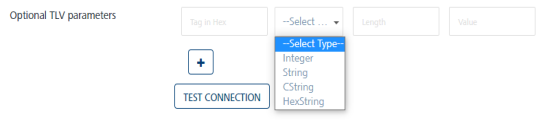
        
        SMPP protocol has the support for optional TLV parameters. Some providers may want the clients (VoltMX Engagement Services here) to pass few additional parameters while interfacing with them. These additional parameters may include operator information, pricing information, and security information and so on.
        
        Volt MX Engagement services has the support to include multiple vendor specific optional TLV parameters. TLV stands for Tag, Length and Value that is the basic format for these parameters.
        
        **Tag**: Tag is a hexa-numeric value used to uniquely identify the optional parameter. The value should be in the range of 0x1400 - 0x3FFF. Enter the value without any hex prefix such as 0x.
        
        **Type**: The type of the optional parameter. Integer, String and CString are allowed. CString is the String type terminated with null.
        
        **Length**: The length of the optional parameter value in octets.  
        For Integers, this value is required to specify if it is 1, 2 or 4 byte integer. If no value is provided for Integer type, Volt MX Engagement Services assumes it as a 4 byte integer.
        
        For String types (String and CString), the length is not required, the Engagement services calculates the length automatically. When provided for String types, the string value may be terminated to the specified length or padded with nulls. This is useful, if the provider expects the value to be of a fixed length always.
        
        **Value**: This is the value of the optional parameter.
        
        Multiple optional parameters can be added. All these parameters are used in the `SUBMIT_SM` command while submitting the message to the gateway.
        
        > **_Note:_** The fields with a red asterisk are mandatory.
        
    
    #### CLICKATELL
    
    The CLICKATELL service provider supports the following protocols:
    
    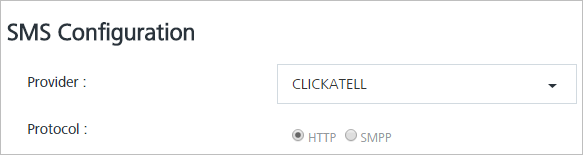
    
    Based on your requirement, select the protocol as HTTP or SMPP.
    
    *   [HTTP](#CLICKATELL_HTTP)
    *   [SMPP](#SMPP_CLICKATELL)
    
    **HTTP**
    
    By default, the protocol is set to HTTP.
    
    Provider Properties
    
    For HTTP protocol, enter details for the following properties:
    
    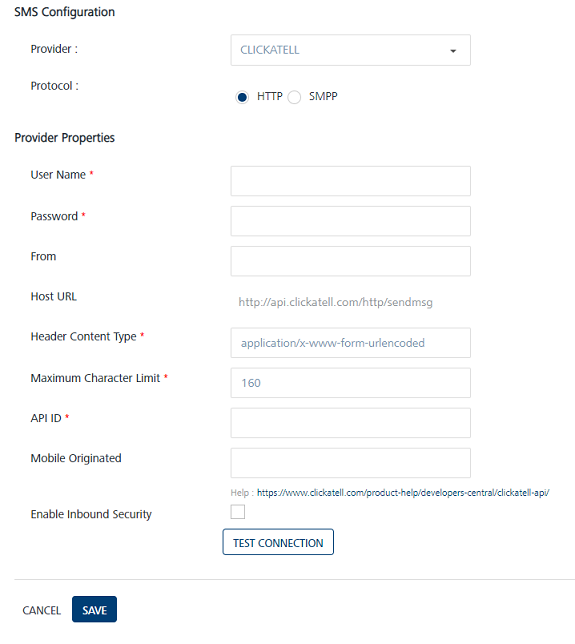
    
    *   **User Name**: Enter the user name in the User Name field.
    *   **Password**: Enter the password in the Password field. The User Name and Password values are used to authenticate the user account details.
    *   **From**: Enter the sender address in the From field.
    *   **Header Content Type**: Based on a selected provider, the field is populated with the header content type as `application/x-www-form-urlencoded`
    *   **Maximum Character Limit**: Based on a selected provider, the field is populated with the maximum number of characters allowed in an SMS message.
    *   **API ID**: Enter the API ID.
    *   **Mobile Originated**: For Clickatell, if inbound SMS is enabled, this parameter should be set to 1 to enable the reply for a message. This parameter when set to 1 will enable Clickatell to use a specific carrier to deliver the message. This can be left blank, if two way messaging is not enabled for the account.
    *   **Enable Inbound Security**: Select the check box, if you want to enable the inbound security.
        
        If **Enable Inbound Security** option is enabled, then all inbound SMS request are validated if the request is from a valid source. For Twilio, an encrypted header sent by Twilio is used to validate the request. For Clickatell or Nexmo, SMS requests are validated by the IP address of the request origin. So for Clicatell or Nexmo you need to provide a list of white listed IPs.
        
    *   **WhiteList ips**: If load balancer or reverse proxy server are used, their IP's must be white listed. Volt MX Foundry Engagement Services accepts inbound requests from providers without any authentication (as provider do not have facility of authentication). In this scenario, any user can misuse and spend all the SMS credits. Thus to ensure security and check the authenticity of the request origin inbound security option is enabled.
    
    **SMPP**
    
    For SMPP protocol, enter details for the following properties:
    
    *   [Provider Properties](#Provider_Properties_smpp_clicktell)
    *   [SMPP Properties](#SMPP_Properties_Clicktell1)
    
    **Provider Properties**
    
    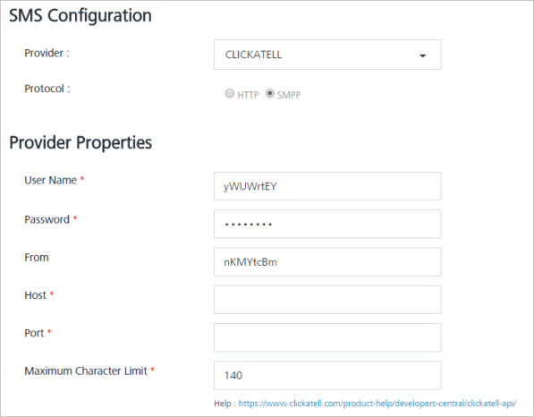
    
    For more details about **User Name**, **Password,** **From**, and **Maximum Character Limit** fields, see [Provider Properties](#Provider_Properties_Http_Clickatell) under the HTTP section
    
    *   **Host**: Enter the SMPP Host URL details.
    *   **Port:** Enter the port number of the CLICKATELL SMPP host.
    
    SMPP Properties
    
    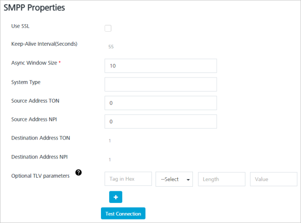
    
    *   **Use SSL**: Select the check box to use Secure Sockets Layer (SSL). Change the port number if you enable SSL.
    *   **Keep-Alive Interval (Seconds)**: As SMPP protocol uses persistent socket connection, you need to periodically send the `ENQUIRE_LINK` commands to the gateway. The value determines how frequently Volt MX Engagement server needs to send the `ENQUIRE_LINK` commands.  
        For CLICKATELL, Volt MX Engagement services sends the `ENQUIRE_LINK` command for every 20 seconds.
    *   **Async Window Size**: In the typical SMPP message flow, the sender submits a message to the server and the receiver returns a response to acknowledge receipt of the message.
        
        Volt MX Engagement services uses the asynchronous mode to submit the messages to the gateway. For example, Volt MX Engagement Services does not need to wait for an acknowledgment of the previous message before submitting the next message. Instead, Volt MX Engagement Services sends the defined **Window Size** number of messages without receiving an acknowledgment. A default value of 10 is recommended for async window size, but you may increase the default value if the network latency is high.
        
    *   **System Type**: CLICKATELL expects to send the API ID as the System Type. Enter the API ID value in this field. The entered value identifies the type of the system connecting to the gateway.
    *   **Source Address TON**: For SMPP environment, enter the Type of Number (TON) value for the source address.
    *   **Source Address NPI**: For SMPP environment, enter the Numbering Plan Identification (NPI) value for the source address.
        
        > **_Note:_** Source Address TON and Source Address NPI: These settings are applied to the sender address that is associated with messages submitted by the Volt MX Engagement Services. If a sender ID is in international format  (starts with a + character), then provide a value as 1 for TON and NPI. If you do not know the values, then provide 0 and 0 for TON and NPI.
        
    *   **Destination Address TON**: For SMPP environment, you need to specify the Type of Number (TON) value for the destination address.
    *   **Destination Address NPI**: For SMPP environment, you need to specify specific Numbering Plan Identification (NPI) values for the destination address.
        
        > **_Note:_** Destination Address TON and NPI: These settings are applied to the recipient addresses for messages submitted by the Volt MX Engagement Services to the gateway. As the recipient addresses in Volt MX Engagement Services are in the international format(starts with +), the values are always one and one.
        
    *   **Optional TLV Parameters**: Enter details.
        
        SMPP protocol has the support for optional TLV parameters. Some providers may want the clients (VoltMX Engagement Services here) to pass few additional parameters while interfacing with them. These additional parameters may include operator information, pricing information, and security information and so on.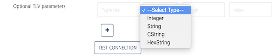
        
        Volt MX Engagement Services has the support to include multiple vendor specific optional TLV parameters. TLV stands for Tag, Length and Value that is the basic format for these parameters.
        
        **Tag**: Tag is a hexa-numeric value used to uniquely identify the optional parameter. The value should be in the range of 0x1400 - 0x3FFF. Enter the value without any hex prefix such as 0x.
        
        **Type**: The type of the optional parameter. The allowed types are Integer, String, and CString. CString is the String type terminated with null.
        
        **Length**: The length of the optional parameter value in octets. For Integers, the value is required to specify if it is 1, 2 or 4 byte integer. If no value is provided for Integer type, Volt MX Engagement services assumes it as a 4 byte integer.  
        For String types (String and CString), this is not required, Volt MX Engagement Services calculates the length automatically. When provided for String types, the string value may be terminated to the specified length or padded with nulls. This is useful, if the provider expects the value to be of fixed length always.
        
        **Value**: This is the value of the optional parameter.
        
        You can add multiple optional parameters. All these parameters are used in the `SUBMIT_SM` command while submitting the message to the gateway.
        
4.  Click **Test Connection** to verify if Volt MX Engagement server is able to establish the SMPP session with the SMS gateway or not. Volt MX Engagement server sends `BIND_TRANSCIEVER` command to the gateway, and if the bind is successful, Volt MX Engagement server sends `UNBIND` command immediately. If the test connection is not successful, you cannot save the SMPP configuration.
5.  Click **Cancel** to close the window.
6.  Click **Save.**
    
    The system displays the confirmation message that the SMS provider configuration is updated successfully.
    
    > **_Note:_**  
    • Volt MX Engagement Services supports SMPP 3.4 protocol.  
    • Volt MX Engagement Services uses `BIND_TRANSCEIVER` command to establish a SMPP session with the gateway.  
    • Volt MX Engagement Services maintains persistent socket connection with the gateway. To keep the session alive, Volt MX Engagement Services periodically sends the `ENQUIRE_LINK` command to the gateway.  
    • Volt MX Engagement Services sends the `SUBMIT_SM` command asynchronously that means, it does not wait for the response before sending the next request.  
    
    > **_Important:_** Though the SMPP protocol is only available for Nexmo and Clickatell, you can customize it for any SMPP provider if `Keep-Alive Interval` is configured to 20 seconds or 55 seconds. You can also change the `Keep-Alive Interval` by changing the property `smpp.nexmo.enquiretask.interval/smpp.clickatell.enquiretask.interval` in the `configResource.properties` file.
    
    > **_Note:_** The fields with a red asterisk are mandatory.
    

#### SALESFORCE

For using Salesforce as the service provider, following are the prerequisites:

*   You must have the [Salesforce Marketing Cloud Account](https://mc.exacttarget.com/cloud/) credentials.
*   Once the account is created and active, you must retrieve the following details:
    *   Client ID
    *   Client Secret
    *   Subdomain
    *   API Key
    *   Keyword

You can find these details from your Salesforce Account Dashboard.

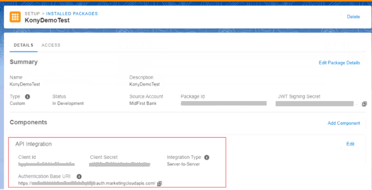

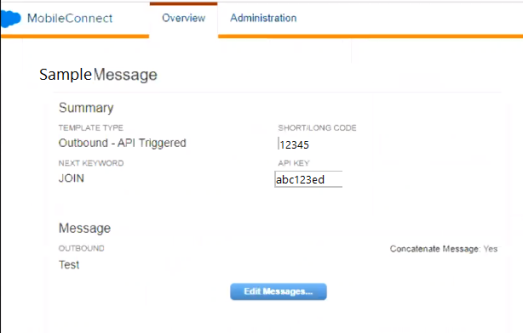

Select the service provider as Salesforce and enter the details for the following fields:

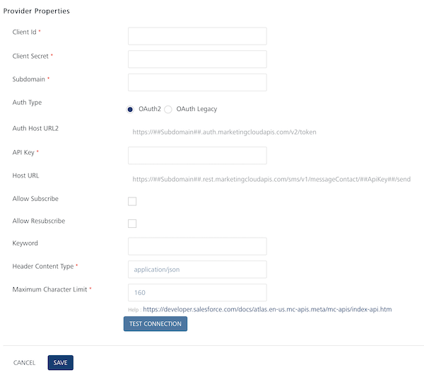

*   **Client ID**: Salesforce provides you a unique Client ID for your account. Enter this unique ID in the Client ID field.  
    
*   **Client Secret**: Salesforce provides you a unique Client Secret for your account. Enter this key in the Client Secret field.
    
    > **_Note:_** Salesforce uses a Client ID and a Client Secret to authenticate you with its servers. Your Client ID and Client Secret are only known to you and Salesforce. It is important to keep both the keys confidential to protect your account.
    
*   **Subdomain**: Salesforce provides you a Subdomain for your account. Enter the Subdomain provided by Salesforce in this field. You can retrieve it from the Authentication Base URI:
```
https://<subdomain>.rest.marketingcloudapis.com/
```
*   **Auth Type**: There are two Auth Types. They are:
    *   OAuth2 (This is the default Auth type)
    *   OAuthLegacy
*   **Auth Host URL**: Based on a selected Auth Type, the field is populated with the **Auth Host URL** details.
*   **API Key**: Provide the App API Key required for authentication.
*   **Host URL**: Based on a selected provider, the field is populated with the **Host URL** details.
*   **Allow Subscribe**: Select this check box to allow a new subscription to be created on your Salesforce account.
*   **Allow Resubscribe**: Select this check box to allow an existing subscription to be reactivated on your Salesforce account.
*   **Keyword**: Salesforce provides you a unique key for your account. Enter this unique key in this field.
*   **Header Content Type**: Based on a selected provider, the field is populated with the header content type as `application/json.`
    
    > **_Note:_** The `application/json` is the content-type header for HTTP POST requests that browsers must support.  
    The request sends a list of name-value pairs to the server.
    
*   **Maximum Character Limit**: Based on a selected provider, the field is populated with the maximum number of characters allowed in an SMS message.
*   Click the **Test Connection** button to check if the connectivity is successful.  
    The system displays the notification that the connection is successful. Click **OK** to continue.
    
    > **_Note:_** The fields with a red asterisk are mandatory.
    

Inbound
-------

You can add new SMS short codes or long numbers through Inbound screen into Volt MX Engagement server. You can purchase these numbers from SMS providers.

On the **SMS Configuration** page, click **Inbound** tab. The **Inbound** page appears.

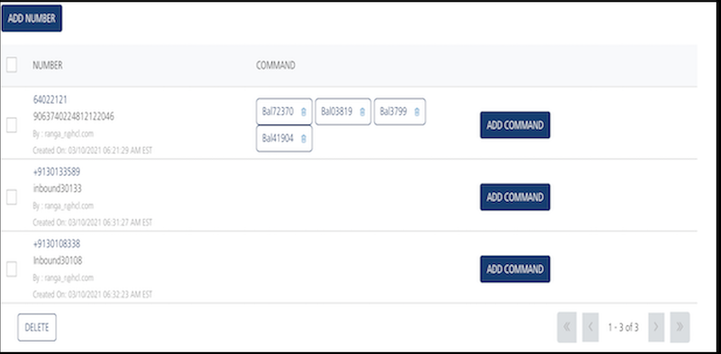

The Inbound home page displays the following details:

*   **Add Number**: Helps you add short code or long number in Volt MX Engagement server.
    
    > **_Note:_** If no number is added into the console, the **Inbound** page displays the following message: **No Numbers Found**.
    

The **Inbound** list view displays the following details:

  
| Inbound Element | Description |
| --- | --- |
| Number | The column displays the added number. |
| Command | The column displays the commands associated with the number. |
| Add Command button | The button allows you add new commands with the number. |
| Delete button | The button helps you delete a number from the list. |
| Display Controls | By default, the number range is set to 20 so that only 20 numbers are displayed in the grid. You can view more screens by navigating through the forward arrow icon. You can move back through the backward arrow icon. |

### Provider Settings

For inbound SMS, initially you need to buy a short code or a long code. When, a code is purchased, the following settings needs to be configured on the provider's page for the purchased number.

> **_Note:_** Volt MX Engagement Services does not supports internationalization for inbound SMS.

### Provider Settings for Twilio

The URL `http://<<host>>:<<port>>/api/v1/messages/sms/inbound/provider` has to be provided as inbound callback URL in the provider's console and the HTTP POST method must be selected with the URL encoded payload.

### Provider Settings for Nexmo

The URL `http://<<host>>:<<port>>/api/v1/messages/sms/inbound/provider` has to be provided as inbound callback URL in the provider's console and the HTTP POST method must be selected with the URL encoded payload.

### Provider Settings for Clicaktell

The URL `http://<<host>>:<<port>>/api/v1/messages/sms/inbound/provider` has to be provided as inbound callback URL in the provider's console and the HTTP POST method must be selected with the URL encoded payload.

You can do the following tasks from the **Inbound** screen:

*   [Adding a Number](#adding-a-number)
*   [Modifying a Number](#modifying-a-number)
*   [Deleting a Number](#deleting-a-number)
*   [Adding a Command](#adding-a-command)
*   [Modifying a Command](#modifying-a-command)
*   [Deleting a Command](#deleting-a-command)

### Adding a Number

**To add a number follow these steps**:

1.  In the Inbound screen, click **Add Number**.
    
    The **Add Number** window appears.
    
    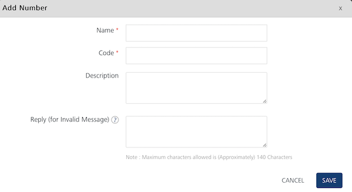
    
2.  Enter details for the following fields:
    *   **Name**: Enter a logical name for the number such as **Balance Enquiry**.
    *   **Code**: This is the purchase number for the provider. This value should be same as displayed on provider's number page, for example **57676**.
    *   **Description**: Enter a logical description for the number such as **Balance Enquiry Portal**.
    *   **Reply for Invalid Message**: This message is applicable if wrong command is given. Enter a reply if the inbound response fails such as **Invalid Message, Type BAL for enquiry**. The message is delivered to the user (if subscribed for SMS) when the inbound message does not contain any of the commands configured for that number. For example, you send an SMS for a command that is not registered with this number.
3.  Click **Cancel** if you do not want to save the entered details.
4.  Click **Save**. The inbound number appears in the **Inbound Number** list view.  
    The system displays the confirmation message that the inbound number is saved successfully.

### Modifying a Number

This feature allows you to view and make the necessary changes to the number. You may need to modify a number for specific reasons, for example, you want to modify the code or the description.

**To modify a number, follow these steps**:

1.  On the **Inbound** page, under the **Number** column in the list view, click the required number to view or edit.
    
    The **View Number** window appears.
    
    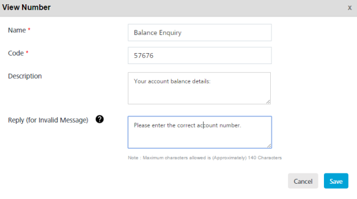
    
2.  In the **View Number** window, you can update the following details:
    
    | Number Element | Description | Modification Allowed |
    | --- | --- | --- |
    | Name | A unique name assigned to the number such as Customer Banking Number | Yes |
    | Code | Short code/ Long Number | Yes |
    | Description | Description of the inbound number | Yes |
    | Reply (for invalid message) | SMS to be sent for invalid requests that are sent to this number. If this field is left blank, then no reply SMS will be sent for invalid requests. | Yes |
    
3.  Click **Cancel** if you do not want to save the changes. The system displays the Inbound home page.
4.  Click **Save**. The updated number appears in the list view. The system displays the confirmation message that the inbound number is updated successfully.

### Deleting a Number

Based on requirement, you can delete a number from your database.

**To delete a number, follow these steps:**

1.  Select the check box next to required number from the list view on the **Inbound** screen.
    
    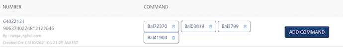
    
2.  Click the **Delete** button. You can either select any one number to delete it or all the listed numbers to delete them.
    
    The **Confirm Delete** dialog box appears, asking if you want to delete the selected number.
    
3.  Click **Cancel** if you do not wish to delete the number.The Confirm Delete dialog box closes without deleting the number.
4.  Click **Ok** to continue.
    
    The system displays the confirmation message that the number is deleted successfully.
    
    > **_Note:_** You cannot delete a number that is associated with a command.
    

### Adding a Command

To add a command to a number, follow these steps:

1.  On the **Inbound** page, click the **Add Command** button from the Inbound list-view.
    
    The **Add Command** window appears.
    
2.  Enter details for the following fields:
    
    *   **Name**: Enter a logical name for the inbound command such as Billing Enquiry.
    *   **Command**: Enter the command such as BILL.
    *   **Description**: Enter an appropriate description of the inbound command such as Billing Inquiry Portal.
    *   **Reply for Invalid Message**: The message is returned if parameters are wrong. Enter an appropriate reply for invalid message such as `Invalid message received. Provide month and year for billing enquiry such as June 2017`_.  
        _
        
        > **_Note:_** A reply for an Invalid Request(at Command level) is sent in the following circumstances:  
        • The required number of command parameters are not present in the inbound message.  
        • The SMS client server responds with the `BAD_REQUEST` status.  
        
    *   Reply(for failover case): Enter an appropriate reply for failover cases if server fails.
        
        > **_Note:_** A reply for failed cases is sent at command level, in the following circumstances::  
        •  If number of retries for an Inbound message crosses the maximum retry count.  
        •  An invalid API URL is provided for SMS client server.  
        •  No response is received from SMS client server.  
        •  Volt MX Engagement Services fails to read values of the response parameters from the response.  
        •  Authorization to SMS Client Server fails.  
        •  SMS client server responds with a status code of series 4xx other than 400.  
        •  SMS client server responds with a status code of series 5xx other than 504 or 503.  
        
    *   **Command Parameters**: Enter the command parameters such as **Name** or **Month**. Click plus icon to add additional command parameters.
        
        > **_Note:_** The Command Parameters that can have multiword values such as **Happy Birthday** should be added at last. Only one such parameter is allowed.
        
        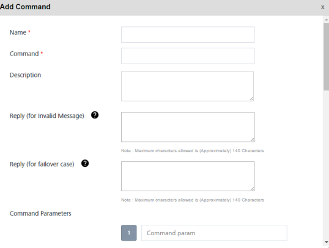
        
        ### Configure API
        
    *   **API URL**: Enter the API URL such as `http://www.billing.portal/savings`.
    *   **Request Method**: Based on your requirement, select the request method as **GET** or **POST**.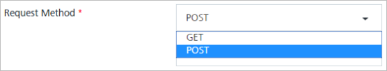
    *   **Authentication Type**: Based on your requirement, select the authentication type as **None**, **Basic Authentication** or **VoltMX Foundry**.
        
        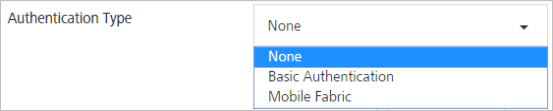
        
        1.  **Basic Authentication**: If you select the authentication type as **Basic**, enter the name and the password for API authentication.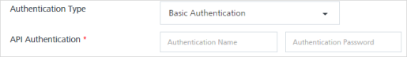
        2.  **VoltMX Foundry**: if you select the authentication type as **VoltMX Foundry**, enter details for the username, pasword, app key, app secret and auth URL for App authentication.
            
            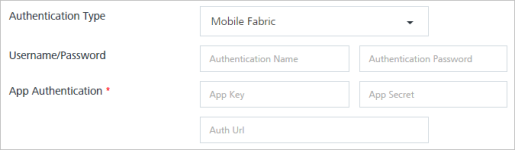
            
            > **_Important:_** A user has two modes available for authentication as Basic and Foundry. For Basic authentication (anonymous), you need to provide user name and the password. But for Volt MX Foundry, you need to provide additional authentications details: app key, app secret and the authentication URL.
            
    *   **Request Headers**: Based on your requirement, select the request header as **User Attribute**, **Command Params** or **Custom Value**.
        
        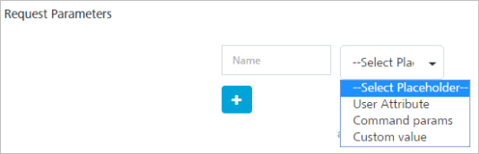
        
        1.  **User Attributes**: If you select the place holder as Audience Attribute, then select the desired option from the drop-down list.
            
            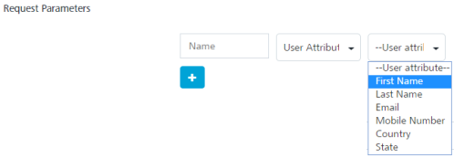
            
        2.  **Command Params**: If you select the place holder as Command Params, then select the desired option from the drop-down list.
            
            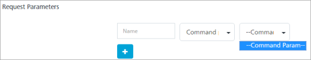
            
        3.  **Custom Values:** If you select the place holder as Custom Values, then enter a value in the **Custom Value** field.
            
            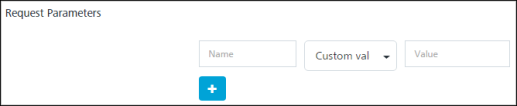
            
        4.  You can click the **+** icon to enter addition fields. Click the trash icon to remove the additional fields.
    *   **Advanced**: If you want to use the request template, then select the check box for Advanced.
        
        The **Request Template** appears.
        
        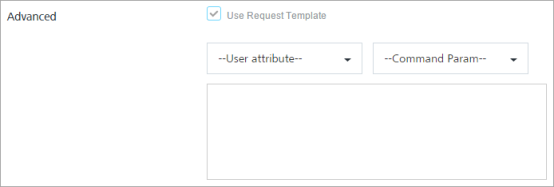
        1.  **User Attributes**: Select the required user attributes from the drop-down list.
        2.  **Command Param**: Select the required params from the drop-down list.
            
            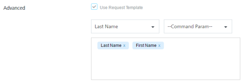
            
    *   **Response Content Type**: Based on your requirement, select the required response content type from the drop-down list such as application/JSON.
        
        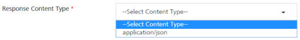
        
        ### Response Message
        
        The **Response Message** section includes the **Response Parameters** and the **Response Message** fields.
        
    
    *   **Secure**: Select the check box, if you want to receive the secure response. The secure fields will be marked with xxxx in status screen
        
        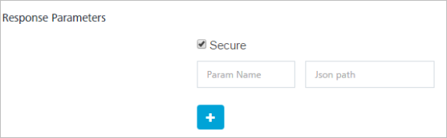
        
    *   **Response Parameters**: Enter Param name and JSON path. You can click the plus icon to add the additional response parameters.
    *   **Response Message**: Select the required audience attributes, command params and response parameters from the respective drop-down lists. The response message is constructed using audience attributes, command params and response params.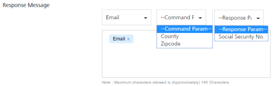
3.  Click **Cancel** if you do not want to save the entered details.
4.  Click **Save**. The system displays the SMS Configuration screen with the confirmation message that the inbound command is saved successfully.
    
    The saved command appears in the list-view under the **Command** column.
    

### Modifying a Command

This feature allows you to view and make the necessary changes to the command. You may need to modify a command details for specific reasons. For example, you want to modify the command parameters.

**To modify a command, follow these steps**:

1.  On the **Inbound** page, under the **Command** column, click the required command you want to view or edit.
    
    The **View Command** drop-down window appears.
    
    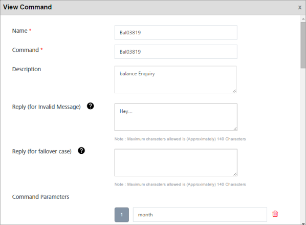
2.  In the **View Command** window, you can update the following details:
    
    | Command Element | Command Element - Level Two | Description | Modification Allowed |
    | --- | --- | --- | --- |
    | Name |   | Inbound command name is unique for the given inbound number like, Customer Care | Yes |
    | Command |   | Command is unique for the given inbound number like 53515 | Yes |
    | Description |   | Description of the command | Yes |
    | Reply (for Invalid Message) |   | Fault Message to be sent when incoming message has invalid parameters | Yes |
    | Reply (for failover case) |   | Default Message to be sent when incoming message processing fails | Yes |
    | Command Parameters |   | Set inbound parameters | Yes |
    | Configure API |   |   | Configure API Objects |
    |   | API URL | API URL details | Yes |
    |   | Request Method | The request method such as POST | Yes |
    |   | Authentication Type | Allowed values are:- NONE > no authentication required for the configured API- BASIC > The configured API supports basic authentication with the given username (required) and password (required) - MOBILE\_ FOUNDRY > Volt MX Mobile foundry authentication thus expect mbassAuthUrl and App key and App Secret. if the service is strictly private, then expect username and password also as mandatory | Yes |
    |   | API Authentication |   | Yes |
    |   | Request Headers | An array of headers objects: (name -value pair) | Yes |
    |   | Request Parameters | An array of params objects: (name -value pair) | Yes |
    |   | Response Content Type | Allowed values: application/json The configured API should reply in json format. If the service does not reply in json format use Volt MX middle ware | No |
    | Response Message |   |   | Response Message objects |
    |   | Response Parameters | An array of params objects: (name -value pair) | Yes |
    |   | Response Message | Default response message | Yes |
    
3.  Click **Cancel** if you do not want to save the changes. The system displays the Inbound home screen.
4.  Click **Save**. The updated command appears in the list-view.  
    The system displays the confirmation message that the inbound command is updated successfully.

### Deleting a Command

Based on your requirement, you can delete a command.

**To delete a command, follow these steps**:

1.  On the **Inbound** page, under the **Command** column, click the delete icon next to the required command in the list-view.
    
    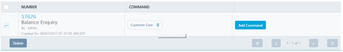
    
    The system displays the **Confirm Delete** dialog asking if you want to delete the selected command.
    
2.  Click **Cancel** if you do not want to delete the command.
3.  Click **OK** to continue.
    
    The system displays the confirmation message that the inbound command is deleted successfully.
    

Voice
-----

The **Voice** tab includes SMS configuration and provider properties sections.

### SMS Configuration

The SMS Configuration section includes the **Provider** drop-down list. You can select the required SMS service provider as TWILIO or NEXMO. By default, the service provider is set to TWILIO.

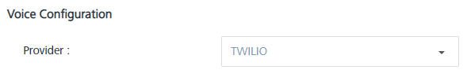

Based on your requirement, choose the service provider as:

*   [TWILIO](#twilio)
*   [NEXMO](#nexmo)

### Provider Properties

#### TWILIO

Prerequisites

1.  Your Twilio account should be configured with Voice capability.
2.  Once the account is created and active, you must retrieve the following details from the homepage:
    *   Account SID
    *   Auth Token
    *   From
    *   TwiML URL

If you select the service provider as TWILIO, enter details for the following fields:

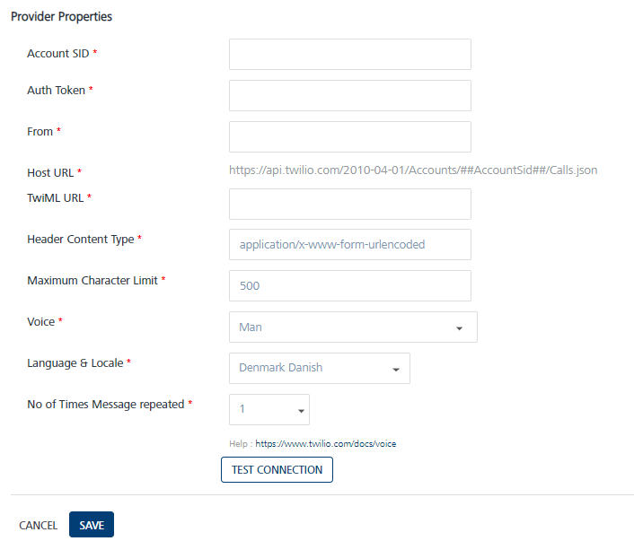

*   **Account SID**: TWILIO provides you a unique Account SID for your account. Enter the Account SID in the Account SID field.  
    
*   **Auth Token**: TWILIO provides you a unique Auth Token for your account. Enter the Auth Token in the Auth Token field.
    
    > **_Note:_** TWILIO uses an Account SID and an Auth Token to authenticate you with its servers. Your Account SID and Auth Token are only known to you and TWILIO. It is important to keep both the keys confidential to protect your account.
    
*   **From**: Enter the phone number or client identifier that initiated the call. The phone numbers are formatted with a + sign and a country code such as +16175551212. The client identifiers begin with the client URL scheme. For example, for a call from a client named xxxx, the From parameter is client:xxxx.
*   **Host URL**: Based on a selected provider, the field is auto-populated with the **Host URL** details.
*   **TwiMLURL**: Twilio provides you a TwiMLURL for your Voice enabled Twilio account. Enter the URL provided by Twilio in this field. For more information refer to, [TwiML docs](https://www.twilio.com/docs/voice/twiml/say).
*   **Header Content Type**: Based on a selected provider, the field is populated with the header content type as `application/x-www-form-urlencoded.`
    
    > **_Note:_** The `application/x-www-form-urlencoded` is the content-type header  for HTTP POST requests that browsers must support.  
    The request sends a list of name-value pairs to the server.
    
*   **Maximum Character Limit**: Based on a selected provider, the field is populated with the maximum number of characters allowed in an SMS message. By default, this is set to 500.
*   **Voice**: From a given list of default voices you can select your choice of voice in which the message will be read out to the receiver. For example, Man, Woman, Alice, etc. By default, it is set to Man.
*   **Language & Locale**: From a given list of default languages and locales you can select the language and dialect in which the message should be read out to the receiver. For example, Germany German, UK English, India English. By default, it is set to Denmark Danish.
*   **No. of times message repeated**: Choose the number of times the same message should be repeated to the receiver. You can choose any number of repetitions from 1 to 5.
*   Click the **Test Connection** button to check if the connectivity is successful.  
    The system displays the notification that the connection is successful. Click **OK** to continue.
    
    > **_Note:_** The fields with a red asterisk are mandatory.
    

#### NEXMO

**Nexmo (Vonage) Prerequisites**

1.  Ensure that your Nexmo account is configured with call credit.
2.  Create an app and generate a Private key with App ID.
3.  As Nexmo Voice call uses JWT authentication, you must generate JWT token by using AppId and Private Key.

If you select the service provider as NEXMO, enter details for the following fields:

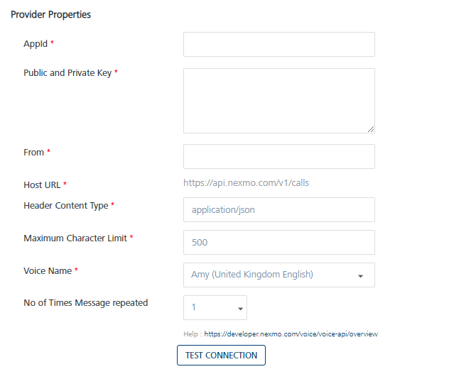

*   **App ID**: NEXMO provides you a unique **App ID** for your account. Enter the provided App ID in the **App ID** field.  
    The App ID acts as a unique identifier for authentication, and can be based on the Universally Unique Identifier (UUID) system to ensure that each App ID is unique to each user.
*   **Public and Private Key**: Enter the Public and Private Key in the **Public and Private Key** field.  
    To sign up for API requests, NEXMO provides your account a **.p8** certificate. You must enter the Public and Private Keys given in that certificate in this field. They are a pair of alphanumeric characters. For example, `djhcfgsd6926gshdf86307`.
*   **From**: Enter the sender address in the **From** field. The sender address can be alphanumeric. For example, `MyCompany2020`.
*   **Host URL**: Based on a selected provider, the field is auto-populated with the Host URL details.
*   **Header Content Type**: Based on a selected provider, the field is populated with the header content type as `application/json`
*   **Maximum Character Limit**: Based on a selected provider, the field is populated with the maximum number of characters allowed in an SMS message. If the SMS message length exceeds the defined limit, Volt MX Engagement services truncates the SMS to the defined limit. By default, this is set to 500.
*   **Voice Name**: From a given list of default voice names you can select your choice of voice, language, and locales in which the message will be read out to the receiver. For example, Mizuki (Japan Japanese), Amy (United Kingdom English), Raveena (India English). By default, it is set to Amy (United Kingdom English).
*   **No. of times message repeated**: Choose the number of times the same message should be repeated to the receiver. You can choose any number of repetitions from 1 to 5.
*   Click **Test Connection** to check if the connectivity is successful.  
    The system displays the notification that the connection is successful. Click **OK** to continue.
