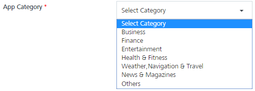
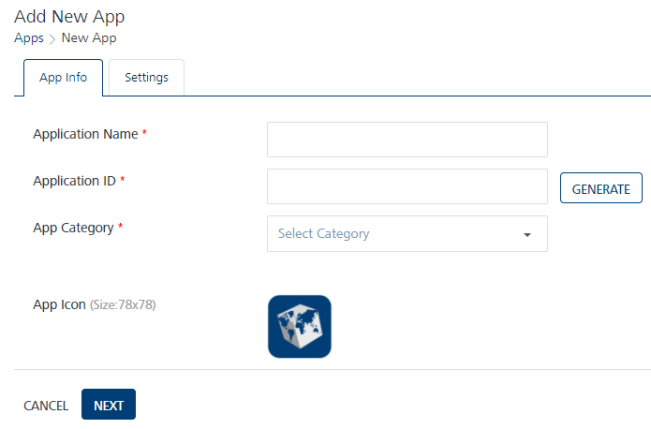

                            

### App Info

1.  Enter the following details in the **App Info** tab:
    *   **Application Name**: Enter the application name. Length of the application name can be a maximum of length 100 containing alphabets and numbers with no special characters allowed.
    *   **Application ID**: Click the **Generate** button to populate the system- generated application ID in the field. You can even enter the application ID manually in the text field.
        
        Every application name (when an application is added) has a unique application ID. The application ID cannot be modified once the application is created and saved.
        
    *   **App Category**: Select the **App Category** from the drop-down list.
        
        
        
    *    **App Icon (Size: 78x78)**: Click the **Browse** button to navigate to the image file path.
        
        The selected image name appears next to the **Browse** button. The file size of the application icon is a maximum 76 KB, and the resolution is 78 pixels x 78 pixels. All image file formats are supported.
        
        
        
        > **_Note:_** The **Application Name**, **Application ID**, and the **App Category** are the mandatory fields. If you do not enter the details, the system displays an error message that information is required.  
        
2.  Click the **Next** button to continue.
