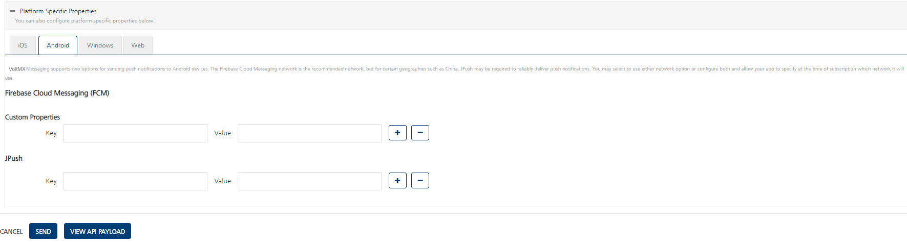

                            

Adding details for Platforms
============================

Based on requirement, choose Apple, Android, or Windows platforms and enter details. You can skip other platforms by clicking **Next**. You need to configure at least one platform to save and publish the application successfully:

*   [Apple](#apple)
*   [Android](#android-platform)
*   [Windows](#windows-platform)

Apple
-----

An SSL certificate secures communication with Apple’s push notification servers. The private key resides securely on Volt MX servers, and Apple uses the public key for authentication.

1.  To configure the Apple platform, enter details for the following fields:
    
    *   **Application Mode: (Production or Development)**: By default, the application mode is set to production. Based on your requirement, select production or development.
        
        The application mode indicates the current status of the project. Push certificates are changed depending on the choice of application mode, and each mode requires a separate certificate.
        
        **Production** mode: When selected, real time certificates and associated password details are used to send push notifications. Binary (.ipa) files that will need to be directly installed on the device will need production certificate.
        
        **Development** mode: When selected, you can send push message notifications using Apple’s demo server. This will also mean that the app has be to directly compelled on the device.
        
        You can run web applications in a specific mode depending on the current state of the project. For example, if you develop an application, you run the application in the development mode; if you test an application, you run the application in the test mode; if you launch an application, you run the application in the production mode.
        
    *   **Upload iPhone Push Certificate**: Click the **Browse** button to upload the certificate for iPhone.
        
        > **Note:**          
        *   Click the [Create the Apple Push Notification Certificate (APNS)](Generating_an_Apple_Push_Notification.md) link for more details on how to generate an Apple certificate.  
        *   Click the [Renew the Apple Push Notification Service (APNS)](Renew_the_Apple_Push_Notification_Service__APNS__Certificate.md) Certificate link for more details on how to renew an Apple Certificate  
        *   While modifying an application, you can also test the certificate for validation by clicking the **Test Connectivity** button.  
                
    *   **Certificate Password**: Enter the password for iPhone.
    *   **Upload iPad Push Certificate**: By default, the **No** option is set to active. Select the **Yes** option, if you want to upload the certificate for iPad. The system displays the **Choose File** and **iPad Certificate Password** fields.
        
        
        
    
    1.  Click the **Choose File** button to upload the certificate for iPad. If you select the **Yes** option and click **Next** without providing a certificate for iPad, then the system displays a warning message to provide a p12 certificate for iPad.
    2.  **iPad Certificate Password**: Enter a password for the iPad certificate.
2.  Click **Save** to save the specified details and proceed.
3.  Click **Cancel** to close the **Add New App** page.

Android Platform
----------------

**Google Cloud Messaging** for **Android (GCM)** is a service that helps you to send data from servers to Android applications on Android devices. This can be a message telling the Android application that there is new data to be fetched from the server (for example, a movie uploaded by a friend), or it can be a message containing up to 4kb of payload data (so apps like instant messaging can consume the message directly). The GCM service handles all aspects of queuing of messages and delivery to the target Android application running on the target device.

To configure Android platform, follow these steps:

### FCM Legacy API

1.  **GCM/FCM Authorization Key**: Enter the GCM Authorization Key.
    
    > **Note:**      
    *   Click the **[Create an Android GCM Key (Via Google Old Console)](#create-an-android-gcm-key-via-google-old-console)** link for more details on how to subscribe for GCM Authorization Key.  
    *   Click the [Create an Android GCM Key (Via Google New Console)](#create-an-android-gcm-key-via-google-new-console) link for more details on how to subscribe for GCM Authorization Key.  
    *   While modifying an application, you can also test the GCM authorization key for validation by clicking the **Test Connectivity** button.  
        
2.  Click **Test Connectivity** button to check the GCM key is valid or not. The system displays the confirmation message that GCM connection test is successful.

### FCM HTTPV1 API

1.  **FCM Project URL and Service Account key**: Provide FCM Project URL and Service Account Key

    > **Note:**
    *   Click the **[Create FCM Project URL and Service Account Key via firebase console](#create-fcm-project-url-and-service-account-key-via-firebase-console)** link for more details on how to create FCM Project URL and Service Account Key.
    *   While modifying an application, you can also test the FCM Project URL and Service Account Key validation by clicking the **Test Connectivity** button.  
2.  Click **Test Connectivity** button to check FCM Project URL and Service Account Key valid or not. The system displays the confirmation message that FCM connection test is successful.

### JPush

The Engagement server supports JPush for geographies where Android push is not allowed like in China. The AppKey and MasterSecret are obtained by registering an application with Jpush.

5.  **JPush > App Key**: Enter the app key.
6.  **JPush > Master Secret**: Enter the master secret.
    
    > **_Note:_** Click the [Create a JPush App Key and Master Secret](#create-a-jpush-app-key-and-master-secret) link for more details on how to subscribe to the JPush key.
    
7.  Click **Next** **Step** to save the specified details and proceed.
8.  Click **Back** to navigate to the previous step if you want to make any changes.

Create an Android GCM Key (Via Google Old Console)
--------------------------------------------------

To create a GCM Authorization Key, follow these steps:

1.  In a browser, go to [https://code.google.com/apis/console](https://code.google.com/apis/console), and log in. If you do not have an account, create one. Do not use a personal account.
2.  Enter your credentials, and click **Sign in** to continue.
3.  Click the **Create Project** button.
    
4.  On the left side of the API’s Dashboard page, click the drop-down menu and select **Create**.
    
5.  Enter a name, and click **Create project**. Your browser refreshes and displays a new URL.
    
6.  The number after #project (example, 214267376347) should be noted. This is your **Sender ID**.
    
7.  Scroll down the page to Google Cloud Messaging for Android and set the **ON/OFF** widget to **ON**.
    
8.  Agree to the terms and conditions, and click **Accep**t.
    
9.  At the bottom of the API’s home page, click the **Create new Server key** button.
    
10. Specify a server or servers that can use GCM. Click **Create**.
    
11. Two **GCM Keys** are now displayed on the **API Access** page.
    
12. Enter the **GCM key** and click **Save**.

Create an Android GCM Key (Via Google New Console)
--------------------------------------------------

To create a GCM Authorization Key, follow these steps:

1.  Open Google Developers Console.
2.  If you have not created an API project, then click **Create Project**.
    
    
    > **_Note:_** The project name is used only in the console. The project ID is used to uniquely identify project name. The identifier cannot be changed.
    
3.  Once a project is created, a page appears that displays your project ID and project number, for example 670330094152.
4.  Make a note of the project number. You will use it later as the **GCM sender ID**.
    
    **Enable GCM Service**
    
5.  In the column on the left, select **API & auth**.
6.  In the displayed list of APIs, turn on the **Google Cloud Messaging for Android** toggle on.
    
    Obtain an API Key
    
7.  In the column on the left, select **APIs & auth** > **Credentials**.
8.  Under **Public API access**, click **Create new key**.
    
    The **Create a new key** dialog appears.
    
9.  In the **Create a new key** dialog, click **Server Key**.
10. In the configuration dialog that appears, supply your server IP address. For testing purposes, you can use 0.0.0.0/0
11. Click **Create**.
12. In the refreshed page, copy the **API** key.
13. If you need to rotate the key, click **Regenerate Ke**y. A new key will be generated. If you think the key has been compromised and you want to delete it immediately, click **Delete**
    
Create FCM Project URL and Service Account Key via firebase console
-------------------------------------------------------------------
To create a FCM Project URL and Service Account Key, follow these steps:

1.  Open firebase console.
2.  If you have not created an API project, then click **Create Project**.
    
    > **_Note:_** The project name is used only in the console. The project ID is used to uniquely identify project name. The identifier cannot be changed.
    
3.  Once a project is created, Click on project name and goto project setting and under general tab you will find your project name project ID and project number, for example 670330094152.

4.  In Project Setting click on cloud messaging tab and Enable Firebase Cloud Messaging API (V1) by clicking three dots on right side.

5.  Create **FCM Project URL**

    https://fcm.googleapis.com/v1/projects/<Project_ID>/messages:send

6.  Create **Service Account Key**
    
    In Project Settings click on Service Accounts and select the java then **Generate new private key**

Create a JPush App Key and Master Secret
----------------------------------------

JPush is a push notification service that performs push notifications to Android, iOS and Windows Phone apps in geographies where Google services are not allowed. Currently the Engagement Server supports the push notifications via Jpush for Android devices only.

To create a JPush key, follow these steps:

1.  In a browser, enter the URL of the JPush website `https://jpush.cn.`
2.  Click **Learn More** to enter the portal.
    
    The **JPush** home page appears.
    
    > **_Note:_** For readability, use the Google Translate option available in the menu bar.
    
3.  Click the **Register** button next to the **log - in** button at the top right corner of the home page.
    
    The first **Register** page appears.
    
4.  To register with **JPush**, complete the following fields:
    *   **User Name**: Enter the user name to register with JPush. The user name should include between five to 20 characters.
        
        > **_Note:_** Do not include special characters in a user name. You can use a combination of letters, numbers, and underscores.
        
    *   **Password**: Enter a password to create your account.
    *   **Confirm Password**: Re-enter the password to confirm it.
5.  Click **I agree, Register now**.
    
    The second **Register** page appears.
    
6.  Enter details for the following fields:
    *   **User Name**: Enter the user name that you entered in the **Register** window.
    *   **Organization**: Enter name of the organization, where you work.
    *   **Email**: Enter your personal mail address.
    *   **Phone Number**: Enter your contact number.
    *   **Push:** Enter a push message.
    *   **Security Code**: Enter the displayed security code to confirm your authenticity.
7.  Click the **Complete Registration** button to continue.
8.  The JPush page appears with a confirmation message that the authentication message is sent to the registered email address. Access your email account, and open the email sent through JPush to authenticate your user account.
9.  Click the **log-in** button next to the **Register** button at the top right corner of the home page.
    
    The **log-in** window appears.
    
10. Enter details for the following fields:
    *   **User ID**: Enter your user ID.
    *   **Password**: Enter your password.
    *   **Confirmation Code**: Enter the code to show your account is not spam.
11. Click **log in** to continue.
    
    The **Application** page appears.
    
12. Click **Creating Applications** to create your own application.
13. Enter details for the following fields:
    *   **Application Information**:
        *   **Application Name**: Enter a name for the application.
        *   **Application Icons**: To provide an icon for the application, then click **Choose File** to browse the icon from its location. The selected icon name appears next to the **Choose File** button.
    *   **Android**:
        
        *   **Application Name**: Enter the application package name, such as com.example.BankingApp
        
        > **_Note:_** The current procedure explains about how to register with Android platform and details about iOS and WinPhone are not stated here.
        
14. Click **Create my application** to continue.
    
    The **Application Information** page appears.
    
15. Record the **Appkey** and **Master Secret** for your reference.
16. To view **Master Secret**, click **View and Copy**.
17. Click **Modify the Application** to update the application details. Based on your requirement, complete the changes to update the application.
18. Click **Save Changes** to update the application details.
    
    > **_Note:_** Click **Remove Application** to remove the application from JPush.
    

Windows Platform
----------------

Windows Platform window has two sections:

*   MPNS
*   WNS

1.  To configure Windows platform, enter details for the following fields:
    *   **MPNS** 
        1.  **Targeted Platforms**: In the **Windows Phone 7 and Windows Phone 8** section, select appropriate check boxes to enable as targeted platforms.
            
            If secure communications is needed, the Windows push certificate can be used. This is a purchased SSL certificate, which is converted into the correct format to upload on Volt MX Foundry Engagement Services. It is not required and can be used only when secure communication is needed.
            
    *   **WNS**:
        
        Windows Secret is an associated secret key that contains strings used for authentication with Volt MX Foundry Engagement Services APIs. Windows Secret is used for authentication on the client side during registration.
        
        Windows SID is a security identifier that is a unique identifier of a user, user group, or other security principal, and cannot be changed. A security principal has a single SID for life, and all properties of the principal, including its name, are associated with the SID. The design allows a principal to be renamed (for example, from "John" to "Jane") without affecting the security attributes of objects that refer to the principal.
        
        1.  **Secret**: Enter the secret key details.
        2.  **SID**: Enter the SID details.
        3.  Click **Validate Credentials**. If credentials are valid, then the system displays the confirmation message that Windows 8 credentials are valid.
2.  Click **Save** to save the specified details and proceed. The newly created app appears on Apps home page. The default status is unpublished.
