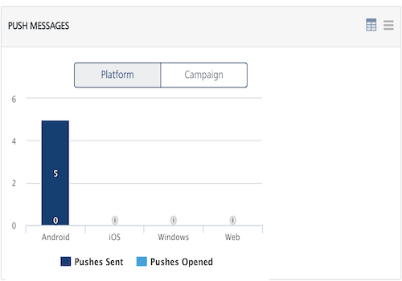
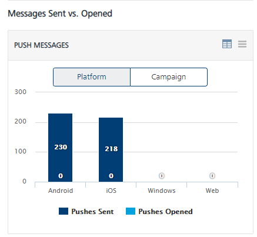
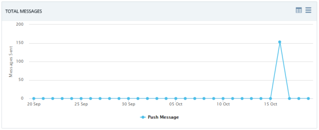

                           

Viewing an Application
======================

Using Volt MX Engagement services Console, you can view statistics for individual apps.

To view statistics for an app, follow these steps:

1.  Click the desired app on the **Apps** home page.
    
    
    
    The **App Details** page opens with two tabs: **Analytics** and **Settings**. By default, the **Analytics** tab is set to active.
    
    
    

Under the **Analytics** tab you can view an individual app's statistics to understand multiple aspects of your application:

*   **Total Devices**: The label displays the total number of devices on which the app is installed.
*   **Total Users**: The label displays the total number of users who use the app.
*   **Total Campaigns**: The label displays the total number of campaigns associated with the app.
*   **Total Events**: The label displays the total number of events associated with the app.

Reports
-------

Under the **Usage** and the **Messages Sent vs. Open** sections, you can view types of reports. The reports helps you view push notification’s performance and make appropriate decisions.

To view App reports, follow these steps:

1.  Hover the cursor over a block in the graph to view additional information such as **Pushes Sent**: **82**.
    
    
    
2.  Click the view as table icon at the upper right corner of the chart to view the report in a table format. Click the back icon to view charts in the graphical format.
    
    
    
3.  Click the chart context menu icon at the top right corner of the chart to generate reports with various options.
    
    
    

### Usage

The **Usage** section displays the following reports:

*   [Daily Subscribers - Existing](#daily-subscribers-existing)
*   [Daily Subscribers - New](#daily-subscribers-new)
*   [User per Location - US](#user-per-location-us)
*   [Users per Location - World](#users-per-location-world)
*   [Device per Platform](#device-per-platform)

#### Daily Subscribers - Existing

The **Daily Subscribers- Existing** chart provides the total number of the existing **Subscribers** (devices and users) for the particular application since Volt MX Engagement services console is configured and used on your system. The chart shows the **Subscribers** (devices and users) for the last seven days.  
Based on your requirement, you can customize the report through the chart context menu icon.

#### Daily Subscribers - New

The **Daily Subscribers - New** chart provides the total number of the new **Subscribers** ( devices and users) in the system since Volt MX Engagement services console is configured and used on your system. By default, the report displays new **Subscribers** (devices and users) for a week.   
Based on your requirement, you can customize the report through the chart context menu icon.

#### User per Location - US

The **User per Location - US** chart provides data about where in the U.S. the users are located for a particular application. The chart also provides a map of the users at various locations in USA.

#### Users per Location - World

The **Users per Location - World** chart provides data about users spread across countries for a particular application. Based on your requirement, you can customize the report through the chart context menu icon.

#### Device per Platform

The **Device per Platform** chart provides data about the relative number of devices running under the different platforms and have the particular application installed.

### Messages Sent vs. Open

The **Messages Sent vs. Open** section displays the following reports:

*   [Messages Sent versus Opened – Platform Level](#messages-sent-versus-opened-platform)
*   [Messages Sent versus Opened – Campaign Level](#messages-sent-versus-opened-campaign)
*   [Total Messages](#total-messages)

#### Messages Sent versus Opened – Platform

The **Messages Sent versus Opened at Platform** chart displays the number of push notifications sent and push notifications opened per platform for the particular application since Volt MX Engagement services console is configured and used on your system.

In this chart, the X axis represents all the current platforms, and the Y axis represents the total number of push messages.

#### Messages Sent versus Opened – Campaign

The **Pushes sent versus Opened at Campaign** chart displays the number of push messages sent and push messages opened for all the campaigns associated with the application since Volt MX Engagement services console is configured and used on your system.

#### Total Messages

The **Total Messages** graph shows the total number of the push messages sent and push messages opened over the last 30 days for the particular application since Volt MX Engagement services console is configured and used on your system.

