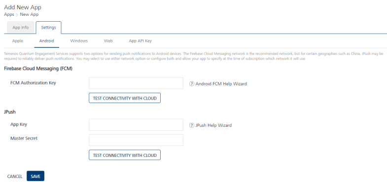

                           

Android
=======

Firebase Cloud Messaging for Android (FCM) is a service that helps you to send data from servers to Android applications on Android devices. The FCM service handles all aspects of queuing of messages and delivery to the target Android application running on the target device.

To configure **Android** platform, follow these steps:

FCM Authorization Key
---------------------

1.  **FCM Authorization Key**: Enter the **FCM Authorization Key**.
    
    > **Note:**      
    *   Click the **[Generating Firebase Cloud Messaging (FCM) Server Key and Sender ID](Generating_the_Global_Cloud.md)** link for more details on how to subscribe for FCM Authorization Key.    
        While modifying an application, you can also test the GCM/FCM authorization key for validation by clicking the **Test Connectivity** button  
            
2.  Click **Test Connectivity** button to check if the **FCM** key is valid or not.  
    The system displays the confirmation message that the FCM connection test is successful.
    
    JPush
    -----
    
    The Engagement server supports **JPush** for geographies where Android push is not allowed such as in China. The `AppKey` and `MasterSecret` are obtained by registering an application with JPush.
    
3.  **App Key**: Enter the app key.
4.  **Master Secret**: Enter the master secret.
    
    > **_Note:_** Click the [Creating a JPush App Key and Master Secret](crajpkeanmsecret.md) link for more details on how to subscribe to the JPush key.
    
5.  Click **Cancel**, if you do not want to add **Android** platform.
6.  Click **Save** to save the specified details.
