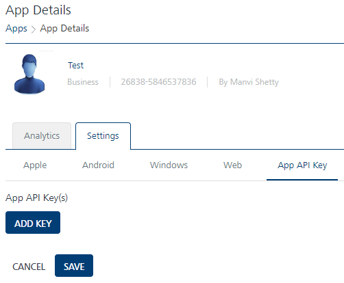
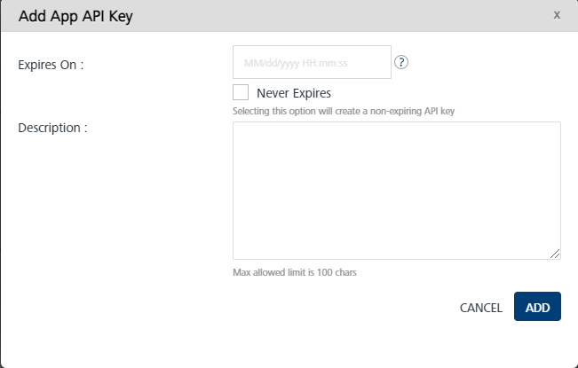
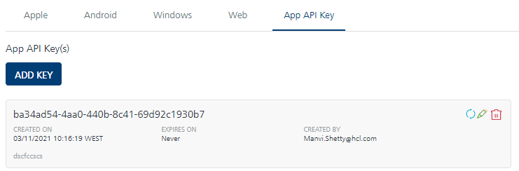
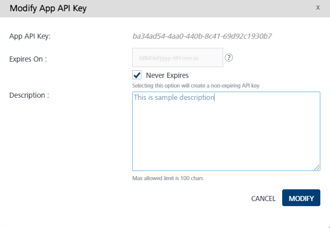
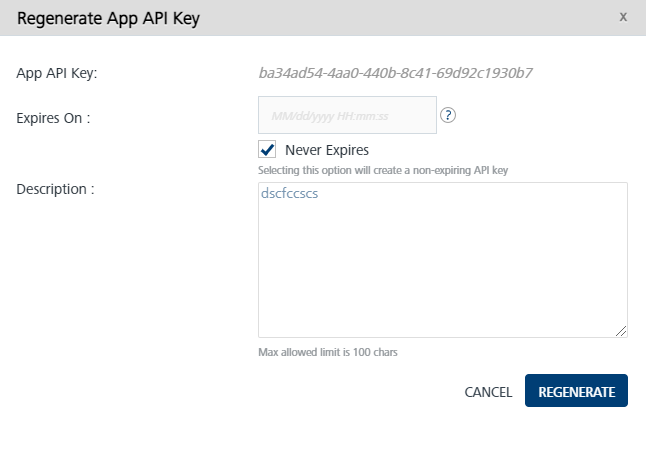
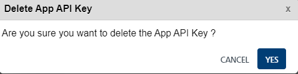

                           

App API Key
===========

Volt MX  Engagement Server supports the static key approach that can be used to programmatically send push notifications to an associated app. This static key can also be used to invoke other non-app specific APIs if the user has the correct set of permissions. The API key is specific to an application and to an environment. An Admin can set, regenerate, or extend the date of expiration of the API key. If the expiry is not given, by default, 90 days will be used as expiry. The date of expiration of the keys is visible to the developers and to the administrators. Follow these steps to add, modify, regenerate, and delete an app API key.

**To configure an App API key, follow these steps:**

1.  Add and save an app for any platform. For more details on adding an app, refer to [Adding an Application](Adding_an_Application.md).
2.  Go to Apps, click the icon at the top right corner of the app. A drop-down menu appears.
3.  Click **Manage App API Key**. The App Details screen appears.

Add App API Key
---------------

1.  **Add Key**: Click the **Add Key** button. The Add App API Key screen appears.

3.  Set Expiration:
    1.  **Expires On**: Specify the date of expiry for the App API key. You must always specify the date and time of expiry. The format is `mm/dd/yyyy hh:mm:ss`.
    2.  **Never Expire**: Select this check box if the App API key should never expire. The **Expires On** field is invalid once you select this check box.
4.  **Description**: Set a description to define the App API key.
5.  Click **Cancel**, if you do not want to add an App API key.
6.  Click **Add** to save the specified details.

A new App API key is created and appears on the App API Key screen.

Modify App API Key
------------------

1.  Click the edit icon at the top right corner of the App API key. The **Modify App API Key** screen appears.

The App API key is auto-generated and cannot be modified.

4.  You can modify the **Expires On** or change the App API key to **Never Expire** and modify the App API key **Description** using this feature.
5.  Click **Cancel** if you do not want to modify the App API key details.
6.  Click **Modify** to save the modified details.

The changes will reflect on the App API Key Screen.

Regenerate App API Key
----------------------

1.  Click the refresh icon at the top right corner of the App API key. The **Regenerate App API Key** screen appears.

The App API key cannot be modified.

4.  You can modify the **Expires On** or change the App API key to **Never Expire** and modify the app API key **Description** using this feature.
5.  Click **Cancel** if you do not want to modify the App API key details.
6.  Click **Regenerate** to save the modified details.

The changes will reflect on the App API Key Screen.

Delete App API Key
------------------

1.  Click the delete icon at the top right corner of the App API Key. The **Delete App API Key** message appears.
2.  Click **Cancel** if you do not want to delete the App API key.
3.  Click **Yes** to delete the selected App API key.

