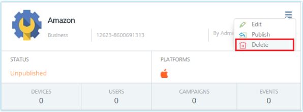

                             

Deleting an Application
=======================

You cannot delete applications, which are used in **Campaigns**, and **Events**. The status of such applications cannot be changed from **Published** to **Unpublished**.

To delete an application, follow these steps:

1.  Navigate to the **Application** page.
2.  Click the icon in the upper right corner of the app to open the drop-down menu. The drop down menu includes the **Edit**, **Publish**, and the **Delete** options.
    
    
    
3.  Click **Delete**.
    
    > **_Note:_** You cannot delete the published applications.
    
    The system displays the **Delete App** dialog box asking if you wish to delete the application.
    
4.  Click **Cancel** to close the dialog. The system returns to the **Application** home screen.
5.  Click **Yes** to continue.
    
    The system displays the confirmation message that the application is deleted successfully.
