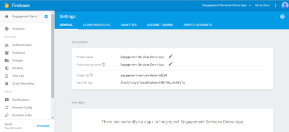

                            

Migration from GCM to FCM
=========================

Firebase Cloud Messaging(FCM), which was introduced to replace Google Cloud Messaging(GCM), is a cross-platform cloud solution for messages and notifications for Android, iOS, and web applications, which currently can be used at no cost.

Support for Google FCM has been added in Volt MX Engagement Server post the V8 SP1 GA release. The Android platform supports Google FCM Push Notifications. This enables you to configure FCM service across Volt MX Iris and Volt MX Engagement Console.

Prerequisites
-------------

*   Access to an instance of the Volt MX Engagement server
*   Android SDK and Volt MX Iris installed on your system

Overview
--------

The possible steps to use FCM across Volt MX Engagement Console and Volt MX Iris include:

1.  [Generation of Firebase Cloud Messaging (FCM) key to send push notifications to Android Devices](#generating-firebase-cloud-messaging-fcm-key-to-send-push-notifications-to-android-devices)
2.  [Migration of the GCM project to FCM](#migrate-gcm-project-to-fcm)
3.  [Configuration on the Engagement console](#configuration-on-the-engagement-console)
4.  [Configuration through Volt MX Foundry console](#configuration-on-the-foundry-console)
5.  [Configuration from the Client side](#configuration-from-the-client-side)

Generating Firebase Cloud Messaging (FCM) key to send push notifications to Android Devices
-------------------------------------------------------------------------------------------

The first step in the installation and configuration of the sample Engagement application on an Android device is the generation of the sender ID. Android devices use the sender ID to register with FCM and receive notifications.

1.  Open the Google developers console window by logging into: [https://console.firebase.google.com/](https://console.firebase.google.com/)
    
    The **Google Developer’s** account login page appears.
    
    
    
2.  Enter your credentials to sign into Google account. Click **Sign in** to continue.
    
    The **Welcome to Firebase** page appears.
    
    
    
3.  Click **Create New Project**.
    
    The **Create a project** dialog appears.
    
    
    
4.  Enter details for the following fields:
    
    *   **Project name**: Enter the Project name. Based on entered project name, the system generates the project ID. Note that the project name is used only in the Google console and project ID is used to uniquely identify the project name.
    *   Select the required country from the drop-down list.
    
    
    
5.  If you do not want to create the project, click **Cancel** to close the **Create a project** dialog box.
6.  After entering the required details, click **Create Project** to continue.
    
    The **Welcome to Firebase! Get started here.** page appears.
    
7.  Click the wheel icon next to the **Engagement Services Demo App** label in the left menu bar.
    
    The **Project settings** drop-down list appears.
    
    
    
8.  Click **Project Settings** from the drop-down list.
    
    The **Settings** page appears. Here you can view the **Project name**, **Public facing name**. **Project ID**, and the **Web API key** for your reference.
    
    
    
    If required, you can edit the **Project name** and the **Public-facing name**.
    
9.  Click the **Cloud Messaging** tab next to the **General** tab.  
    The **Project credentials** section appears. The **Project credentials** section displays the **Firebase Cloud Messaging** token, **Sender ID**, and the **Server key**.
    
    
    
10.  Copy **Sender ID**. The **Sender ID** is used in the client side application to register to **FCM** from the device.
11.  Copy the **Server Key**. You must provide the **Server Key** in the Engagement server while configuring an application to send push messages.

Migrate GCM project to FCM
--------------------------

If you already have an existing GCM project on your Google cloud, which you wish to convert to FCM. Execute the following steps:

1.  From the [Firebase console](https://console.firebase.google.com/), click **Add Project**.  
    
2.  From the drop-down box, select your GCM project from the list of your existing Google Cloud projects.
3.  Click **Add Firebase**.  
    
4.  From the Firebase welcome screen, select Add Firebase to your Android App.  
    
5.  Provide your package name and SHA-1 and select **Add App**.
6.  Download the google-services.json file for your Firebase app.

Configuration on the Engagement console
---------------------------------------

Firebase Cloud Messaging for Android (FCM) is a service that helps you to send data from servers to Android applications on Android devices. FCM can be used to send pushes to devices. The FCM service handles all aspects of queuing of messages and delivery to the target Android application running on the target device.

To configure the new app for the Android platform, follow these steps:

1.  From the Engagement console, go to **Apps**. Click on **Add New App**.
2.  Go to the **Settings**\> **Android** tab.
3.  **FCM Authorization Key**: Enter the FCM Authorization Key. This is the Server Key as mentioned in the [Generating Firebase Cloud Messaging (FCM) Server Key and Sender ID for Android Devices](#generating-firebase-cloud-messaging-fcm-key-to-send-push-notifications-to-android-devices) section.
4.  Click **Test Connectivity with Cloud** button to check if the FCM key is valid or not.  
    If the FCM key is valid, the system displays a confirmation message that the FCM connection test is successful.
5.  Click **Save** to save the specified details.

> **_Important:_** In the **Configuration** > **General** > **Basic** section of the Engagement console a new **Payload Type for Android** drop-down menu has been added.

The FCM standard of Google now provides an option to send both Notification Messages and Data Messages. The Notification Message has an option to send data payload and notification payload. Whereas, the Data Message will send only the data payload. Engagement server supports the following options in the **Payload Type for Android** drop-down menu:

*   **FCM (Notification Message)**: Choose this option to send Notification Message to the client application by the Engagement server. However, both notification and data payloads will be sent.
*   **FCM (Notification Message) / GCM v2**: This option is provided for backward compatibility. Currently we support GCM v2 in the Engagement server. If you choose this option, the notification payload is copied into the data payload. This will work like both the FCM (Notification Message) and FCM (Data Message) options as discussed above.
*   **FCM (Data Message)**: Choose this option to send Data message to the client application by the Engagement server. Only the data payload will be sent.

The scenarios where users will need to use backward compatibility are as follows:

*   When a user has existing apps that use the Data payload and if they want to use the Notification payload for their new apps.

> **_Note:_** For new users, by default the FCM (Notification Message) option is chosen.

For more information on Notification and Data messages refer to [About FCM messages](https://firebase.google.com/docs/cloud-messaging/concept-options#notifications_and_data_messages).

Configuration on the Foundry console
-----------------------------------

To configure the new app for the Android platform, follow these steps:

1.  Log in to the Volt MX Foundry console. From the Apps menu select **Add New**.
2.  From the **Configure Services** tab, go to **Engagement**. Expand **Android**.

4.  **FCM Authorization Key**: Enter the FCM Authorization Key. This is the Server Key as mentioned in the [Generating Firebase Cloud Messaging (FCM) Server Key and Sender ID for Android Devices](#generating-firebase-cloud-messaging-fcm-key-to-send-push-notifications-to-android-devices) section.
5.  Click **Save**.

Configuration from the Client side
----------------------------------

Volt MX  Iris for Android development allows you to customize the native Cloud Messaging (FCM) receiver and push message status notification to meet your application requirement. Otherwise, the default settings of Volt MX Iris take effect.

### FCM Overview

An Android application developed in Volt MX Iris shows the status bar notification for new push message if the application is in background, whether it is running or not running. The default FCM notification message is shown below:

*   The notification provides an icon and two-line text for title and description of the message. The notification message appears below:

 

*   A push message is composed of key value pairs.
*   By default, only one notification is displayed per application on the status bar. Any new push message received will overwrite the existing notification.

### Integrating FCM

After [downloading](#migrate-gcm-project-to-fcm) the **google-services.json** file provided by the Firebase console, you must create FCM folders in the following locations:

*   **For Mobile**: ProjectLocation\\resources\\mobile\\native\\android\\fcm
*   **For Tablet**: ProjectLocation\\resources\\tablet\\native\\androidtab\\fcm

> **_Note:_** You must check the Payload formats of FCM. It is recommended to use FCM (Notification messages) payload.

For customizing your FCM application, from **Project Settings** > **Native** > **Android**, in the **Push Notification** section select **FCM**.

This option is to enable Push Notifications for the application. This option copies the libraries required for push notification into the project during build time.

*   **Custom FCM Service (Optional)** - If your application requires to override the default FCM service, you can provide your own custom FCM service. To customize the FCM service, see [Customizing FCM Service](../../../../Iris/iris_user_guide/Content/Custom_FCM.md).
