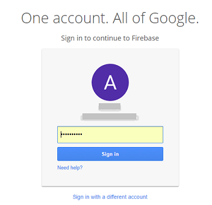
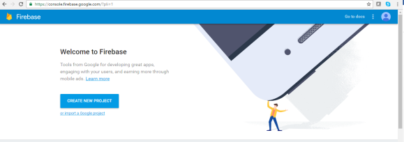
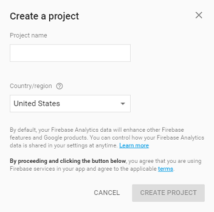
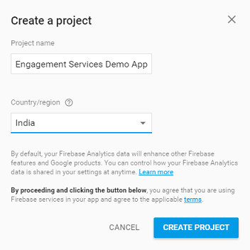
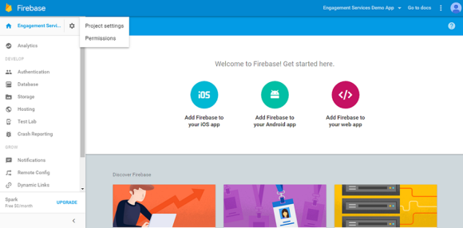
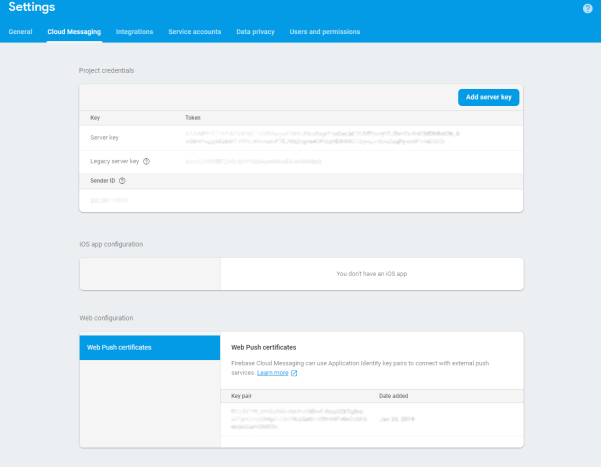

                            

Generating Firebase Cloud Messaging (FCM) Server Key and Sender ID for Web Devices
==================================================================================

The first step in the installation and configuration of the sample Engagement application on a Web device is the generation of the sender ID. Web devices use the sender ID to register with FCM and receive notifications.

1.  Open the Google developers console window by logging into: [https://console.firebase.google.com/](https://console.firebase.google.com/)
    
    The **Google Developer’s** account login page appears.
    
    
    
2.  Enter your credentials to sign into Google account. Click **Sign in** to continue.
    
    The **Welcome to Firebase** page appears.
    
    
    
3.  Click **Create New Project**.
    
    The **Create a project** dialog appears.
    
    
    
4.  Enter details for the following fields:
    
    *   **Project name**: Enter the Project name. Based on entered project name, the system generates the project ID. Note that the project name is used only in the Google console and project ID is used to uniquely identify the project name.
    *   Select the required country from the drop-down list.
    
    
    
5.  If you do not want to create the project, click **Cancel** to close the **Create a project** dialog box.
6.  When you enter the required details, click **Create Project** to continue.
    
    The **Welcome to Firebase! Get started here** page appears.
    
7.  Click the wheel icon next to the **Engagement Services Demo App** label in the left menu bar.
    
    The **Project settings** drop-down list appears.
    
    
    
8.  Click **Project Settings** from the drop-down list.
    
    The **Settings** page appears. Here you can view the **Project name**, **Public facing name**. **Project ID**, and the **web API key** for your reference.
    
    
    
    If required, you can edit the **Project name** and the **Public -facing name**.
    
9.  Click the **Cloud Messaging** tab next to the **General** tab.  
    The **Project credentials** section appears. The **Project credentials** section displays the **Firebase Cloud Messaging** token, **Sender ID**, and the **Server key**.
    
    
    
10.  Copy **Sender ID**. The **Sender ID** is used in the client side application to register to **FCM** from the device.
11.  Copy the **Server Key**. The **Server Key** is used in the Engagement server while creating an application.
12.  Generate or Import an existing **key pair** in the Web Push certificates section. The **Key pair** is used as the public key in the client side application to generate the Registration Token.
