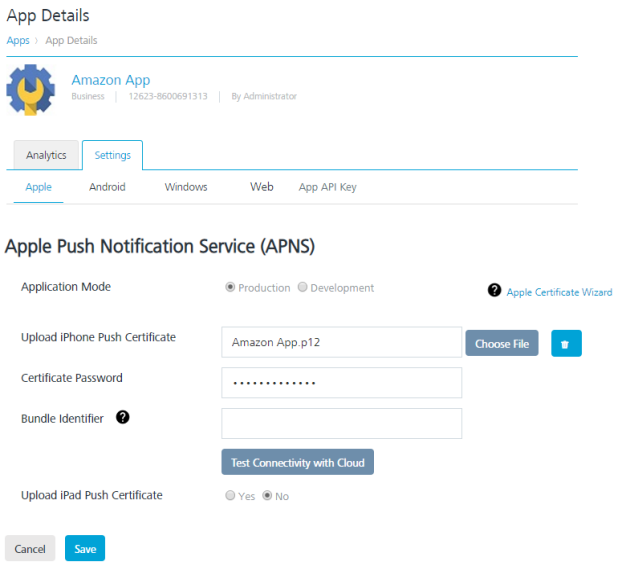
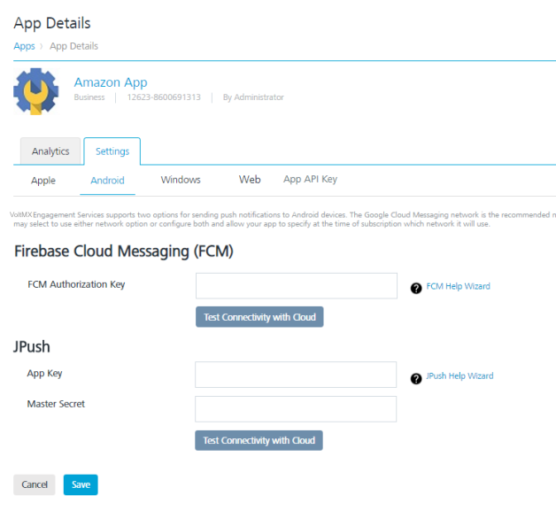
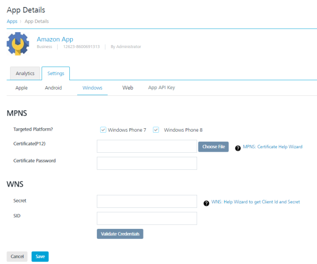
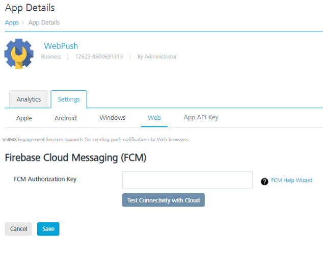

                            

Modifying Platform Details
==========================

Apple Platform
--------------

You may need to modify platform details for various reasons. For example, you need to update the expired APNS certificate with the new APNS certificate.

For more details about how to update the Apple platform details, refer to [Apple Platform](../../../../Foundry/vms_console_user_guide/Content/Apps/Apple.md)

Android Platform
----------------

You may need to modify Android platform details for various reasons. For example, you need to update the expired GCM/FCM authorization key.

For more details about how to update the Android platform details, refer to [Android Platform](../../../../Foundry/vms_console_user_guide/Content/Apps/Android.md)

Windows Platform
----------------

You may need to modify Windows platform details for various reasons.

For more details about how to update the Windows platform details, refer to [Windows Platform](../../../../Foundry/vms_console_user_guide/Content/Apps/Windows.md)

Web Platform
------------

You may need to modify Web platform details for various reasons.

For more details about how to update the Web platform details, refer to [Web Platform](Web.md#Apps/Windows.md)
