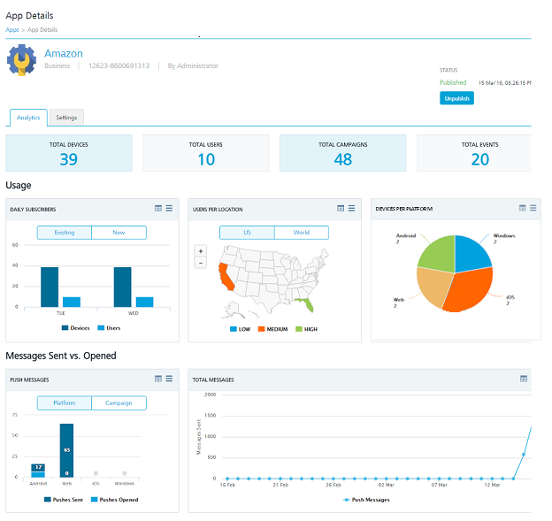

                             

Modifying an Application
========================

You can view as well as modify application details, such as the application name, or validate platform certificates.

To view or modify an application, follow these steps:

1.  In the **Applications** home screen, click the required application from the list.
    
    The **App Details** page of the selected application appears with the **Analytics** tab set to active.
    
2.  You can update an application for the following details:
    1.  **Modify the Basic Details**: For more information, refer to [Modify the Basic](Modifying_Basic.md).
    2.  **Modify the Platform Details**: For more information, refer to [Modify the Platform details for Apple, Android, Windows, and Web](Modifying_Platform.md).
    3.  **Publishing or Unpublishing an Application**: For more information about publishing or unpublishing, refer to [Publishing an Application](Publishing_or_Unpublishing.md).
3.  Click the **Cancel** button to ignore any modifications. The system displays the **Apps** home screen.
4.  Click the **Save** button. The updated application appears on the **Apps** home page.
