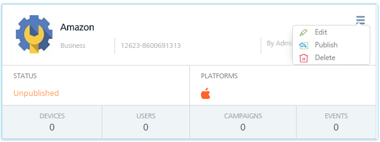
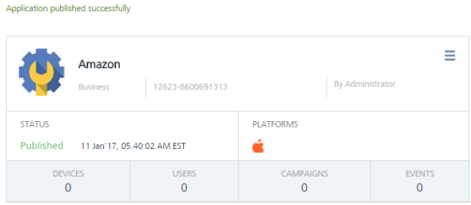
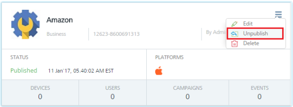

                            

Publishing an Application
=========================

When an application is added into the console, the console sets the application's status as unpublished. A user, with appropriate permissions, can change the application's status to published. Only applications with the status set as published are used for push notifications.

To publish an application, follow these steps:

1.  Click the icon in the top right corner of the app.
    
    A drop-down list appears.
    
2.  Select the status as **Publish** from the drop-down list.
    
    The **Publish Application** dialog box appears asking if you want to publish the app.
    
3.  Click **Cancel** if you do not want to publish the app.
4.  Click **Yes** to continue.
    
    The system displays the confirmation message that application published successfully. The status changes from **Unpublished** to **Published**.
    
    
    
    Unpublishing an App
    -------------------
    
5.  To change the status of an app from published to unpublished. Click the drop-down list from the top right corner of the app and select the status as **Unpublish**.
    
    
    
    The **Unpublish Application** dialog box appears asking if you want to unpublish the app.
    
6.  Click **Cancel** if you do not want to unpublish the app.
7.  Click **Yes** to continue.
    
    The system displays the confirmation message that the application unpublished successfully.
    
    > **_Note:_** You can publish or unpublish an app from the **App** home page or the **App Details** page.
