                           

Renew the Apple Push Notification Service (APNS) Certificate
============================================================

The Apple Push Certificate cannot be renewed. You need to create a new push certificate for the existing bundle identifier. The Push notification certificate is not a part of the application build, therefore you need to create a new certificate and upload it on Volt MX Engagement Server.

**To renew the Apple Push Notification Service (APNS) certificate, follow these steps**:

1.  In the Keychain Access application on your Mac, under the Certificate Assistant menu, choose the **Request a Certificate From a Certificate Authority** option.
    
    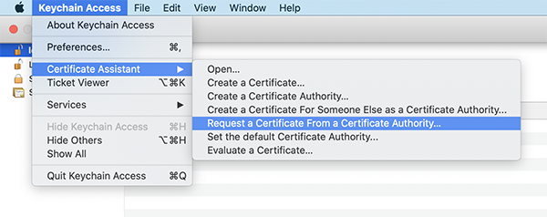
    
2.  Enter Email Address, your Name and in the Request is group, select the Saved to disk option and click **Continue**.
    
    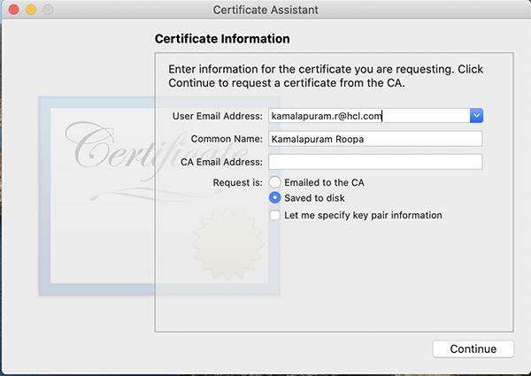
    
3.  Save the Certificate Signing Request (CSR) to your local machine. You must change the extension from .`certSigningRequest` to .csr,and click **Save**.
    
    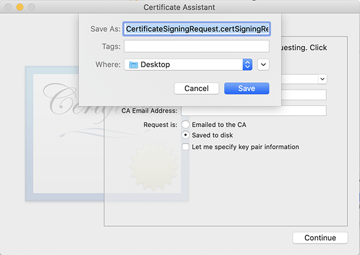
    
4.  Click **Done**. The CSR is generated.
    
    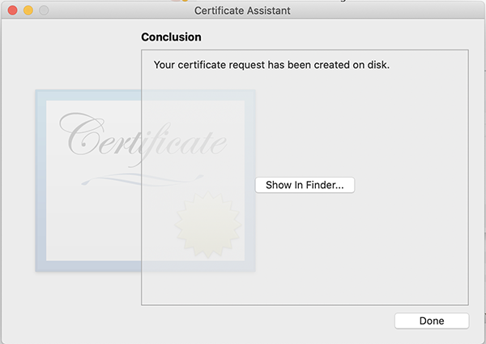
    
5.  Login to `http://developer.apple.com` with valid credentials. Select **Accounts and Certificates**, **IDs & Profiles** under the **Overview** section from the left panel.
    
    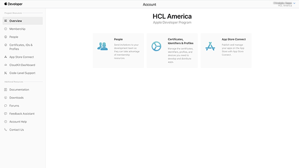
    
6.  Select **App IDs** under **Identifiers** from the left navigation pane and choose the **App Id** from the right panel.
    
    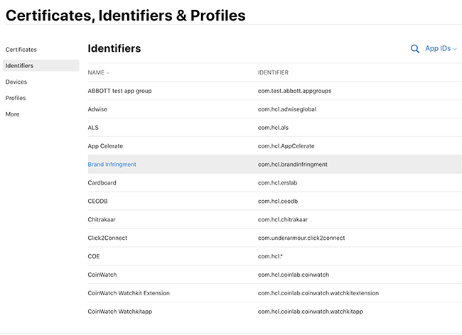
    
7.  Click the **Edit** button.
    
    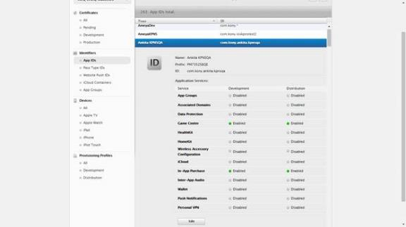
    
8.  Based on your requirement, choose **Development SSL Certificate** or **Production SSL Certificate**.
    
    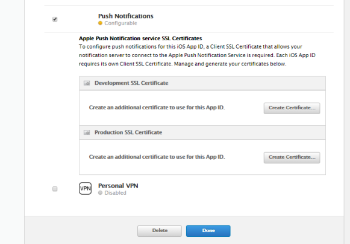
    
9.  Upload the .csr file, and click **Generate**.
    
    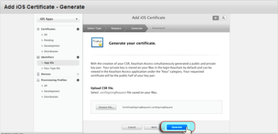
    
1.  Click **Download** to install and backup.
    
    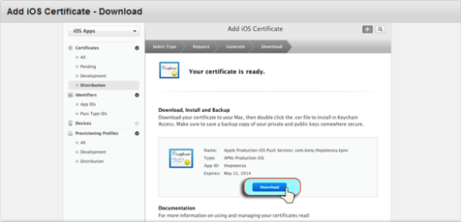
    
1.  Check your local **Download** folder for .cer file.
    
    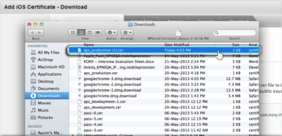
    
1.  Click **Add** to add the certificate to Keychain.
    
    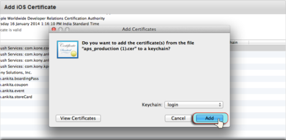
    
1.  Under Keychain, select the file and right click to **Export.**
    
    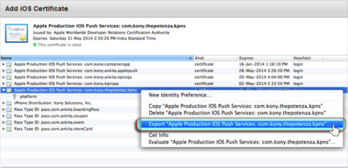
    
1.  Click Save to save the exported file in .`p12` format.
    
    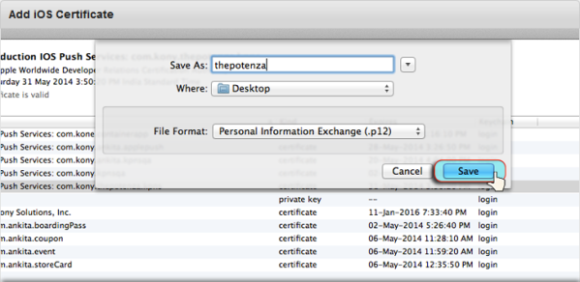
    
1.  Encrypt the exported item by providing a Password. Click **OK**
    
    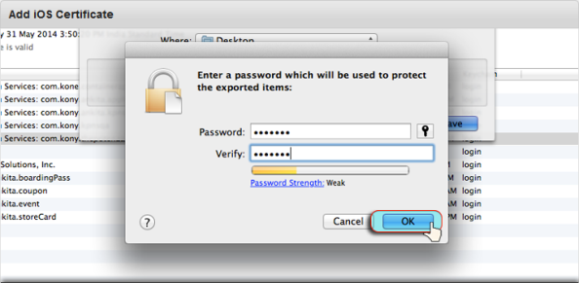
    
1.  Enter local machine password to allow export from Keychain. Click **Allow**.
    
    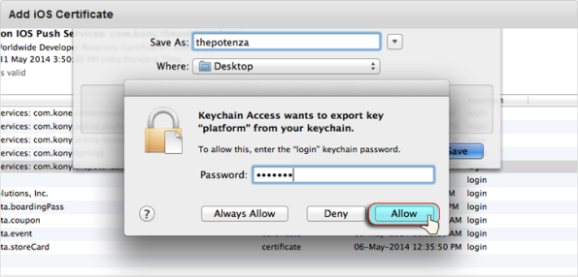
    
1.  Check your local machine for the generated CSR.
    
    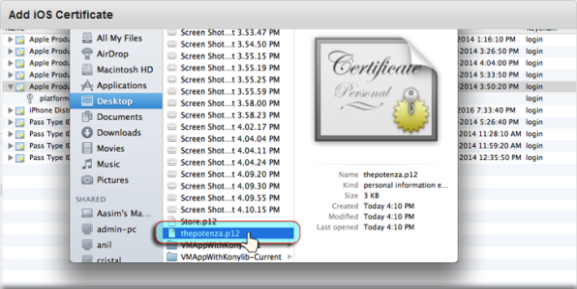
    
1.  Browse the certificate `(.p12)` and provide a Certificate Password in the Volt MX Engagement Services Application Console. Click **Save.**
