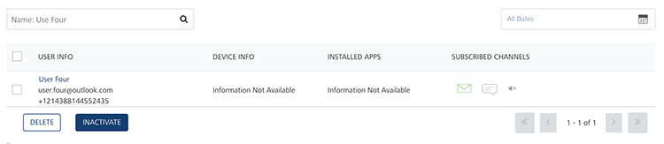
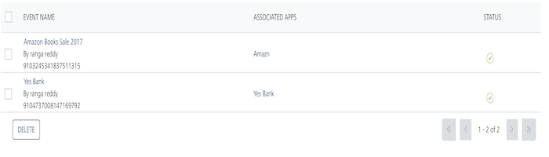

                            

Searching Data in Volt MX Foundry Engagement Services
====================================================

Volt MX  Foundry Engagement Services provides search options that help to access and analyze data across Volt MX Foundry Engagement Services Console. The search option automates the finding of data and helps users navigate it with a single view across Volt MX Foundry Engagement Services.

In Volt MX Foundry Engagement Services, you can sort or filter data based on columns. You may want to sort data according to application name, target platform, or application status. For example, create an alphabetically sorted list based on user' names. You can also filter records to create a data subset based on a defined criteria. Through sorting and filtering, you gain insight into data and make more effective decisions.

To search data for any column in the grid, follow these steps:

1.   To search data based on a key word, enter the key word in the search field and click Enter.
    
    For example: name: User Four. After **Search Filter** is applied, the result is displayed below.
    
    
    
2.  **Searching without Labelling with Multiple Parameters**: Enter the required parameters with a space in the Search field. For example, the following image displays search results for two events based on the entered parameters.
    
    
    
    > **_Note:_** The search results remains in effect only for the duration of the current screen session, or until you:  
    \- Select another search parameter to search in the list view.  
    \- Click another module in the console.
