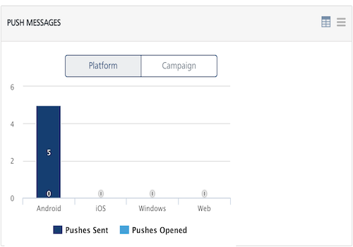
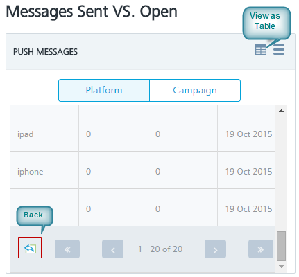
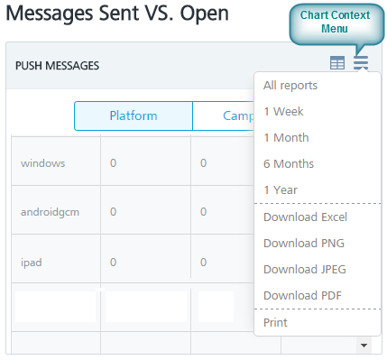
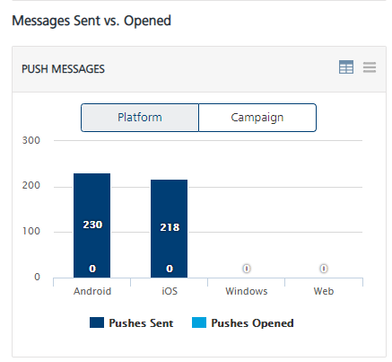
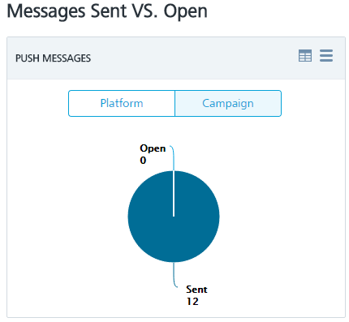
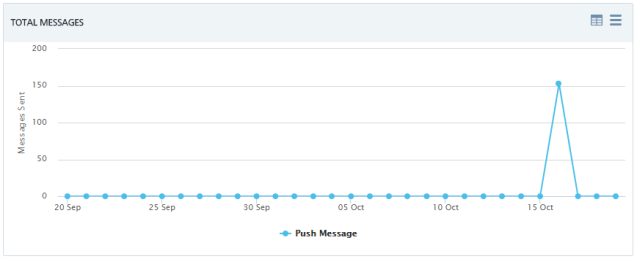

                           

Viewing App Reports
===================

To successfully analyze data in Volt MX Foundry Engagement Services, app reports provide you with more details to understand and familiarize with business data. Volt MX Foundry Engagement Services generates three types of reports for applications.

The app reports presented in a pictorial form is key to measure push notification’s performance and make appropriate decisions to meet long-term push notification goals. The App Details page displays three types of reports:

*   [Messages Sent versus Opened – Platform Level](#messages-sent-versus-opened-platform-level)
*   [Messages Sent versus Opened – Campaign Level](#messages-sent-versus-opened-campaign-level)
*   [Total Messages](#total-messages)

To view App reports, follow these steps:

1.  Under **Overview**, **click Apps**.
    
    The system displays the **App Details** page with three types of reports.
    
2.  Hover the mouse over any of the blocks in the graph to view additional information such as Pushes Sent: 59
    
    
    
3.  Click the **View as Table** button at the top right if you want to view the report in a table format.Click the **Back** button to view charts in graphical format.
    
    
    
4.  Click the **Chart Context Menu** button at the top right corner of the graph, if you want to generate reports with various options.
    
    
    

Messages Sent versus Opened – Platform Level
--------------------------------------------

The **Messages Sent versus Opened at Platform Level** graph assesses the relationship between push sent, pushes opened per platform over a period. The default view presents the total of pushes sent versus opened per platform since Volt MX Foundry Engagement Services console is configured and initiated its services.

This report shows total number of push messages for each platform. Only two columns exists for pushes sent and pushes received. The X axis is for all the current platforms and the Y axis is for total number of pushes.

Messages Sent versus Opened – Campaign Level
--------------------------------------------

The Pushes sent versus Opened at Campaign level graph assesses the relationship between push sent, pushes opened per campaign over a period. The default view presents the total of pushes sent versus opened per campaign since Volt MX Foundry Engagement Services console is configured and initiated its services.

Total Messages
--------------

The **Total Messages** graph assesses the relationship between pushes sent, pushes opened over a period. The default view presents the total of pushes sent versus opened since Volt MX Foundry Engagement Services console is configured and initiated its services.

